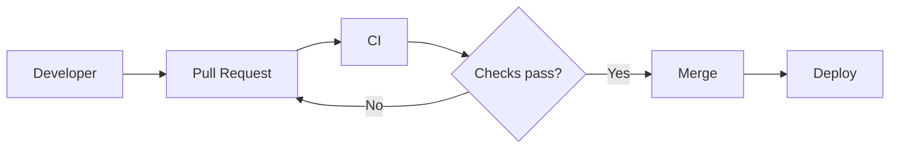

# Design and implement processes and communications

## Design and implement traceability and flow of work

### Design and implement a structure for the flow of work, including GitHub Flow
For this objective:

**Design and implement traceability and flow of work
→ Design and implement a structure for the flow of work, including GitHub Flow**

The key phrase is “structure for the flow of work.” This is broader than simply knowing Git commands. Microsoft wants you to understand how work moves from:

**Requirement / issue → branch → commits → pull request → review/checks → merge → deployment**

GitHub Flow is one way to structure that movement.

At a high level, GitHub Flow is deliberately lightweight:

**main → create short-lived branch → commit changes → open PR → review + automated checks → merge to main → deploy**

A major principle is that main should remain deployable. Unlike GitFlow, you normally don't have permanent develop, release, and hotfix branches. Instead, work happens on short-lived branches and gets integrated frequently.

For AZ-400, think beyond “How do I create a branch?” The design questions are more like:

A team deploys continuously and wants developers to integrate changes frequently while keeping the main branch releasable. Which branching strategy is appropriate?

GitHub Flow is a strong candidate.

Or:

How do you ensure that changes cannot enter main without review and successful CI?

Now you're combining GitHub Flow with **pull requests, branch protection/rulesets, required reviewers, and required status checks**. That combination is much closer to what AZ-400 cares about.

One distinction worth locking in early:

**GitHub Flow ≠ GitFlow**

GitHub Flow is roughly:
main
 **├──── feature/login ───── PR ──► main
 │
 └──── fix/payment ─────── PR ──► main**

 GitFlow has more long-lived structure:
 **main
  ↑
release
  ↑
develop
  ↑
feature branches**
GitFlow can make sense where releases are carefully staged or maintained separately, but GitHub Flow generally fits continuous integration / continuous delivery better because branches stay short-lived.

For AZ-400, I’d lock in these points:

- GitHub Flow favors short-lived branches.
- Changes reach main through pull requests.
- Rulesets/branch protection enforce the workflow.
- Required status checks turn CI from informational into a merge gate.
- Long-lived branches increase merge-conflict and integration risk.
- After merge, the feature branch is usually deleted

### Design and implement a strategy for feedback cycles, including notifications and GitHub Issues
A feedback-cycle strategy generally connects:
Something happens
       ↓
Feedback is captured
       ↓
Right people are notified
       ↓
Someone responds
       ↓
Work is tracked
       ↓
Resolution

GitHub Issues can provide the tracked work item, while notifications help get information to the people who need to respond.

**GitHub Issues** An Issue isn't just “there's a bug.” Issues can represent things like bugs, feature requests, technical debt, or other actionable work.

Instead of having:
**Bug → ??? → some code changed → ???**

we can establish:
**Feedback → Issue #42 → PR #51 → commits → CI → merge → Issue closed**

Notifications answer questions such as:

Who needs to know? When? Through which channel? For which events?
GitHub Issues capture and track feedback. Notifications surface relevant events to the appropriate people.

Now connect it to traceability

Alice fixes Issue #12 on a feature branch and creates PR #18.

We want GitHub to connect the implementation back to the original feedback and automatically close the Issue when the fix is merged.

GitHub supports special keywords in a PR description, for example:
Fixes #12
Now we've created end-to-end traceability:
User feedback
     ↓
Issue #12
     ↓
Assigned + labeled
     ↓
PR #18 — "Fixes #12"
     ↓
CI / review
     ↓
Merge to main
     ↓
Issue #12 closed

Exactly. That shows you understand the distinction:

Fixes #12 → establishes the relationship and closes the Issue when the PR is merged.

Related to #12 → useful human-readable reference/traceability, but doesn't tell GitHub to close the Issue.

One nuance for the exam: GitHub recognizes specific closing keywords such as fixes, closes, and resolves. “Related to” isn't a closing keyword. Design notifications so actionable feedback reaches the right people without flooding everyone.

- GitHub Issues capture and track feedback/work.
- Labels categorize Issues.
- Assignees establish ownership.
- Issue references such as #2 improve traceability.
- Closing keywords such as Fixes #2, Closes #2, and Resolves #2 connect PRs to Issues and can automatically close them after merge.
- PR comments/reviews create feedback loops during development.
- Notifications should get relevant information to the right people without excessive noise.
- @mentions are useful for targeted/ad-hoc attention.
- A good feedback strategy considers who needs what feedback and when, rather than simply maximizing notifications.

### Design and implement integration for tracking work, including GitHub projects, Azure Boards, and repositories
GitHub Projects — planning and organizing work around GitHub Issues/PRs, with views such as tables, boards, and roadmaps.

Azure Boards — Azure DevOps work tracking: epics, features, user stories/product backlog items, tasks, bugs, queries, backlogs, sprints, etc.

Repositories — where the implementation lives: commits, branches and PRs, whether that's GitHub repositories or Azure Repos.

With integration, we're aiming for:
Requirement
    ↓
Work item
    ↓
Repository
    ↓
Branch / commit
    ↓
Pull request
    ↓
Build / deployment

GitHub Projects vs GitHub Issues

There's also a distinction worth establishing before we touch Azure Boards.

Earlier, you created Issue #2 for updating the README.

Imagine the team now has 150 Issues across bugs, documentation, features, and technical debt.

GitHub Issues store the individual pieces of work. A GitHub Project can help organize and visualize those items, for example:

Todo          In Progress       Done

Issue #21     Issue #7          Issue #2
Issue #25     Issue #14         Issue #18
Issue #31

GitHub Issue = an individual unit of work.
GitHub Project = a planning/tracking view across work items and their status.
And importantly, Projects aren't just static boards. You can use different views and fields to organize work—for example status, priority, iteration, assignee, tables, boards, and roadmaps.

Now compare that with Azure Boards

Azure Boards solves a similar work-management problem but sits in the Azure DevOps ecosystem and supports a more structured hierarchy.
Epic
└── Feature
    └── User Story
        ├── Task
        └── Task

Don't confuse the work-tracking system with the source-control system.
integrate systems when each already serves its role well, rather than moving everything into one platform just for traceability.
the planning artifact and implementation artifact can live in different systems while remaining traceable.

- GitHub Projects → organize and visualize GitHub Issues/PRs and their status.
- Azure Boards → structured work tracking, backlog/sprint planning, work-item hierarchy.
- Repositories → implementation lives in commits, branches, and PRs.
- Integration connects the planning/work item to the actual code change.
- AB#<ID> → link GitHub activity to an Azure Boards work item.
- Fixes AB#<ID> → link it with resolution/state-transition intent.

### Design and implement source, bug, and quality traceability
Source traceability answers:

Which commit, branch, and PR implemented this work?

Bug traceability answers:

Which bug/work item caused this change, and which change resolved it?

Quality traceability answers:

What evidence shows that this specific change passed validation?
Now quality traceability extends that chain:
Bug #42
   ↓
PR #51
   ↓
Commit abc123
   ↓
CI run #900
   ├── Build ✅
   ├── Unit tests ✅
   ├── Security scan ✅
   └── Code quality ✅
   ↓
Merge

BUG TRACEABILITY
"Why was this change made?"
Bug #42 ──────► PR #51

SOURCE TRACEABILITY
"What code implemented it?"
PR #51 ──────► Commit abc123

QUALITY TRACEABILITY
"How do we know that code was good?"
Commit abc123 ──────► Build ──────► Test results

| Traceability | Question                                                            |
| ------------ | ------------------------------------------------------------------- |
| **Source**   | What code/commit/PR produced this artifact or change?               |
| **Bug**      | Which work item/bug led to the change, and what change resolved it? |
| **Quality**  | What build/tests/quality checks validated that source revision?     |

Bug #42
  │
  │  Bug traceability
  ▼
PR #51
  │
  │  Source traceability
  ▼
Commit abc123
  │
  │  Quality traceability
  ▼
Build #700
  ↓
Tests / quality checks ✅

“Which code/change/build produced this?” → source traceability
“Which change fixed this defect?” → bug traceability
“Did this version pass its tests/quality gates?” → quality traceability

| Type                     | Think                                    |
| ------------------------ | ---------------------------------------- |
| **Source traceability**  | **What code produced this?**             |
| **Bug traceability**     | **Why was this code changed?**           |
| **Quality traceability** | **What proves this code was validated?** |

## Design and implement appropriate metrics and queries for DevOps
Delivery
Deployment at 14:14
      ↓
Operations
Errors spike at 14:15
      ↓
KQL / telemetry
Identify failing endpoint
      ↓
Logs / exceptions
Find root cause
      ↓
Bug/work item
      ↓
Source fix + PR
      ↓
Tests + security checks
      ↓
Deployment
      ↓
Operations
Verify error rate returns to normal
### Design and implement a dashboard, including flow of work, such as cycle times, time to recovery, and lead time

A useful mental model is:

Lead time: How long does the customer/request wait for value?

Cycle time: Once we start working, how long does it take us to finish?

The time to recovery is concerned with how quickly the team can restore service after a failure.

You'll also encounter the term MTTR. Be careful with the exact expansion because organizations/tools sometimes use it for mean time to recovery, restore, repair, or resolution. For AZ-400, concentrate on the concept: how quickly can we recover from a production failure?

Metrics should help identify bottlenecks and drive improvement, not just provide attractive charts.

Don't just collect metrics. Choose visualizations and queries that provide useful information for decisions.

- Lead time → request/creation to completion. Think customer wait for value.
- Cycle time → active work started to completion. Think delivery efficiency once work begins.
- Time to recovery → failure to service restoration. Think operational resilience.
- Queries define which data you're measuring; bad filters produce misleading metrics.
- Dashboards should expose trends, bottlenecks and actionable information—not just numbers.
- Compare metrics using equivalent teams, work-item types, and periods where appropriate.
- Consider averages, outliers, sample size, and trends before drawing conclusions.

And the diagnostic pattern you just worked through is particularly useful:

Lead ↑, Cycle stable → investigate waiting/planning/capacity before work starts.
Cycle ↑ → investigate the active delivery process.
Recovery ↑ → investigate detection, incident response, remediation and restoration.

### Design and implement appropriate metrics and queries for project planning
- How much work is waiting?
- How much can the team realistically complete?
- Are we consistently overcommitting?
- What work belongs to the next sprint/iteration?
- Which work is blocked or high priority?
- How much work remains toward a goal/release?

A query selects the work you're interested in

A metric summarizes or measures what's happening

And then dashboards/charts make those useful for planning

**Velocity**
Velocity = how much work the team historically completes.

One important planning concept is velocity.

But here's an important principle: velocity isn't supposed to become a target like:

“You did 22 last sprint, so management requires 30 next sprint.”

It's primarily a planning/forecasting signal based on historical delivery.

**Capacity**
Capacity = how much working availability the team has for the upcoming iteration.

There's also capacity, which asks how much working capacity the team actually has during an iteration.
For example, even if historical velocity is around 23 points, next sprint might contain holidays, vacations, training, etc.

**Queries**
Queries then let us extract actionable subsets of the backlog.

**Burndown**
How much work remains during the current iteration, and is it decreasing as expected?
Remaining work

40 │●
35 │  ●
30 │    ●
25 │       ●
20 │          ●
15 │             ●
10 │                ●
 5 │                   ●
 0 └──────────────────────
    Mon Tue Wed Thu Fri

| Planning question                                   | Tool/metric         |
| --------------------------------------------------- | ------------------- |
| What work matches certain criteria?                 | **Work-item query** |
| How much have we historically completed per sprint? | **Velocity**        |
| How much availability do we have next sprint?       | **Capacity**        |
| Are we on track during this sprint?                 | **Burndown**        |
| How long does work take once started?               | **Cycle time**      |
| How long from request to completion?                | **Lead time**       |

- Queries filter actionable subsets of work: priority, state, iteration, assignee, work-item type, etc.
- Velocity uses historical completed work to inform future planning.
- Capacity reflects actual team availability for an upcoming iteration.
- Burndown shows remaining work and progress during an iteration.

### Design and implement appropriate metrics and queries for development
For development, useful metrics and queries might answer questions such as: Are builds succeeding? Which PRs are waiting for review? Which builds are failing? Are tests becoming unreliable? How long are PRs sitting open? Where are development bottlenecks?

**Example: build success rate**
A useful development query could identify:
Open PRs that have been waiting for review for more than two days.

Development metrics should help expose bottlenecks and quality problems in the engineering process, then queries help identify the specific affected items or runs.

A compact set of development-focused metrics to recognize is:

- PR review/approval time
- PR age
- CI success/failure rate
- CI queue time
- CI execution duration
- Test pass/fail trends
- Flaky-test frequency
- Active/stale/unassigned bug counts
- Code-quality or security-check failures

### Design and implement appropriate metrics and queries for testing
How do we measure whether testing is effective, reliable, and giving developers useful feedback?

- Test pass rate / failure rate
- Test duration
- Flaky test rate
- Code coverage
- Number of failed tests by build/PR
- Trend of test failures over time
- Tests not run / skipped
- Failure concentration — e.g. one test causing most failures

High code coverage tells you how much code is exercised, not how effectively its behavior is validated.

Coverage asks “Did tests execute this code?”
Pass rate asks “Did the executed tests succeed?”
Test effectiveness asks “Would these tests catch meaningful defects?”

Measure → establish threshold → enforce → provide feedback.

Imagine a real Azure DevOps project has 10,000 test executions. A dashboard shows:

Test pass rate dropped from 98% to 89%.

A useful query/drill-down wouldn't simply show all 10,000 executions. We'd want something actionable, such as:

Failed tests from recent builds, grouped or filtered to identify recurring failures.

- Pass/fail rate tells you whether tests are succeeding.
- Code coverage tells you how much code is exercised, not whether the tests are good.
- Flaky-test rate helps identify unreliable tests.
- Test duration helps identify slow feedback loops.
- Failure trends help detect regressions over time.
- Queries/drill-downs help identify exactly which tests, builds, or areas are failing.
- Quality gates turn a metric into an enforced policy, such as coverage >= 80%.

### Design and implement appropriate metrics and queries for security
SECURITY METRIC
“How are we doing overall?”
        ↓
Examples:
Critical vulnerabilities: 3
High vulnerabilities: 12
Mean remediation time: 4 days
Secret detections this month: 2

SECURITY QUERY
“Which specific items need action?”
        ↓
Examples:
Critical vulnerabilities still open
High-severity findings older than 7 days
Security bugs with no assignee
Builds failing dependency scanning

Age matters as well as severity.

A better security dashboard would combine several dimensions:
Severity
   +
Age / remediation time
   +
Exposure / exploitability
   +
Trend
   ↓
Security risk picture

In a fuller DevSecOps pipeline you might have several signals:
Dependency scanning ──► vulnerable packages?
Secret scanning     ──► exposed credentials?
SAST                ──► insecure source patterns?
DAST                ──► runtime vulnerabilities?
Container scanning  ──► vulnerable image/packages?

- Metrics expose security posture and trends: vulnerability count by severity, remediation time, finding age, new findings, scan success/failure, etc.
- Queries identify actionable findings: e.g. High/Critical + unresolved + older than SLA.
- Risk/severity matters — don't prioritize purely by total count.
- Age matters — long-lived vulnerabilities can indicate remediation problems.
- Freshness matters — security results need to correspond to current changes/releases.
- Security gates can enforce policy by failing CI/CD checks.
- One scanner isn't complete security coverage — dependency scanning, SAST, secret scanning, and other controls answer different questions.

### Design and implement appropriate metrics and queries for delivery
For delivery, think primarily about the CI/CD path from a releasable change through deployment into an environment.

Useful delivery metrics include deployment frequency, deployment success/failure rate, deployment duration, lead time for changes, and rollback/recovery information. You'll notice some overlap with earlier metrics—that's normal because DevOps metrics span stages of the lifecycle.

Deployment frequency → How often are we delivering?
Success/failure rate → How reliable is delivery?
Deployment duration → How quickly does the delivery mechanism complete?

Deployment success rate → Did the deployment operation succeed?
Change failure rate → Did the deployed change cause a production failure requiring remediation?

This connects to the well-known DORA-style delivery metrics you should recognize for AZ-400:

Deployment frequency
Lead time for changes
Change failure rate
Time to restore/recover

- How often do we release?	Deployment frequency
- How long until a change reaches production?	Lead time for changes
- How often do changes cause production problems?	Change failure rate
- How quickly do we recover?	Time to recovery/restore
- Is the deployment mechanism working?	Deployment success/failure rate
- How long does deployment take?	Deployment duration
- Which deployments failed?	Query/drill-down into failed deployments

### Design and implement appropriate metrics and queries for operations
Is the production system healthy, reliable, and performing as expected?
healthy servers do not necessarily mean a healthy service.
A useful operations model to know is the four “golden signals”:
Latency      → How long are requests taking?
Traffic      → How much demand is the system receiving?
Errors       → How many requests are failing?
Saturation   → How close are resources to their limits?

Traffic explains increased demand.
Saturation tells us the system may no longer have enough capacity to handle that demand.

Typical operational metrics include:

- Availability / uptime
- Response time / latency
- Request/error rate
- Throughput
- CPU, memory, disk and network utilization
- Incident count
- Time to detect
- Time to recover/restore
- SLA/SLO compliance

A useful operational drill-down is:
Error-rate spike
   ↓
Group failures by status code
   ↓
500s dominate
   ↓
Query affected endpoints / dependencies / exceptions
   ↓
Find root cause

A typical Application Insights query to find failing requests could start with:

requests
| where success == false

Then we can summarize them:

requests
| where success == false
| summarize Failures = count() by resultCode
| order by Failures desc

Conceptually:

Telemetry
   ↓
Filter failed requests
   ↓
Group by result code
   ↓
Count
   ↓
Largest failure category

Don't worry about memorizing every KQL operator yet. For AZ-400, you should be comfortable recognizing the pattern:
where → filter
summarize → aggregate/calculate
by → group results
order by → sort

In KQL, bin() is commonly used to group timestamps into intervals.

For example:

requests
| where success == false
| summarize Failures = count() by bin(timestamp, 5m)
| order by timestamp asc

That produces failure counts in 5-minute buckets, which is suitable for a trend chart.

Conceptually:

14:00  2 failures
14:05  3 failures
14:10  4 failures
14:15  97 failures ⚠️
14:20  112 failures ⚠️

- Availability → Is the service reachable?
- Latency / P95 / P99 → How quickly are users getting responses, including tail latency?
- Error rate → How frequently are operations failing?
- Traffic/throughput → How much demand is the service handling?
- Saturation → Are resources approaching their limits?
- Time to detect/recover → How effective is incident response?
- SLA/SLO metrics → Are reliability objectives being met?
- KQL queries → drill into telemetry to determine which requests, endpoints, exceptions, dependencies, time periods, etc. explain a metric.

## Configure collaboration and communication

### Document a project by configuring wikis and process diagrams, including Markdown and Mermaid syntax

**Markdown first For example:**

Mermaid becomes especially useful for DevOps because diagrams are represented as text.

The major DevOps advantage is that the diagram itself is source text:
diagram change
     ↓
Git diff
     ↓
PR review
     ↓
Version history

Wiki vs repository documentation

This distinction is worth understanding.

A repository README.md is naturally suited to documentation tightly coupled to the code: setup, build instructions, contribution guidance, etc.

A project wiki can be better for broader documentation such as onboarding, operational procedures, architecture decisions, runbooks, release processes, and team practices.

And these aren't necessarily mutually exclusive

There are two Azure DevOps Wiki approaches worth recognizing:

Project wiki → Azure DevOps provisions a wiki Git repository for the project. Good for general project/team documentation.

Publish code as wiki → publish Markdown content from an existing Azure Repos Git repository as a wiki. This is useful when documentation already lives alongside source and you want to expose it as a navigable wiki.

So your decision model is:
Code-specific documentation
README / docs in repository
        ↓
Versioned with the code

Existing repository documentation
that should appear as a wiki
        ↓
Publish code as wiki

Project/team-wide documentation
runbooks, onboarding, architecture, processes
        ↓
Project wiki

For this AZ-400 bullet, remember the decision points: Markdown for structured text documentation, Mermaid for diagrams-as-code, project wiki for broader project/team knowledge, and publish code as wiki when existing repository Markdown should remain the source of truth while being presented as a wiki.

### Configure release documentation, including release notes and API documentation
Release notes answer:

“What changed in this release?”

API documentation answers:

“How do consumers use the interface we've released?”

Release notes:
Good release notes can be generated from traceable development information:
Work items / Issues
        ↓
PRs
        ↓
Commits
        ↓
Release
        ↓
Release notes

This is where all the traceability work we've done becomes useful. Instead of a developer manually trying to remember what happened since the last release, the release process can derive information from work items, commits, PRs, tags, builds, or deployments.

API documentation:
Suppose your application exposes:
GET /orders/{id}
POST /orders
DELETE /orders/{id}

Rather than maintaining a Word document separately from the API, a common approach is to define the API using OpenAPI.
paths:
  /orders/{id}:
    get:
      summary: Get an order
      responses:
        "200":
          description: Order returned successfully
        "404":
          description: Order not found

Keep documentation close enough to the implementation that it can be versioned and updated as part of the delivery process. The important design consideration is that the release notes should represent what was actually included in that release, not merely every PR ever closed.

So the exam takeaway for this bullet is: release notes should accurately reflect the changes included in a release, ideally derived from traceable PRs/work items/tags; API documentation should be version-controlled and kept aligned with the implementation; supported API versions should have matching published docs; and breaking changes should be clearly documented for consumers.

- Release notes communicate what changed in a specific release.
- Generate them from traceable release history such as PRs/work items between release tags rather than unrelated repository activity.
- Categorize and curate generated notes to reduce noise and suit the audience.
- OpenAPI provides a machine-readable API contract that can drive API documentation.
- Keep API specifications version-controlled and aligned with implementation.
- Publish documentation for supported API versions.

### Automate creation of documentation from Git history
- Define a reliable release boundary, usually previous tag → current tag.
- Use consistent PR titles, labels, or commit conventions so automation can categorize changes.
- Prefer PR/work-item metadata over raw commit messages when you want more human-friendly notes.
- Run generation in CI/CD so documentation is produced consistently for every release.

A common convention is Conventional Commits, for example:
feat: add order cancellation
fix: correct tax calculation
docs: update API examples
Automation can turn that into sections like Features, Bug Fixes, and Documentation.
Standardize Git/PR metadata → validate it in CI or repository policy → generate changelog/release notes automatically from tags/commits/PRs.

### Configure integration by using webhooks
“When event X happens here, send an HTTP request to system Y.” Webhook → the source system proactively sends an event when something changes. Typical webhook payloads include information about the event, repository/project, actor, and affected object such as a PR, issue, push, or release.

What's actually configured?

A webhook generally needs:
Payload URL
https://your-service.example/webhook

Event(s)
Pull request / push / release / etc.

Secret
Used to verify authenticity

Content/payload format
Usually JSON

That's why webhook receivers should verify authenticity, commonly using a shared secret and a cryptographic signature supplied with the request.
GitHub
  │
  │ payload + signature
  ▼
Webhook receiver
  │
  ├─ Verify signature ❌ → reject
  │
  └─ Verify signature ✅
             ↓
        Process event

That leads to three important webhook design concerns for AZ-400:
- Authenticity → verify the webhook signature/secret so forged events are rejected.
- Reliability → handle failed deliveries with retries and monitoring.
- Idempotency → be prepared for the same event to arrive more than once without performing the action twice. subscribe narrowly, then validate the payload condition you actually care about.

- The receiver must be reachable from the source system over HTTP/HTTPS.
- Configure the webhook with the payload URL and only the events you need.
- Use a secret and validate the webhook signature.
- Inspect the event type and payload fields, such as PR closed + merged + target branch main.
- Return an appropriate HTTP success response when processed.
- Handle retries, duplicate deliveries/idempotency, and logging/monitoring.
- Avoid triggering sensitive actions from unverified requests.

GitHub event
   ↓
Webhook subscription
   ↓
HTTPS POST
   ↓
Public receiver endpoint
   ↓
Verify signature
   ↓
Validate event/payload
   ↓
Perform action
   ↓
Return 2xx
   ↓
Log / monitor delivery

### Configure integration between Azure Boards and GitHub repositories
One is scope of the connection: Azure Boards can be connected to specific GitHub repositories, so you should think about which repos actually need integration rather than broadly connecting everything.

Another is permissions/authentication: the integration depends on authorized access between Azure DevOps and GitHub. If permissions are missing or revoked, linking activity will stop working even though the work items and repos still exist.

And one exam trap is worth remembering:
Using Azure Boards does not require Azure Repos.

- Configure the GitHub connection from Azure DevOps.
- Connect the relevant GitHub repository/repositories.
- Use AB#<ID> in GitHub commits/PRs to link development activity to Azure Boards.
- Use closing syntax such as Fixes AB#<ID> when you want resolution behavior.
- Preserve GitHub as the source-control system while Azure Boards remains the work-tracking system.
- Verify permissions and repository scope so the integration remains functional.

### Configure integration between GitHub or Azure DevOps and Microsoft Teams
Get useful DevOps events into the collaboration space where the team works.
GitHub / Azure DevOps
        ↓
PR / build / deployment / work-item event
        ↓
Microsoft Teams
        ↓
Relevant channel
        ↓
Team can see and act on it

For GitHub specifically, Microsoft Teams has supported GitHub integration that can subscribe a channel/chat to repository activity. For Azure DevOps, Teams integration can surface Azure Boards/work-item activity and other Azure DevOps events, depending on the integration being used. Because the exact Microsoft Teams/GitHub/Azure DevOps integration options can change, when we do the hands-on configuration I'll check the current Microsoft/GitHub instructions rather than give you potentially outdated menu clicks.

GitHub vs Azure DevOps → Teams

The exam may give you either side of this:
GitHub
├── Pull requests
├── Issues
├── Releases
└── CI/repository activity
        ↓
   Microsoft Teams

Azure DevOps
├── Azure Boards work items
├── Builds/pipelines
├── Releases/deployments
└── Other project events
        ↓
   Microsoft Teams

Which events should be routed to which people/channel, with what filtering?

Azure DevOps → Microsoft Teams

Microsoft provides separate Teams integrations for the major Azure DevOps services:

What you want in Teams	Integration
Work items	Azure Boards app
Builds/releases/approvals	Azure Pipelines app
Commits/PR activity	Azure Repos app
Dashboard/Kanban board	Azure DevOps tab

Microsoft documents these as the current supported integrations.

For example, for Azure Boards, an enterprise setup looks like:

Teams channel
     ↓
Install Azure Boards app
     ↓
Sign in
     ↓
Link Azure DevOps project
     ↓
Configure subscriptions
     ↓
Filter events
     ↓
Notifications appear in channel

Inside the Teams channel, you sign in:

@azure boards signin

Then link the project:

@azure boards link https://dev.azure.com/<organization>/<project>/

After linking, you create subscriptions. Azure Boards lets you filter those subscriptions by things such as event, area path, work-item type and tags.

So you could configure something like:

Event:
Work item updated

Work item type:
Bug

Area:
Production

Destination:
Operations Teams channel

Instead of dumping every Azure Boards event into Teams.

You can also put an actual Azure DevOps dashboard or Kanban board into a Teams tab by installing the Azure DevOps app, selecting the organization/project and choosing the dashboard or board to display.

GitHub → Microsoft Teams

GitHub has an official Microsoft Teams integration as well. An administrator/user with appropriate permissions installs the GitHub app from the Teams app store and connects their GitHub account.

You then authenticate in Teams with:

@GitHub Notifications signin

and subscribe a channel to a repository:

@GitHub Notifications subscribe owner/repository

For your lab repository, for example, that would conceptually be:

@GitHub Notifications subscribe mattls95/az400-github-flow-lab

GitHub supports subscriptions for issues, PRs, commits, releases, deployments, GitHub Actions workflows, reviews and other events.

The interesting part for our earlier notification-fatigue discussion is that you can narrow the subscription.

For example, you can enable PR reviews:

@GitHub Notifications subscribe owner/repo reviews

or GitHub Actions workflows:

@GitHub Notifications subscribe owner/repo workflows

Workflow subscriptions can also be filtered by things such as workflow name, branch, triggering event and actor.

So an enterprise might configure:

GitHub
 │
 ├── PR review requested
 │          ↓
 │     Development Teams channel
 │
 ├── Critical security event
 │          ↓
 │     Security Teams channel
 │
 └── Production workflow/deployment
            ↓
       Operations Teams channel

So for AZ-400, I wouldn't memorize every Teams button. Remember the architecture:

Install appropriate integration → authenticate → connect project/repository → subscribe to relevant events → filter → route to appropriate Teams channel → manage permissions and notification noise.

# Design and implement a source control strategy

## Design and implement branching strategies for the source code

### Design a branch strategy, including trunk-based, feature branch, and release branch
At a high level, the exam wants you to choose a branching model that fits the team's release cadence, integration needs, and risk tolerance.

Trunk-based:
Trunk-based development minimizes divergence from the main integration branch. Trunk-based does not necessarily mean “everyone commits directly to main with no review.” Teams can still use very short-lived branches and PRs—as long as they merge quickly and don’t become long-lived isolation branches.
main
 ├─ very short-lived branch
 ├─ very short-lived branch
 └─ frequent merges back to main

Feature branch:
The feature branch provides temporary isolation for a specific change, then disappears after integration. It isn't intended to maintain a separate product version.
main
 ├──────── feature/login
 ├──── feature/orders
 └──────── feature/search

Release branch:
So release branches are useful when you truly need parallel supported versions, but they increase the risk of branch drift and missed fixes.
main
 └──── release/2.4
          ├─ stabilization fixes
          └─ release-specific changes

Trunk-based development keeps everyone integrating into one primary branch very frequently. Branches, if used, are extremely short-lived. It fits continuous integration well because developers avoid drifting far from the shared codebase.

Feature branching isolates a piece of work on its own branch until it's ready to merge. That's essentially what you practiced with GitHub Flow. It gives isolation and PR-based review, but long-lived feature branches increase merge and integration risk.

Release branches are created when a particular release needs to be stabilized or maintained independently from ongoing development. For example:
main
  │
  ├── new features for 3.0 continue here
  │
  └── release/2.5
        ├── bug fix
        ├── security patch
        └── testing/stabilization

A useful design shortcut is:

Need very frequent integration? → trunk-based
Need isolated development per change? → feature branches
Need to stabilize or maintain a release separately? → release branch

Strategy	Primary purpose
Trunk-based	Integrate small changes very frequently
Feature branch	Temporarily isolate development of a change
Release branch	Maintain/stabilize a release independently

Feature branches become problematic when they live too long:
main       A──B──C──D──E──F──G
            \
feature      X──Y────────────Z
                              ↑
                      large divergence

Meanwhile, main has changed significantly. When the feature finally comes back, you may face large merge conflicts and discover integration problems very late. Feature flags become important here. Rather than keeping:

feature/new-checkout

isolated for three weeks, they could merge incomplete pieces into main behind a feature flag:

main
 ├── checkout code increment 1
 ├── checkout code increment 2
 ├── checkout code increment 3
 │
 └── Feature flag: NewCheckout = OFF

 Production can continue using the old behavior while development code is continuously integrated.

 Frequent integration
small changes
continuous delivery
        ↓
TRUNK-BASED

Temporary isolation
for a particular feature/change
        ↓
FEATURE BRANCH

Maintain/stabilize
a release independently
        ↓
RELEASE BRANCH

Trunk-based → frequent integration; branches, if used, are short-lived. Works particularly well with strong CI/CD and feature flags.
Feature branches → temporary isolation of a specific change. Avoid letting them become unnecessarily long-lived.
Release branches → independently stabilize or maintain a particular release/version.
Hybrid strategies → completely reasonable when requirements justify them.
Feature flags → allow incomplete functionality to be continuously integrated without exposing it to users.
Branch policies → protect whichever strategy you choose with PR reviews, status checks, tests, security checks, etc.

### Design and implement a pull request workflow by using branch policies and branch protection rules

Define how a pull request is validated and approved before code can enter a protected branch. A PR workflow is not just “open PR → merge.” It is usually:
Developer branch
      ↓
Pull Request
      ↓
Automated validation
      ↓
Review / approval
      ↓
Policy checks
      ↓
Merge to protected branch

The two main enforcement mechanisms are:
- GitHub branch protection / rulesets
- Azure Repos branch policies

Typical controls include:
- Require a PR before merging
- Require one or more reviewers
- Require successful build/status checks
- Require branch to be up to date
- Restrict who can push or bypass policies
- Require conversation resolution
- Require specific reviewers or code owners

For AZ-400, the key distinction is between technical validation and human review:
- Status checks answer: “Does the code build/test successfully?”
- Review policies answer: “Has an appropriate person examined and approved the change?”
- Latest code → latest checks → valid approvals → merge
- Branch policies are only as strong as their bypass model.

- protected target branches
- PR required before merge
- required reviewers
- stale approvals invalidated after new commits
- required status/build checks
- up-to-date validation where appropriate
- resolved review conversations
- tightly controlled bypass permissions

### Implement branch merging restrictions by using branch policies and branch protection rules
Who is allowed to merge, under what conditions, and by which merge methods?
Typical restrictions include:

Require PRs before merge
- Require specific reviewers or a minimum number of approvals
- Block merge if required status checks fail
- Require conversations to be resolved
- Require the branch to be up to date
- Restrict who can push or merge to protected branches
- Control allowed merge methods, such as merge commit, squash, or rebase
- Limit or audit bypass permissions

The last two points are what make this bullet a bit different from the previous one.

PR ready?
   ↓
Checks passed?
   ↓
Approvals valid?
   ↓
Conversations resolved?
   ↓
User allowed to merge?
   ↓
Allowed merge method?
   ↓
Merge

Merge methods

Another part of merge restrictions is deciding how history should be integrated.

Consider these three common approaches:

Merge commit
feature ──A──B──┐
                M── main

Squash merge
feature ──A──B──C
                ↓
main ───────────S

Rebase
feature commits replayed
onto latest main

For this AZ-400 bullet, keep these distinctions clear:
- Approval restriction → who must review/approve?
- Merge permission → who may actually merge?
- Direct-push restriction → can anyone bypass PRs?
- Status/review requirements → what conditions must be satisfied?
- Merge-method restriction → squash, merge commit, rebase, etc.
- Bypass control → who can override protections?

## Configure and manage repositories

### Design and implement a strategy for managing large files, including Git Large File Storage (LFS) and git-fat
The core problem is that Git is optimized for source-like content and retains history. Large binary files—videos, PSDs, archives, datasets, binaries—can make repositories grow very quickly because historical versions remain part of the repository. git-fat describes exactly this problem: large binary history can make repository size impractical.

Git LFS solves it by keeping a small pointer file in Git while storing the real large object separately. GitHub then uses that pointer to retrieve the actual file when needed.
Conceptually:

Normal Git

repo
├── source.py
├── huge-video-v1.mp4
├── huge-video-v2.mp4
└── huge-video-v3.mp4

Git history becomes very large

versus:

Git + LFS

Git repository
├── source.py
└── video.mp4 pointer
          │
          ▼
     LFS storage
     actual video.mp4
A Git LFS pointer is tiny metadata containing things such as the object's identifier and size rather than the actual binary content.

Git LFS workflow

After installing Git LFS, you initialize it:

git lfs install

Then decide which file patterns should use LFS:

git lfs track "*.psd"

Git LFS records that tracking rule in .gitattributes, so that file should also be committed. GitHub's documentation recommends configuring file types through git lfs track.

You then work approximately as normal:

git add
git commit
git push

but LFS transparently handles the large object separately.
One important collaboration point: someone cloning the repo without Git LFS installed may only get the pointer files, not the actual large objects.

What about git-fat?

git-fat follows a similar general philosophy: keep large binary content outside normal Git history and store references in the repository.

Its model typically uses .gitattributes plus an external object store reachable through rsync/SSH.

So roughly:

Git LFS
Git pointer
   ↓
LFS server/storage

git-fat
Git placeholder/reference
   ↓
external fat-file store
often rsync/SSH

For AZ-400, I'd treat Git LFS as the more important technology to understand operationally, while recognizing what git-fat is and the problem it solves.

If a large file was accidentally committed into normal Git history, you may need history rewriting/migration to actually remove or migrate the historical object. Git LFS provides migration functionality for this type of situation.

So distinguish:

Untracking/removing changes what Git tracks going forward.
History rewriting/migration changes what previous commits contain.

This fetches only a limited amount of commit history, so it can reduce what a client downloads. But that's a clone optimization, not a fix for the underlying repository history.

Think of the distinction:

git lfs track
→ Prevent/manage future large-file storage

git clone --depth N
→ Download less history to this clone

History migration/rewrite
→ Change/remove large files already stored
  in historical commits

There's another option you'll encounter in CI: a pipeline checkout may use a shallow fetch because the build doesn't need years of history.

Keep large binary objects outside ordinary Git object history while retaining references/versioning through Git.

Git LFS is integrated into major Git hosting platforms and uses LFS pointer objects/protocol. git-fat is an older external approach where large objects can live in separate storage, commonly accessed using mechanisms such as rsync.

Large source asset that needs versioning
→ Git LFS

Generated build artifact
→ Artifact/package storage

Historical large blobs already in Git
→ History migration/rewrite

CI only needs latest revision
→ Shallow clone/fetch with depth

### Design a strategy for scaling and optimizing a Git repository, including Scalar and cross-repository sharing
What do you do when the repository itself is so large that normal Git operations become slow, even if individual files are not the main issue?

Scalar

Scalar is aimed at very large Git repositories, especially monorepos. It configures Git features that reduce how much data and work the client has to do up front.

Conceptually:

Normal clone
→ fetch lots of objects/history
→ index huge working tree
→ expensive maintenance

Scalar-managed repo
→ partial/sparse behavior
→ background maintenance
→ optimized fetch/index operations

So Scalar is not “another source-control system.” It is an optimization layer around Git for very large repositories.

Cross-repository sharing

This is about avoiding unnecessary duplication when multiple related repositories share Git objects/history.

Instead of:

Repo A clone
→ stores object X

Repo B clone
→ stores the same object X again

Repo C clone
→ stores the same object X again

you can use mechanisms where repositories can reuse or lazily obtain objects rather than independently storing/fetching everything.

If several huge repositories share a lot of history/data, design the repository topology so clients don't repeatedly download/store identical objects unnecessarily.

One more optimization: sparse checkout
Suppose your monorepo contains:

/frontend
/backend
/mobile
/infrastructure
/docs

A mobile developer only needs /mobile and perhaps /docs.

Instead of populating the entire repository into their working directory, sparse checkout can restrict which paths are checked out.

So distinguish:

Partial clone → reduce which Git objects are initially downloaded.
Sparse checkout → reduce which files/directories appear in the working tree.

These techniques complement Scalar for very large repositories.

The distinction is:

- Sparse checkout reduces what appears in the working tree.
- Partial clone avoids downloading many Git objects until they're actually needed.
- Shallow clone / --depth limits how much commit history you fetch.

AZ-400 takeaway: scaling and optimizing Git

Keep this decision map:

Problem	Technique
Large individual binary files	Git LFS
Huge repository overall	Scalar
Only certain directories needed	Sparse checkout
Don't need all Git objects immediately	Partial clone
Don't need old commit history	Shallow clone / fetch depth
Related repos duplicate Git objects	Cross-repository sharing
Generated build artifacts	Artifact/package storage, not Git

And remember that Scalar isn't a replacement for Git. It's designed to configure and manage Git repositories for very large-scale scenarios.

One useful exam habit is to identify what dimension is actually large before choosing an optimization: file size, working-tree size, object transfer, history depth, or duplicated objects.

### Configure permissions in the source control repository
The core principle is least privilege:

Give users and service identities only the permissions they need to perform their role.

Typical repository permissions include things like:

Read/clone
Create branches
Contribute/push
Create/manage pull requests
Approve/review
Manage repository settings
Bypass branch policies
Delete branches/tags
Force push

A useful mental model:

Developer
→ read
→ create branches
→ push to own branches
→ create PRs
→ no direct push to main

Reviewer
→ developer permissions
→ review/approve PRs

Release manager
→ merge protected branches
→ maybe controlled bypass

Repository admin
→ manage settings/policies
→ very limited membership

Explicit deny vs allow

Azure DevOps permissions introduce an important concept: permissions can be inherited through groups, and explicit Deny generally takes precedence over Allow.

Service identities

Permissions aren't just for humans.

Your CI/CD pipeline might need to:

Pipeline identity
├── Read source       ✅
├── Create tag        maybe
├── Update repo       maybe
└── Admin repo        ❌

Again, grant only what the automation actually needs.

For “Configure permissions in the source control repository”, remember:

- Follow least privilege.
- Prefer groups/teams over assigning permissions individually.
- Scope permissions appropriately: organization/project → repository → branch, depending on the platform.
- Separate normal contributor permissions from administrative permissions.
- Protect important branches even when developers have repository write access.
- Give service identities only the permissions their automation requires.
- Understand permission inheritance and that an explicit Deny can override an Allow in Azure DevOps.
- Keep bypass/admin permissions tightly restricted.
- Periodically review access when roles or employment/contract status changes.

The recurring exam question is essentially:

Who needs access, to what resource, and what is the minimum permission they need to do their job?

### Configure tags to organize the source control repository
Git tags are important because they give a meaningful name to a specific point in repository history.

commit A ── commit B ── commit C ── commit D
                         ↑
                       v1.0.0

Instead of saying:

“Production version is commit a84c7...”

you can say:

“Production version is v1.0.0.”

A branch reference moves as new commits are added. A tag normally remains attached to the particular commit it identifies.

This makes tags useful for releases, version identification, deployment traceability, and marking important repository milestones.

Lightweight vs annotated tags

Git supports two types you should recognize.

A lightweight tag is essentially just a name pointing to a commit:

git tag v1.0.0

An annotated tag contains additional metadata such as tagger, date, and message:

git tag -a v1.0.0 -m "Release version 1.0.0"

Annotated tags are generally more appropriate for formal releases because they carry that additional metadata.

You then push a tag to the remote, for example:

git push origin v1.0.0

Tags also connect directly to what you practiced earlier with release notes:

v1.0.0
   │
   │ changes since previous release
   ▼
v1.1.0
   ↓
Release notes

Tag naming strategy

Tags become much more useful when they're consistent. A common approach is Semantic Versioning:

v2.4.1
 │ │ │
 │ │ └─ PATCH
 │ └─── MINOR
 └───── MAJOR

Broadly:

MAJOR → incompatible/breaking changes
MINOR → backward-compatible functionality
PATCH → backward-compatible fixes

For “Configure tags to organize the source control repository”, remember:

- A tag identifies a specific commit.
- Unlike a branch, a tag normally doesn't move forward with development.
- Use tags for releases, versions, and important milestones.
- Annotated tags contain metadata/message and are useful for formal releases.
- Push local tags when they need to be available remotely.
- Use a consistent naming/versioning convention such as Semantic Versioning.
- Protect important release tags from unauthorized deletion/modification.
- Tags provide release → exact source revision traceability.

### Recover specific data by using Git commands
Typical recovery scenarios include:

- Recover a deleted file.
- Restore a file from an earlier commit.
- Undo an accidental commit.
- Recover a commit after a reset/rebase.
- Restore a branch that was deleted.
- Recover content from another branch or commit.

A few commands are especially important:

git restore
git checkout   (older syntax, still common)
git revert
git reset
git reflog
git show

Scenario 1: deleted file, not committed yet

Suppose you accidentally delete:

config.yaml

but you have not committed the deletion.

What would you want Git to do: rewrite history, or simply restore config.yaml from the current committed version?
You could use:

git restore config.yaml

Conceptually:

HEAD
config.yaml exists
      ↓
Working tree
config.yaml accidentally deleted ❌
      ↓
git restore config.yaml
      ↓
Working tree restored ✅

Scenario 2: recover an older version

Now suppose config.yaml still exists, but someone changed it several commits ago.

You discover that the version from commit:

abc123

contained the configuration you need.

You don't want to move the entire repository back to abc123. You only want that version of config.yaml.

What do you think we should restore: the whole commit/branch, or just that specific file from abc123?

You can restore that specific file from the older commit:

git restore --source=abc123 config.yaml

Conceptually:

abc123
├── config.yaml  ← version we want
├── app.py
└── README.md

         ↓ restore only this file

Current branch
├── config.yaml  ← recovered from abc123
├── app.py        ← remains current
└── README.md     ← remains current

The restored file becomes a change in your current working tree. You can inspect it and then commit it normally if it's correct.

Older Git workflows may use:

git checkout abc123 -- config.yaml

Scenario 3: committed mistake on a shared branch

Now suppose a bad commit has already been pushed to main, and other developers may already have pulled it.

Would you prefer to rewrite main history with git reset, or create a new commit that safely reverses the bad commit?
On a shared branch, preserving history is normally safer. That's what:

git revert <commit>

is designed for.

Suppose:

A ─ B ─ C ─ D
        ↑
     bad commit

Running:

git revert C

doesn't delete C. Git creates a new commit containing the inverse changes:

A ─ B ─ C ─ D ─ E
        ↑           ↑
       bad        revert C

That preserves traceability and avoids rewriting history other developers may already depend on.

So remember:

restore → recover file content
revert → safely undo a committed change with another commit

Scenario 4: the scary one

You're working locally and run:

git reset --hard HEAD~1

Then you realize the commit you just removed contained two hours of work.

git log no longer shows it.

Do you think Git has necessarily destroyed that commit immediately, or might Git still have a record of where HEAD previously pointed?

Git may still have a record of where HEAD pointed before the reset. That’s what git reflog is for.

You could run:

git reflog

and look for the commit before the reset. You might see something like:

abc123 HEAD@{1}: commit: add webhook receiver
def456 HEAD@{0}: reset: moving to HEAD~1

If abc123 is the lost commit, you can recover it by creating a branch from it:

git switch -c recover-work abc123

or move your current branch back to it if that’s really what you want.

The important distinction is:

git log shows normal reachable history.
git reflog shows where local refs like HEAD pointed recently.

reset and rebase can move or rewrite your local branch history, so the commit may disappear from normal git log output even though Git still remembers where HEAD or the branch pointed recently.

That makes git reflog a recovery tool for cases like:

reset
rebase
accidental branch move
deleted local branch

You can inspect the reflog, find the old commit hash, then recover it by creating a branch or resetting back to it.

AZ-400 recovery map

At this point, you can distinguish the major cases:

Situation	Tool
Accidentally changed/deleted an uncommitted file	git restore
Need one file from an older commit	git restore --source=<commit>
Undo a commit safely on shared history	git revert
Move local branch/HEAD to another commit	git reset
Find commits lost after reset/rebase/branch deletion	git reflog
Inspect content from a commit	git show

The important exam distinction is shared vs local history. On shared/protected history, prefer operations such as revert that preserve history. For local mistakes, tools such as reset and reflog give you more freedom.

### Remove specific data from source control
Removing something from the current repository state is not the same as removing it from Git history.

We touched this when discussing large files.

Suppose someone accidentally commits:

config/secrets.json

and it contains a credential.

They then run:

git rm config/secrets.json
git commit -m "Remove secrets"

The current version no longer contains the file, but:

A ─ B ─ C
    ↑   ↑
 secret removed
 still
 exists
 here

Anyone with access to commit B may still be able to retrieve the secret.

So there are two different requirements:

"Stop tracking this file going forward"
→ remove/untrack + .gitignore

"Remove this data from historical commits"
→ rewrite repository history

For history cleanup, modern Git workflows commonly use tools designed to rewrite/filter history, such as git filter-repo; you may also encounter older mechanisms such as git filter-branch or tools like BFG Repo-Cleaner.

There is an additional security step that's especially important for credentials:

Removing a secret from Git history does not make the exposed credential safe again.

If an API key was committed, assume it may have been copied. The credential should be revoked/rotated, independently of cleaning Git history.

Scenario 1
A developer accidentally adds a local build directory:

/build/

to Git. It has been committed once, but there's no sensitive data and you don't care about purging that old commit. You simply want Git to stop tracking /build/ from now on while keeping the local directory.

Would you delete the directory entirely, or untrack it and add it to .gitignore?
Since we don't care that /build/ exists in old history, there's no need for a disruptive history rewrite.

You'd add it to .gitignore:

/build/

and remove it from Git's index while keeping the local files:

git rm -r --cached build/

Then commit that change.

Local /build/     → remains ✅
Git tracking      → removed ✅
.gitignore        → prevents accidental re-add ✅
Old Git history   → unchanged

Scenario 2
A developer accidentally committed an Azure client secret to the repository and pushed it to the remote. What's the first security action you'd take: rewrite Git history, or revoke/rotate the exposed credential?
History cleanup matters, but the exposed secret may already have been copied. Removing it from Git does not invalidate it.

The priority is:

1. Revoke/rotate secret
2. Remove secret from current source
3. Rewrite history if required
4. Force-update affected remote history
5. Have collaborators re-clone/reconcile
6. Add prevention controls

Those prevention controls could include .gitignore, secret scanning, pre-commit checks, and CI security gates.

One nuance: rewriting shared Git history is disruptive because commit hashes change, so it should be coordinated carefully.
Current state cleanup ≠ history cleanup ≠ credential remediation
Removing from the working tree is not the same as removing from repository history. And if history is rewritten on a shared repo, collaborators may need to re-clone or carefully realign because rewritten commits get new IDs.

# Design and implement build and release pipelines

## Design and implement a package management strategy

### Recommend package management tools including GitHub Packages and Azure Artifacts

Source control stores source. Package management stores versioned reusable artifacts.
Examples of packages:

NuGet packages
npm packages
Maven packages
Python packages
Universal Packages
Container images, depending on the platform/service

A typical flow is:

Source code
   ↓
Build
   ↓
Package
   ↓
Package registry/feed
   ↓
Other apps/pipelines consume versioned package

Two services explicitly named by the exam are:

GitHub Packages

- Closely integrated with GitHub repositories and GitHub Actions.
- Natural fit for teams already centered on GitHub.
- Supports multiple package ecosystems.

Azure Artifacts

Part of Azure DevOps.
- Integrates naturally with Azure Pipelines and Azure Boards/Azure DevOps organizations.
- Supports feeds for package ecosystems such as NuGet, npm, Maven, -Python, plus Universal Packages.
- Useful when an organization already uses Azure DevOps heavily or wants centrally managed feeds there.

The design question is usually not:

“Which one is objectively better?”

It is:

“Which package service best fits the existing ecosystem, permissions, pipelines, and consumers?”

A useful first mental model is:

GitHub-centric org
repos + PRs + Actions
        ↓
GitHub Packages often fits naturally

Azure DevOps-centric org
Repos/Boards/Pipelines
        ↓
Azure Artifacts often fits naturally

A major trap is confusing packages with pipeline artifacts.

Suppose a build produces a reusable library:

OrderValidation v1.4.2

Five different applications need to reference that library by version.

That's a package-management problem:

OrderValidation
├── 1.4.0
├── 1.4.1
└── 1.4.2
       ↓
Applications declare dependency

Compare that with:

Pipeline run #742
      ↓
application.zip
      ↓
Deploy this exact build

That's more naturally a pipeline/build artifact.

A package is generally intended to be versioned, discoverable, and consumed as a dependency. A pipeline artifact is commonly an output passed between stages or retained from a particular build.

Choose the package registry based on the package-consumption ecosystem and governance needs, not only on where the Git repo lives.

A proper package feed gives you something more like:

Package registry
OrderValidation
├── 1.0.0
├── 1.1.0
└── 1.2.0

Consumer
→ requests OrderValidation 1.2.0
→ package manager resolves/downloads it

So another exam trap is:

Git repository ≠ package registry.

Your first point is partly right, but let's sharpen it: the feed isn't automatically updated merely because it exists. A developer or, preferably, a pipeline publishes a new package version.

The bigger advantages are:

Git repository
→ source history

Build/publish pipeline
→ produces versioned package

Azure Artifacts
→ az400-utils 0.1.0
→ az400-utils 0.2.0
→ az400-utils 1.0.0

Consumer
→ requests a defined package/version

Consumers don't need your source repository structure or build process. They consume a standard Python package using normal package-management tooling. The feed also gives you centralized versioning, access control, and dependency management.

A few exam traps to lock in:

Git repo vs package feed: source lives in Git; reusable versioned dependencies belong in a package registry.
Package vs pipeline artifact: a package is meant to be consumed/versioned by other projects; a pipeline artifact is usually an output of a specific build/run.
GitHub Packages vs Azure Artifacts: choose based on ecosystem, governance, existing feeds, CI/CD tooling, and consumers—not just repo location.
Versioning matters: az400-utils==0.1.0 gives the consumer a reproducible dependency instead of “whatever is latest.”
Publishing is explicit: the feed does not magically update; a developer or pipeline must publish the new version.

### Design and implement package feeds and views for local and upstream packages
A useful mental model is:

Consumer
   ↓
Azure Artifacts feed
   ├── locally published packages
   └── upstream packages
          ↓
   NuGet.org / PyPI / npmjs / another Azure Artifacts feed

A feed is the package repository itself. It can contain packages you publish directly and packages cached/saved from upstream sources. Azure Artifacts supports project-scoped and organization-scoped feeds, with permissions controlling who can read, publish, or administer them.

An upstream source lets your feed act as a single entry point for dependencies that actually originate somewhere else. For example:

Application
   ↓ pip install
az400-team-feed
   ├── az400-utils 0.1.0      ← internal/local
   └── requests 2.x           ← originally from PyPI

The consumer only needs to connect to the Azure Artifacts feed. When an authorized user first installs an upstream package, Azure Artifacts saves a copy into the feed. That cached copy can remain available even if the original upstream source is temporarily unavailable.

That gives upstream sources two major benefits:

One dependency endpoint → consumers don't need separate configuration for every registry.

Dependency caching/availability → once an upstream version is saved, your feed retains a copy.

Now the other important concept: views.

Every feed has these default views:

@Local
@Prerelease
@Release

@Local contains packages published directly into the feed plus packages saved from upstream sources. @Prerelease and @Release are suggested views you can use to expose selected package versions to different consumers. Views are effectively read-only subsets of the feed; packages are published to the base feed and then promoted into a view.

Think:

Feed
az400-team-feed
│
├── @Local
│   ├── utils 1.0.0
│   ├── utils 1.1.0-beta
│   └── utils 1.1.0
│
├── @Prerelease
│   └── utils 1.1.0-beta
│
└── @Release
    ├── utils 1.0.0
    └── utils 1.1.0

That lets you separate:

“Package exists”

from:

“Package has been validated and is approved for this audience.”

A subtle exam trap: once an upstream package version has been saved into the feed, it becomes part of the feed’s available package set. That means your organization can continue consuming that saved version even if the public upstream is temporarily unavailable.

A view like @Release is not a completely separate package repository. It is a filtered/promoted view over the same feed.

So:

Base feed
├── package A 1.0
├── package A 1.1-beta
└── package A 1.1

@Release
├── package A 1.0
└── package A 1.1

The package isn’t rebuilt when promoted. You’re changing its visibility/lifecycle status for consumers of that view.

Views are filtered/promoted views over the same feed, not separate physical package stores.
Keep these distinctions clear:

Requirement	Appropriate concept
Store internal packages	Feed
Consume internal + public packages through one endpoint	Upstream source
Cache a public dependency internally	Upstream source
Mark a validated package as production-ready	Promote to @Release
Expose preproduction versions separately	@Prerelease
Package merely exists in the feed	@Local

The particularly important trap is:

Promotion does not rebuild, copy, or move the package.

The same az400-utils 0.1.0 you tested is promoted:

Build once
    ↓
az400-utils 0.1.0
    ↓
Test exact package
    ↓
Promote exact package
    ↓
@Release

That's much safer than rebuilding after validation.

Upstream packages:

pip
 ↓
Azure Artifacts
 ↓
PyPI upstream
 ↓
pendulum retrieved
 ↓
saved in your feed

Local package + views:

az400-utils 0.1.0
 ↓
published to feed
 ↓
@Local
 ↓
validated
 ↓
promoted
 ↓
@Release

Same package remains in @Local

Source validation and package validation are related, but not identical.

### Design and implement a dependency versioning strategy for code assets and packages, including semantic versioning (SemVer) and date-based (CalVer)
SemVer

Semantic Versioning uses:

MAJOR.MINOR.PATCH

For example:

2.4.1
│ │ │
│ │ └─ PATCH → backward-compatible bug fix
│ └─── MINOR → backward-compatible functionality
└───── MAJOR → breaking/incompatible change

Examples:

1.2.3 → 1.2.4
bug fix

1.2.3 → 1.3.0
new backward-compatible feature

1.2.3 → 2.0.0
breaking change

Pre-release versions can also be expressed, for example:

2.0.0-alpha.1
2.0.0-beta.2
2.0.0-rc.1

The big advantage of SemVer is that the version number communicates compatibility intent to consumers.

CalVer

Calendar Versioning derives version numbers from the date.

Examples might look like:

2026.8
2026.08.23
26.8.1

The exact pattern is an organizational choice.

CalVer is useful when the key information is when the release happened, rather than API compatibility semantics.

For example, a frequently updated platform or tool might use:

2026.08
2026.09
2026.10

That immediately communicates release chronology.

The key decision

Think:

Need version number to communicate compatibility?
→ SemVer

Need version number to communicate release date/cadence?
→ CalVer

Neither is universally better.

Now connect this to package dependencies. Suppose application A depends on:

az400-utils 1.4.2

If az400-utils follows SemVer, version 1.5.0 should normally add functionality without intentionally breaking existing 1.x consumers, while 2.0.0 signals that consumers may need to change.

Suppose you're developing that breaking 4.0.0 release, but it isn't production-ready yet.

Instead of publishing 4.0.0 immediately, SemVer supports prerelease identifiers:

4.0.0-alpha.1
      ↓
4.0.0-beta.1
      ↓
4.0.0-rc.1
      ↓
4.0.0

Conceptually:

alpha → early/incomplete
beta → more mature but still being validated
rc → release candidate
no suffix → stable release

Package version and Azure Artifacts view are independent. Promotion changes the view, not the package's version.

- SemVer communicates compatibility intent with MAJOR.MINOR.PATCH.
- CalVer communicates release chronology using dates.
- Exact version pinning improves reproducibility.
- Prerelease suffixes such as -beta or -rc are part of the version itself.

- Breaking change → increment MAJOR.
- New backward-compatible feature → increment MINOR.
-Backward-compatible fix → increment PATCH.
- 4.0.0-rc.1 and 4.0.0 are different package versions.
- Promoting a package to @Release does not rename its version.
- SemVer does not guarantee a newer compatible version is bug-free.

### Design and implement a versioning strategy for pipeline artifacts
The key distinction from the package-versioning point is:

Package versioning identifies a reusable dependency.
Pipeline artifact versioning identifies the output of a particular pipeline run/build.

For example:

Source commit abc123
        ↓
Pipeline run 842
        ↓
Artifact
eshop-web-842.zip
        ↓
Deployment
        ↓
Production

The important property is traceability:

“Which source revision produced the artifact currently running in production?”

A weak strategy would be:

app.zip

for every build.

If every pipeline overwrites the same name, it becomes difficult to distinguish:

app.zip ← build 841?
app.zip ← build 842?
app.zip ← build 843?

A stronger strategy gives each build output a unique identity, such as:

eshop-web-842.zip
eshop-web-843.zip
eshop-web-844.zip

or something more descriptive:

eshop-web-1.4.2+842.zip

where you combine a product/release version with a unique build/run identifier.

Common inputs to an artifact version

A pipeline artifact identity can be derived from things such as:

Pipeline run/build ID
Build number
Git tag
Commit SHA
Branch
Semantic version
Calendar/date

For example:

1.8.0-build.842
2026.08.23.842
commit-a84c7d2

You don't necessarily put every one of these into the filename. The pipeline system itself can retain metadata mapping the artifact back to the run, commit, branch, and timestamps.

Build once, identify the artifact, validate it, and promote/deploy that exact artifact.

Version and identify pipeline artifacts so you can trace them to the exact build and source revision, then promote the same validated artifact through environments.

- Application/package version communicates the software version.
- Build ID/run ID uniquely identifies the pipeline execution.
- Build number can provide a human-readable pipeline version.
- Commit SHA identifies the exact source revision.
- Combining application version + build identity gives strong traceability.
- Artifacts should be treated as immutable outputs.
- Build once, promote the same artifact through test/staging/production.
- Don't rely on latest when reproducibility and traceability matter.
- Don't rebuild for each environment when the requirement is to deploy the tested artifact.

## Design and implement a testing strategy for pipelines

### Design and implement quality and release gates, including security and governance
This point is about deciding what must be true before a change is allowed to progress through a pipeline.

A gate is essentially a policy checkpoint:

Build
  ↓
Quality checks
  ↓
Security checks
  ↓
Governance checks
  ↓
Release gate
  ↓
Deploy

Examples:

unit/integration tests must pass
code coverage must exceed a threshold
SAST/dependency scan has no Critical findings
required approvals are present
change-management approval exists
deployment is allowed only during an approved window
environment-specific checks succeed

A check becomes a gate when failure blocks progression.

Quality gates

These focus on software correctness and maintainability, such as:

Tests pass
Coverage ≥ 80%
No lint/build errors
Integration tests pass
Security gates

These enforce security policy:

Critical vulnerabilities = 0
High vulnerabilities = 0
Secret scan = clean
SAST policy = passed
Governance gates

These are more about organizational control:

Production approval required
Only authorized group can approve
Change ticket linked
Required policy checks completed

One important distinction:

automated gate → evaluated by tooling
manual approval → evaluated by an authorized person

Both may exist in the same release flow. Check = detect/evaluate. Gate = enforce a decision based on the result. Put critical governance gates at the resource/environment boundary they protect, and restrict who can administer those gates.

Quality gates → tests, coverage, integration checks, code quality
Security gates → vulnerability thresholds, secret scanning, SAST, dependency scanning
Governance gates → approvals, change-management requirements, deployment windows, protected environments

The core principle is:

Check = evaluate. Gate = enforce progression based on the result.

- A warning-only security scan is not an effective gate.
- Put gates at the boundary they protect.
- Run automated checks before asking for human approval where possible.
- Environment-level/resource-level checks are stronger than YAML-only controls when developers can edit the YAML.
- Central templates can enforce policy more consistently than copying security logic into every repo.
- Human approvals are best for decisions requiring judgment; objective rules should usually be automated.

### Design a comprehensive testing strategy, including local tests, unit tests, integration tests, and load tests

A useful progression is:

Local tests
   ↓
Unit tests
   ↓
Integration tests
   ↓
Load tests
   ↓
Release confidence increases

Local tests run on the developer machine before code reaches CI. They give the fastest feedback and can include unit tests, linting, formatting, or targeted checks.

Unit tests validate small pieces of code in isolation. They should be fast, deterministic, and run frequently—typically on every PR/build.

Integration tests validate that components work together: app ↔ database, service ↔ API, app ↔ queue, etc. They are slower and need more environment/setup.

Load tests validate behavior under expected or extreme traffic: latency, throughput, errors, saturation, and breaking points. They are usually too expensive to run on every tiny commit.

Think of the pyramid:

        Load tests
       /          \
   Integration tests
   /              \
      Unit tests
 /                  \
Fast + many      Slow + fewer

The strategy should balance feedback speed, cost, and realism.

Developer machine
→ local tests

Every PR
→ unit tests
→ fast quality checks

After build / test environment
→ integration tests

Before important release / scheduled
→ load tests in representative environment

Unit tests passing does not prove integrations work.
Integration tests passing does not prove performance under load.
Local tests do not replace CI validation.
Load tests should have explicit thresholds such as failure rate and P95 latency.
Heavy load tests usually should not run against production on every PR.
Run fast/cheap tests early; slower/more expensive tests later or on appropriate triggers.

### Implement tests in a pipeline, including configuring test tasks, configuring test agents, and integration of test results
Previously:

Developer
   ↓
pytest
   ↓
unit + integration tests

Now we want:

Azure Pipeline
   ↓
Test agent
   ↓
Install dependencies
   ↓
Execute tests
   ↓
Generate test results
   ↓
Publish results to Azure DevOps
   ↓
Pass/fail pipeline

There are three pieces in the exam point.

Test tasks execute or publish tests. The exact tooling depends on the technology: pytest for Python, dotnet test for .NET, Maven/Gradle for Java, and so on. Azure Pipelines also has tasks for publishing standardized result formats such as JUnit.

Test agents are the machines where those tests actually execute. You need an agent with the appropriate OS, runtime, dependencies, networking, and resources.

For example:

Microsoft-hosted Ubuntu agent
├── Python
├── install requirements
└── pytest

Self-hosted agent
├── organization's network access
├── custom software
└── perhaps access to private test systems

The important design question isn't simply “hosted or self-hosted?” It is:

What environment does the test require?

For ordinary isolated unit tests, a Microsoft-hosted agent is usually convenient. An integration test that must reach a private service inside a corporate network may require a suitably networked self-hosted agent.

Finally, test-result integration is different from merely printing test output.

This:

pytest

can fail the pipeline, but Azure DevOps gets much more useful information if pytest produces structured results:

pytest
   ↓
JUnit XML
   ↓
PublishTestResults
   ↓
Azure DevOps Tests UI
├── passed
├── failed
├── duration
└── individual test results

That gives you reporting, history, troubleshooting information, and visibility beyond raw console logs. The broader principle is: choose the agent based on the test's execution requirements, not because one agent type is universally better.

Use Microsoft-hosted agents when tests have standard requirements and don't need special network access.
Use self-hosted agents when you need private network connectivity, custom tooling, special hardware, or tighter environment control.
pytest output in logs is not the same as published test results.
Generate a supported format such as JUnit XML, then publish it.
Use condition: succeededOrFailed() so failed tests are still published and diagnosable.
An in-process Flask test client does not require a separately deployed API; a real external integration test would.

### Implement code coverage analysis
For pipelines, the goal is to make coverage:

generated automatically
attached to the pipeline run
visible in Azure DevOps
optionally enforced with a threshold

A typical flow is:

Tests run
   ↓
Coverage tool collects data
   ↓
Coverage report generated
   ↓
Pipeline publishes report
   ↓
Azure DevOps shows coverage summary
   ↓
Optional gate blocks low coverage

The key distinction is the same one you learned before:

Coverage reporting tells you the number.
Coverage enforcement turns that number into a gate.

And remember: high coverage does not prove high test quality. It only proves that tests executed the measured code.

100% passing tests can still coexist with low coverage.
High coverage does not guarantee good tests.
Generating coverage.xml does not automatically publish it.
Test results and coverage reports are separate outputs.
Use a condition like succeededOrFailed() so diagnostics remain available after failures.
A threshold such as --cov-fail-under=95 turns coverage into an enforced quality gate.

Fail the pipeline on policy violations, but preserve the diagnostic evidence needed to understand why it failed.

## Design and implement pipelines

### Select a deployment automation solution, including GitHub Actions and Azure Pipelines

The two named options are:

GitHub Actions

Native to GitHub repositories.
Natural fit when source control, PRs, issues, and CI/CD already live in GitHub.
Workflows are YAML under .github/workflows/.
Strong event-driven model around GitHub events such as push, pull_request, release, and manual dispatch.

Azure Pipelines

Native to Azure DevOps.
Natural fit when the organization already uses Azure Boards, Azure Repos, Azure Artifacts, Environments, approvals/checks, and Azure DevOps governance.
Supports YAML pipelines and classic concepts in older environments.
Strong fit for enterprise deployment controls and Azure DevOps-integrated release workflows.

A useful exam shortcut is:

GitHub-centric delivery
repos + PRs + Actions
        ↓
GitHub Actions

Azure DevOps-centric delivery
Boards + Repos + Artifacts + Environments
        ↓
Azure Pipelines

But this is not a hard rule. Hybrid setups are valid.

For example:

GitHub repo
   ↓
Azure Pipelines
   ↓
Azure deployment

is perfectly reasonable if the organization standardizes CI/CD and governance in Azure DevOps.

The real decision criteria are things like existing platform, authentication model, governance, approvals, environments, reusable templates, hosted/self-hosted execution, package integration, and team familiarity. Source-control location is only one factor. Choose the deployment platform that best fits the surrounding delivery and governance ecosystem.

You’ve now seen both sides:

GitHub Actions: native GitHub events, runs-on, uses, environments, artifact upload/download.
Azure Pipelines: Azure DevOps-native environments, approvals/checks, agent pools, pipeline artifacts.

The selection question is mostly about the surrounding ecosystem and governance requirements, not which YAML syntax you prefer.

- GitHub source does not automatically mean GitHub Actions.
- Azure Pipelines can build/deploy GitHub repositories.
- GitHub Actions and Azure Pipelines can both deploy to Azure.
- Reuse existing environments, approvals, identities, artifact systems, and governance rather than duplicating them.
- Separate jobs do not share local files automatically; use artifacts or another explicit handoff.
needs: expresses job dependencies in GitHub Actions.

Choose based on the broader delivery ecosystem and requirements—not simply where the repository lives.

### Design and implement a GitHub runner or Azure DevOps agent infrastructure, including cost, tool selection, licenses, connectivity, and maintainability
Terminology first:

GitHub Actions   → runner
Azure Pipelines  → agent

Both:
machine/environment that executes pipeline jobs

The major architectural choice is usually:

Managed/hosted
vs.
Self-hosted

For Azure Pipelines, Microsoft-hosted agents give you a fresh managed VM for jobs. GitHub similarly provides GitHub-hosted runners. Self-hosted infrastructure gives you greater control but transfers much more operational responsibility to you.

The exam point explicitly gives us five decision dimensions.

Cost

Hosted infrastructure reduces infrastructure administration, but execution/minute and concurrency entitlements matter.

Self-hosted infrastructure introduces compute and operational costs:

VM/container compute
+ storage/network
+ patching
+ monitoring
+ scaling
+ engineering time

So:

Self-hosted does not automatically mean cheaper.

At high, predictable utilization, self-hosting may make economic sense, but total cost of ownership matters.

Tool selection

Suppose every build requires:

.NET SDK
Node.js
Terraform
Azure CLI
custom proprietary compiler

Hosted images may already contain many common tools. Pipelines can install additional tools at runtime.

But if every job spends 15 minutes installing a large proprietary toolchain, a controlled self-hosted image may be more practical.

There is a trade-off:

Install dynamically
→ easier maintenance
→ slower startup

Preinstall on self-hosted image
→ faster jobs
→ image/tool maintenance responsibility
Licenses

This is easy to overlook.

The pipeline might require licensed software such as a commercial compiler, testing product, or security scanner.

You must consider:

Can it legally run on hosted infrastructure?
How is the license supplied?
Is licensing per user/machine/concurrent execution?
Can ephemeral machines activate it?
How are license credentials protected?

A tool being technically installable does not mean its licensing permits arbitrary hosted execution.

Connectivity

You've already encountered this one:

Hosted runner/agent
       X
Private internal service

If jobs need private connectivity to databases, internal APIs, on-premises systems, or restricted Azure resources, you need execution infrastructure with the necessary network path.

A self-hosted runner/agent inside an appropriate network is one solution.

But remember:

Don't expose an internal service publicly merely to make the pipeline architecture easier.

Maintainability

Hosted:

Provider
→ patches OS
→ refreshes images
→ maintains runner infrastructure

Your team
→ maintains pipeline requirements

Self-hosted:

Your team
→ OS patches
→ runner/agent upgrades
→ tool versions
→ capacity
→ security hardening
→ monitoring
→ cleanup
→ availability

For larger environments, manually maintaining ten special snowflake VMs is usually undesirable. You'd want repeatable provisioning/images and potentially ephemeral or autoscaled execution infrastructure. Don’t compare only compute price; compare total cost and operational overhead.

- Self-hosted is not automatically cheaper; compare total cost of ownership.
- Private connectivity can justify self-hosting.
- Licensing may require stable named machines.
- Manual tool installation across agents causes configuration drift.
- Persistent agents can retain workspace/state between jobs, so cleanup and hardening matter.
- For standard builds with no special needs, hosted agents/runners are often simpler.

Self-hosted infrastructure gives control, but that control must be paired with reproducible configuration, patching, monitoring, scaling, and cleanup.

### Design and implement integration between GitHub repositories and Azure Pipelines

The basic architecture is:

GitHub repository
   ↓
Azure Pipelines integration
   ↓
Pipeline triggered by push / PR
   ↓
Azure Pipelines checks out GitHub source
   ↓
Build / test / deploy
   ↓
Status shown back in GitHub

Azure Pipelines needs permission to do two things:

Receive repository events so it knows when to run.
Fetch the repository source so the agent can build it.

Microsoft currently supports GitHub App, OAuth, and PAT authentication, with the Azure Pipelines GitHub App recommended for CI. It runs using the Azure Pipelines identity rather than a personal GitHub identity, and it integrates with GitHub Checks.

That gives you an important exam distinction:

GitHub App
→ preferred
→ not tied to one developer's personal identity
→ supports GitHub Checks

OAuth / PAT
→ possible
→ tied more closely to a user's identity/credentials

Also remember the security principle you already know: give the connection access only to the repositories it actually requires rather than broadly granting every pipeline access to everything. Microsoft specifically recommends explicit pipeline authorization rather than simply granting a GitHub service connection to all pipelines.

- Prefer a GitHub App/integration identity over a personal PAT when possible.
- Grant access only to the repositories actually required.
- Reading GitHub source is only part of the integration; repository events should trigger CI appropriately.
- Azure Pipelines can report status back to GitHub so the result can become a required PR check.
- GitHub source does not mean you must use GitHub Actions.

Azure Pipelines
→ runs build/test/security logic
→ reports status back to GitHub

GitHub branch protection / ruleset
→ decides whether that status must pass
→ blocks merge if required check fails

Pipeline creates the check; repository policy enforces the check.

- Azure Pipelines can use GitHub as its source repository.
- Prefer a GitHub App/integration identity over a personal PAT when possible.
- The integration covers source checkout, event triggers, and PR status reporting.
- GitHub source does not require GitHub Actions.
- Least privilege still applies to repository access.
- A PR check existing is not the same as being required.
- GitHub branch protection/rulesets determine whether Azure Pipeline results block merging.
- Connected your GitHub repository to Azure Pipelines.
- Verified Build.Repository.Name and Build.SourceVersion.
- Confirmed a GitHub push automatically triggered Azure Pipelines.
- Confirmed a GitHub PR triggered Azure Pipelines.
- Saw the Azure Pipeline status appear directly on the GitHub PR.

That gives you the full integration loop:

GitHub PR
   ↓
Azure Pipelines
   ↓
Build/test/gates
   ↓
Status returned to GitHub
   ↓
GitHub ruleset
   ↓
Merge allowed or blocked

### Develop and implement pipeline trigger rules

A trigger rule answers:

Which repository event, branch, path, tag, or schedule should start this pipeline?

Typical trigger types include:

- Push/CI triggers → run when code is pushed.
- PR triggers → validate pull requests before merge.
- Path filters → run only when relevant files change.
- Branch filters → run only for selected branches.
- Tag triggers → run for version/release tags.
- Scheduled triggers → run at a set time.
- Manual triggers → run only when explicitly started.

The design goal is to avoid both extremes:

Too broad
→ every tiny change runs every pipeline
→ cost + noise + slow feedback

Too narrow
→ important changes aren't validated
→ risk

A common optimization is path filtering.

Imagine a monorepo:

/frontend
/backend
/docs
/infrastructure

If a pipeline only builds the backend, it usually shouldn't run when only /docs changes.

- CI/push trigger → start from commits/pushes.
- PR trigger → validate proposed changes before merge.
- Branch filter → restrict triggers to branches such as main.
- Path filter → run only when relevant files change.
- Tag trigger → useful for release workflows such as v*.
- Scheduled trigger → run based on time rather than repository activity.
- Manual execution → explicitly initiated rather than event-driven.
- Condition ≠ trigger → conditions control stages/jobs/steps after a pipeline has started.

### Develop pipelines by using YAML
A useful Azure Pipelines hierarchy is:

Pipeline
│
├── Stage: Build
│   ├── Job: BuildApp
│   │   ├── Step
│   │   └── Step
│   └── Job: BuildDocs
│
├── Stage: Test
│   └── Job: Tests
│
└── Stage: Deploy
    └── Deployment job

The hierarchy is:

stages
  ↓
jobs
  ↓
steps

A step is an individual operation, such as:

steps:
- script: python -m pytest

A job groups steps and executes them on an agent:

jobs:
- job: UnitTests
  pool:
    vmImage: ubuntu-latest
  steps:
  - script: python -m pytest

A stage is a higher-level boundary, commonly used for phases such as:

Build → Test → DeployTest → DeployProd

Stages are particularly useful for dependencies, approvals, conditions, and separating lifecycle phases.

Dependencies

By default, stages generally progress sequentially, but YAML lets you explicitly model dependencies with:

dependsOn:

For example:

Build
  ↓
Test
  ↓
Deploy

could be explicitly represented as:

- stage: Test
  dependsOn: Build

- stage: Deploy
  dependsOn: Test

But dependencies aren't always linear.

You might want:

            ┌→ UnitTests
Build ──────┤
            └→ IntegrationTests

where independent jobs can execute in parallel.

This is an important design principle:

Don't create artificial dependencies between jobs that can safely execute independently.

That can reduce pipeline duration.

Parameters
→ chosen/expanded when pipeline structure is being prepared
→ useful for controlling pipeline configuration

Variables
→ values used while the pipeline runs
→ useful for runtime configuration

Variables are more appropriate for values used during execution, such as configuration values, calculated values, or values supplied through variable groups.

Another important distinction is when expressions are evaluated:

${{ ... }}  → template/compile-time expression
$(...)      → macro/runtime variable syntax
$[...]      → runtime expression

You don't need to memorize every edge case immediately, but you should recognize that:

${{ parameters.environment }}

and:

$(environment)

are not simply two spellings of the same mechanism.

- Parameters vs variables: parameters are useful when pipeline structure/configuration is decided before runtime.
- Compile-time vs runtime: ${{ ... }} is not the same as $(...).
- Trigger vs condition: triggers decide whether the pipeline starts; conditions decide whether a stage/job/step runs.
- Dependencies should reflect real dependencies: unnecessary serialization slows pipelines.
- Central templates reduce YAML duplication and configuration drift.
- A deployment condition should usually include success logic too, not just environment == prod.

### Design and implement a strategy for job execution order, including parallelism and multi-stage pipelines
The key rule in GitHub Actions is:

Jobs run in parallel by default unless you create dependencies with needs:.

So this:

jobs:
  unit-tests:
    runs-on: ubuntu-latest

  security-scan:
    runs-on: ubuntu-latest

means:

unit-tests ──────►
                  running in parallel
security-scan ──►

But:

jobs:
  build:
    runs-on: ubuntu-latest

  test:
    needs: build
    runs-on: ubuntu-latest

means:

Build
  ↓
Test

And needs can contain several jobs, which lets you create a fan-out/fan-in graph:

             ┌→ Unit Tests ──────┐
Build ───────┤                    ├→ Deploy
             └→ Security Scan ───┘
deploy:
  needs:
    - unit-tests
    - security-scan

By default, if a required upstream job fails or is skipped, jobs depending on it are skipped too. GitHub supports conditions such as always() when a downstream job must still execute, for example cleanup/reporting.

Multi-stage pipelines?

GitHub Actions doesn't use Azure Pipelines' explicit stage: hierarchy in the same way. You usually model lifecycle phases using jobs + needs + environments.

Conceptually:

Azure Pipelines             GitHub Actions

Stage: Build                Job: build
Stage: Test                 Job: test
Stage: Deploy               Job: deploy
                            environment: production

Matrix parallelism

This is a useful new concept.

Suppose a Python library must work with:

Python 3.10
Python 3.11
Python 3.12
Python 3.13

Instead of manually defining four jobs, GitHub Actions can use a matrix strategy. GitHub creates a job for each matrix combination and runs them in parallel subject to runner availability.

Conceptually:

                  ┌→ Python 3.10
                  ├→ Python 3.11
Test matrix ──────┼→ Python 3.12
                  └→ Python 3.13

That's particularly useful for cross-platform or multi-runtime testing.

- Jobs run in parallel by default.
needs: creates explicit dependencies.
- Multiple independent jobs should run in parallel where possible.
- A downstream job can depend on multiple upstream jobs.
- A matrix creates parallel job executions for combinations such as OS/runtime versions.
needs: test waits for the entire test matrix.
- GitHub Actions usually models multi-stage flows with jobs + dependencies + environments, rather than Azure Pipelines-style explicit stage: blocks.
- YAML order does not define GitHub job execution order.
- Separate jobs do not share a filesystem automatically.
- Don't serialize jobs that have no real dependency.
- Matrix combinations multiply: 2 OS × 2 Python = 4 runs.
- If one required matrix execution fails, downstream deployment is normally skipped.
- Use fan-out/fan-in to increase validation speed while still gating deployment on all required checks.

### Develop and implement complex pipeline scenarios, such as hybrid pipelines, VM templates, and self-hosted runners or agents
A complex pipeline often doesn't use one execution model everywhere. Different jobs have different requirements:

                 ┌→ Hosted agent → Build
GitHub/Azure ────┤
                 └→ Self-hosted agent → Private integration test
                                           ↓
                                    Production deployment

That's a hybrid pipeline: different execution environments participate in one delivery flow.

Why hybrid?

Imagine:

Build
→ standard Python/.NET tooling
→ no private connectivity

Integration Test
→ must access private SQL database

Deploy
→ must access internal production endpoint

Putting everything on self-hosted agents would work, but you'd take on unnecessary infrastructure maintenance for Build.

Putting everything on Microsoft-hosted agents may not work because the private resources aren't reachable.

A stronger design could therefore be:

Microsoft-hosted
Build + unit tests
        ↓
Artifact
        ↓
Self-hosted
Integration tests
        ↓
Self-hosted / controlled deployment

This follows a useful principle:

Use specialized infrastructure only where the workload actually requires it.

VM templates / images

You've already seen the configuration-drift problem:

Agent A → Python 3.11
Agent B → Python 3.12
Agent C → Python 3.13

Manually creating self-hosted agents doesn't scale well.

Instead, define a repeatable machine baseline:

Version-controlled definition
├── OS
├── required tools
├── agent prerequisites
├── security configuration
└── versions
        ↓
Build VM/image
        ↓
Create agents consistently

Depending on the architecture, this might involve VM images, image-building tooling, infrastructure as code, VM Scale Sets, or equivalent runner infrastructure.

This also enables ephemeral agents:

Known image
   ↓
Create agent
   ↓
Run job
   ↓
Destroy agent

rather than:

Agent VM
↓
job
↓
job
↓
job
↓
six months of accumulated state...

Ephemeral execution improves isolation and reduces configuration drift, though it adds provisioning/image-management considerations.

The design principle is use the appropriate execution environment for each workload. A complex pipeline doesn't need to be entirely hosted or entirely self-hosted.

You also connected this to VM templates: when many self-hosted agents are required, standardized images/templates help prevent configuration drift and make scaling/replacement reproducible.

Ephemeral agents improve isolation further, but they don't eliminate maintenance; you still need to maintain the underlying image.

- Hybrid doesn't mean duplicate builds. Build once and pass the artifact across execution environments.
- Self-host everything isn't automatically better just because one stage needs private connectivity.
- Ephemeral ≠ maintenance-free. The base image still needs patching and version management.
- Different agents have different filesystems. Artifacts provide an explicit handoff.

Use the least specialized execution environment that satisfies the job’s requirements.

### Create reusable pipeline elements, including YAML templates, task groups, variables, and variable groups
The four concepts are:

YAML templates → reusable pipeline structure or steps.
Task groups → reusable groups of tasks in classic pipelines.
Variables → reusable values inside pipelines.
Variable groups → centrally managed sets of variables shared across pipelines.

A simple mental model:

Reusable logic     → YAML template / task group
Reusable values    → variable / variable group
YAML templates

A template can hold repeated steps, jobs, or stages.

For example, instead of copying this into every repo:

steps:
- script: npm ci
- script: npm test
- script: npm run lint

you could put it in a template:

templates/test.yml

and reference it from multiple pipelines.

This reduces duplication and makes changes easier to apply consistently.

Task groups

Task groups are mainly associated with Classic pipelines in Azure DevOps.

They let you bundle several configured tasks together and reuse them as one logical unit.

Conceptually:

Task group: BuildAndTest
├── Restore
├── Build
├── Test
└── Publish results

For modern YAML pipelines, templates are usually the more relevant reusable mechanism.

Variables

Variables are reusable runtime values, such as:

variables:
  buildConfiguration: Release

and then:

- script: echo $(buildConfiguration)
Variable groups

A variable group centralizes values that multiple pipelines may need:

Variable group: shared-prod-settings
├── region = westeurope
├── appName = orders-api
└── someSecret = ***

Pipelines can then reference that group rather than duplicating values in YAML.

The key governance benefit is:

Change the shared value once, instead of editing many pipelines.

Parameters configure reusable pipeline logic; variables provide values to executing pipeline logic.

- YAML templates → reusable steps/jobs/stages in YAML pipelines.
- Task groups → reusable task sequences mainly for Classic pipelines.
- Variables → values used within one pipeline/run.
- Variable groups → centrally managed values shared across pipelines.
- Template parameters → inputs that configure reusable YAML before execution.
- Don’t use a variable group for every trivial one-off value.
- Don’t copy repeated YAML across many repositories if a template can centralize it.
- Parameters and variables are not interchangeable: parameters shape/configure template expansion; variables are primarily runtime values.
- For Classic pipelines, expect task groups rather than YAML templates.
- Shared secrets should be protected carefully; for stronger secret management, external secret stores such as Azure Key Vault may be appropriate.

### Design and implement checks and approvals by using YAML-based environments
The architecture is:

YAML pipeline
    ↓
deployment job
    ↓
environment: production
    ↓
Environment checks
├── approvals
├── branch control
├── business hours
├── exclusive lock
└── other configured checks
    ↓
deployment allowed

The important distinction is that the YAML targets the environment, but approvals/checks are generally configured on the protected resource in Azure DevOps rather than being defined by the application pipeline YAML itself. This separation prevents someone who can edit pipeline YAML from simply removing a production approval.

A deployment job might therefore contain:

- stage: DeployProd
  jobs:
  - deployment: Deploy
    environment: production
    strategy:
      runOnce:
        deploy:
          steps:
          - script: echo "Deploying"

The key new construct is:

deployment:

rather than an ordinary:

job:

A deployment job is specifically designed for deployments and can target an Azure DevOps environment.

Checks versus conditions

This distinction is very exam-relevant:

YAML condition
→ pipeline-defined logic
→ should this stage/job execute?

Environment check
→ protected-resource governance
→ is this deployment permitted to proceed?

For example:

condition: eq(variables['Build.SourceBranch'], 'refs/heads/main')

could stop the stage from running for a feature branch.

An environment approval could require:

Production deployment reached
        ↓
Approval required
        ↓
Authorized approver
   ├─ Reject → stop
   └─ Approve → continue

These mechanisms complement each other rather than replacing one another.

Checks

Azure DevOps environments support checks such as approvals, branch control, business hours, REST/Azure Function checks, Azure Monitor alert checks, and exclusive locks. Checks are evaluated before a stage consuming the protected resource can proceed.

For example, an exclusive lock addresses:

Pipeline A ─┐
            ├→ production
Pipeline B ─┘

when you don't want two deployments modifying production simultaneously.

## Design and implement deployments

### Design a deployment strategy, including blue-green, canary, ring, progressive exposure, feature flags, and A/B testing
The strategies differ mainly in how much traffic/user exposure the new version gets, how quickly that exposure grows, and how rollback works.

A useful map is:

Blue-green
→ two complete environments
→ switch traffic from old to new

Canary
→ small percentage gets new version first
→ increase traffic if healthy

Ring
→ predefined user/environment groups
→ Ring 0 → Ring 1 → Ring 2...

Progressive exposure
→ umbrella idea
→ gradually increase exposure based on validation

Feature flags
→ deploy code separately from enabling functionality

A/B testing
→ intentionally expose different variants
→ compare user/business outcomes

Blue-green

You maintain two equivalent environments:

Blue  → v1 currently serving users
Green → v2 deployed and validated

Then switch traffic:

Before:
Users → Blue v1

After:
Users → Green v2

If v2 fails, you can potentially route traffic back to Blue quickly.

The trade-off is that maintaining two production-capable environments can cost more.

Canary

With canary deployment, only a small portion receives the new release first:

v1 → 95% traffic
v2 → 5% traffic

If telemetry looks healthy:

5% → 20% → 50% → 100%

If error rate or latency becomes unacceptable, stop or roll back before everyone is affected.

Ring deployment

Ring deployment uses groups rather than primarily percentages.

For example:

Ring 0 → internal engineering
Ring 1 → employees
Ring 2 → selected customers
Ring 3 → everyone

This is particularly useful when you want increasingly broad populations with known characteristics.

Progressive exposure

This is the broader pattern behind canary and rings:

Start with limited exposure, observe, then expand only if telemetry says it is safe.

So canary and ring strategies are both forms of progressive exposure.

Feature flags

Feature flags separate:

Deployment
≠
Feature release

You can deploy:

v2 code → production
NewCheckout flag = OFF

and later enable it:

NewCheckout
→ internal users
→ 5%
→ 25%
→ 100%

This also connects to the trunk-based development work you did earlier.

A/B testing

A/B testing has a different goal.

It is not primarily:

“Is version B technically safe?”

It is:

“Which experience performs better?”

For example:

Group A → old checkout
Group B → new checkout

Measure:
conversion rate
cart abandonment
revenue/user

So remember:

Canary optimizes release risk.
A/B testing compares outcomes between variants.

One exam nuance: blue-green doesn't magically make every rollback safe. Database/schema changes and external side effects must remain compatible with switching back.

Important exam distinction
Deployment
→ getting code into an environment

Release
→ making functionality available to users

- Blue-green → two complete environments; switch traffic between them.
- Canary → small traffic percentage first, then gradually increase.
- Ring → expose to predefined user/population groups.
- Progressive exposure → broader strategy combining staged exposure, telemetry, flags, rings, canaries, etc.
- Feature flags → deploy code independently from enabling the feature.
- A/B testing → compare different variants based on user/business outcomes.
- Canary vs A/B: canary is about release safety; A/B is about comparing outcomes.
- Ring vs canary: rings are predefined populations; canary commonly uses traffic percentages.
- Deployment vs release: feature flags can separate them.
- Blue-green rollback can be fast, but database/schema compatibility can still make rollback difficult.
- Progressive rollout should be driven by telemetry and thresholds, not merely by waiting a fixed amount of time.

### Design a pipeline to ensure that dependency deployments are reliably ordered
Think:

Database schema
   ↓
Backend API
   ↓
Frontend

If the frontend depends on a new backend API, and the backend depends on a new database schema, deploying them in the wrong order can break the application even if every individual deployment succeeds.

The core principle is:

Model real deployment dependencies explicitly instead of relying on timing or YAML order.

For example:

DeployDatabase
      ↓
DeployBackend
      ↓
DeployFrontend

In Azure Pipelines this can be modeled with stage dependencies such as dependsOn. In GitHub Actions you'd use needs: between jobs.

But ordering alone isn't enough. A reliable dependency deployment strategy should also consider:

- whether the dependency actually deployed successfully
- whether it is ready/healthy, not merely “deployment command returned 0”
- backward compatibility between old and new components
- rollback implications
- whether independent components can deploy in parallel

A stronger flow is therefore:

Deploy DB
   ↓
Validate DB migration
   ↓
Deploy API
   ↓
Health check API
   ↓
Deploy frontend

Compatibility is important

Suppose version 2 of the backend requires a database column that doesn't exist yet.

This is unsafe:

Backend v2
   ↓
Database migration

because there is a period where the new backend can hit the old schema.

A safer strategy is often:

Backward-compatible DB change
   ↓
Backend v2 deployed
   ↓
Old schema removed later

This is sometimes called an expand-and-contract style migration.

Correct order alone is not enough; each dependency should be proven ready before the next deployment starts. Encode actual dependencies explicitly, validate that dependencies are ready, and parallelize components that don't depend on each other.

- YAML order alone shouldn't be relied on for complex deployment dependencies; model them explicitly with dependsOn.
- Deployment succeeded ≠ dependency is ready. Health/readiness validation may be required.
- Don't serialize independent deployments unnecessarily.
- Database changes often need to precede application code that depends on them.
- Prefer backward-compatible database evolution where possible; deployment ordering alone cannot solve incompatible schema changes.
- A downstream component depending on several services should wait for all required dependencies.

### Plan for minimizing downtime during deployments by using load balancing, rolling deployments, and deployment slot usage and swap

→ keep multiple instances serving traffic

Rolling deployment
→ replace/update instances gradually

Deployment slots
→ prepare new version separately, then switch it into production
Load balancing

Imagine three application instances:

            Load balancer
          /      |       \
       App A   App B    App C

If App A is being updated, a good deployment process can take it out of rotation:

Traffic
  ↓
Load balancer
  ├─ App A → updating, no traffic
  ├─ App B → serving
  └─ App C → serving

Once A is healthy again, it rejoins the pool.

The important pieces are multiple instances + health checks + traffic routing.

Rolling deployment

Instead of:

Stop all 10 instances
→ deploy v2 everywhere
→ restart all

you do something like:

10 × v1

Update 2
↓
8 × v1 + 2 × v2

Update next 2
↓
6 × v1 + 4 × v2

...

10 × v2

Users continue being served by the remaining healthy instances.

The trade-off is that, during rollout, v1 and v2 may run at the same time, so compatibility matters.

Deployment slots

Azure App Service slots give you separate live app environments such as:

Production slot → v1
Staging slot    → v2

You deploy v2 to staging first:

Deploy v2
   ↓
Staging slot
   ↓
Warm up
   ↓
Smoke/integration tests
   ↓
Swap
   ↓
Production now serves v2

That reduces cold-start and deployment downtime because the new version is already running before traffic is switched.

It also gives you a useful rollback path: in many scenarios you can swap back.

One important exam nuance is slot settings. Some configuration values should stay tied to a slot instead of swapping with the application—for example environment-specific settings or secrets.

- Rolling deployments require v1 and v2 compatibility while both versions coexist.
- A running instance isn't necessarily healthy; use health/readiness checks before routing traffic to it.
- Deployment slots allow validation before production exposure.
- Slot-specific settings stay with their slot; normal swappable settings can move during a swap.
- A slot swap can provide a fast rollback path by swapping back, but incompatible database changes can still complicate rollback.
- Deployment slots require an App Service tier that supports them.

### Design a hotfix path plan for responding to high-priority code fixes
A hotfix path is a deliberately shortened but still controlled route for urgent production fixes.

The goal is:

Reduce time-to-recovery without throwing away traceability, validation, or governance.

A normal path might be:

feature branch
   ↓
full PR workflow
   ↓
all tests
   ↓
staging
   ↓
scheduled release
   ↓
production

A hotfix path may instead be:

production issue
   ↓
hotfix branch from production version
   ↓
targeted fix
   ↓
fast CI + critical security/tests
   ↓
expedited approval
   ↓
production
   ↓
merge fix back to main/release branches

The important point is that hotfix does not mean bypass everything. You usually keep the controls that matter most:
- source traceability
- peer review where possible
- targeted automated tests
- critical security checks
- controlled production approval
- rollback plan
- post-deployment verification

The path is shorter because lower-value delays are removed, not because safety disappears.

A second important concept is where to branch from. If production is running v2.4.1, and main already contains unfinished v3.0 work, creating the hotfix from main could accidentally pull unreleased changes into production.

So a safer model is:

main → v3 development

v2.4.1 tag/release branch
        ↓
    hotfix/2.4.2

Then after release, the fix should be propagated forward so it isn't lost from future versions.

- branch from the current production baseline
- keep the change narrowly scoped
- retain essential tests/security checks
- use expedited but controlled approval
- deploy with rollback available
- verify production health
- propagate the fix back to main and any other supported release branches
- Hotfix does not mean bypass all controls.
- Branch from the production release/tag, not from unreleased main.
- If rollback is faster and safe, rollback may be the better first recovery action.
- After the emergency is resolved, forward-port the fix so it isn't reintroduced later.
- Keep traceability through commits, PRs, pipeline runs, approvals, and incident/change records.

You practiced the two key Git operations:

git switch -c hotfix/2.4.2 v2.4.1

to branch from the production version, and:

git switch main
git cherry-pick abc123

to propagate the targeted fix forward. 

Rollback plans must account for stateful dependencies such as databases, not just application binaries.

### Design and implement a resiliency strategy for deployment
A resilient deployment pipeline should handle expected failures safely instead of assuming every deployment operation succeeds on the first attempt.

Think about failures such as:

Deployment pipeline
   ↓
Azure API call → transient timeout
   ↓
Health check → temporary failure
   ↓
Deployment interrupted halfway
   ↓
What happens now?

A resiliency strategy usually combines several mechanisms:

Prevention
→ immutable/versioned artifacts
→ dependency validation
→ backward-compatible changes

Tolerance
→ retries for transient failures
→ timeouts
→ idempotent deployment operations

Detection
→ health checks
→ telemetry
→ post-deployment validation

Recovery
→ rollback
→ redeploy known-good artifact
→ slot swap-back
→ forward fix when rollback isn't safe
Idempotency

This is particularly important and hasn't been a major focus in our previous labs.

An idempotent deployment can safely be executed again without creating an incorrect state.

Imagine a pipeline fails halfway through:

1. Create infrastructure       ✅
2. Configure application       ✅
3. Configure monitoring        ❌ timeout

You rerun it.

A poor deployment implementation might fail immediately:

Create infrastructure
→ ERROR: already exists

A resilient/idempotent implementation instead recognizes the desired state:

Infrastructure exists correctly → no change
Configuration correct           → no change
Monitoring missing              → create it

Infrastructure-as-code tools are useful here because they generally work toward a declared desired state.

Retries

Retries are useful for transient failures:

Azure API
   ↓
HTTP 503
   ↓
wait
   ↓
retry
   ↓
success

But retries aren't appropriate for every failure.

Authentication denied
Invalid ARM/Bicep
Failed unit test

Running those 20 more times probably won't help.

A common approach is retry with backoff:

attempt 1
   ↓ fail
wait 2s
   ↓
attempt 2
   ↓ fail
wait 4s
   ↓
attempt 3

This avoids hammering a struggling dependency.

Versioned artifacts

You've already practiced passing artifacts between stages. For resiliency, the important extension is that the deployment should use a known, immutable/versioned artifact.

If production fails:

v43 ❌
 ↓
redeploy v42

you want the exact previously validated v42, not:

checkout old source
→ rebuild it today
→ hope it's identical

So:

Build once, version the artifact, promote that exact artifact, retain known-good versions for recovery. A resilient deployment should tolerate recoverable failures, detect unrecoverable ones, and fail safely rather than retrying indefinitely or leaving deployment state ambiguous.

- Retries with backoff for transient failures.
- Timeouts/bounded attempts so pipelines don't hang indefinitely.
- Idempotent deployment operations so retries and reruns are safe.
- Health/readiness checks before progressing.
- Immutable known-good artifacts for recovery.
- Rollback or forward-fix paths depending on compatibility.
- Progressive exposure/slots/rolling deployment to reduce blast radius.
- Don't retry permanent errors such as invalid configuration indefinitely.
- A deployment command returning success does not necessarily mean the application is healthy.
- Rerunning a non-idempotent deployment can make the situation worse.
- Rebuild-from-source is weaker recovery than redeploying an already validated artifact.
- Retry logic should be bounded and eventually produce a clear failure.

### Implement feature flags by using Azure App Configuration Feature Manager
Now the new objective is specifically implementing them with Azure App Configuration Feature Management.

The architecture is roughly:

Application
     ↓
Azure App Configuration
     ↓
Feature flag: BetaCheckout
├── Disabled
└── Enabled
     ↓
Feature Manager in application
     ↓
Old or new behavior

Instead of hard-coding:

BetaCheckout = true

the application evaluates a feature flag stored in Azure App Configuration. Microsoft provides feature-management libraries for application frameworks, including .NET, Java, Python, and JavaScript.

Basic flag

The simplest flag is Boolean:

BetaCheckout
├── OFF → old checkout
└── ON  → new checkout

But feature management becomes more useful when you add filters.

For example:

BetaCheckout
   ↓
Targeting
├── Group: employees
├── User: test-user
└── Percentage rollout

This connects directly to the progressive-exposure strategy you just studied.

Feature filters

A feature flag doesn't necessarily mean:

everyone ON
or
everyone OFF

Filters can determine whether the feature is enabled for the current context.

For example, percentage-based rollout:

BetaCheckout
5% users
   ↓ telemetry good
25%
   ↓
50%
   ↓
100%

Or targeting:

Employees       → ON
Beta customers  → ON
Everyone else   → OFF

Another useful option is a time window, where activation can be constrained to particular times.

Feature flags versus application configuration

Azure App Configuration can hold both ordinary configuration and feature flags, but conceptually keep them separate:

Configuration
connectionTimeout = 30
region = swedencentral

Feature management
BetaCheckout = enabled/disabled

Feature flags represent behavioral decisions, not just arbitrary configuration values.

Operational advantage

A major advantage is that changing a flag doesn't inherently require rebuilding and redeploying the application.

Code already deployed
      ↓
BetaCheckout OFF
      ↓
change flag
      ↓
BetaCheckout ON

Depending on the application's configuration refresh behavior, it can pick up updated feature state without a new application deployment.

Azure App Configuration’s targeting model can include:

specific users
groups
excluded users/groups
rollout percentages within groups
a default rollout percentage for everyone else

Conceptually:

BetaCheckout
├── Developers group → ON
├── alice            → ON
├── bob              → ON
└── everyone else    → OFF

- Feature flag → controls whether functionality is exposed.
- Pipeline condition → controls whether deployment logic executes.
- Targeting filter → expose to specific users/groups.
- Percentage rollout → progressively expose to a percentage.
- Experiment → compare variants/outcomes.
- Feature flags can act as a kill switch without rolling back the whole application.
- Avoid hard-coded access keys; prefer identity-based authentication such as DefaultAzureCredential.

### Implement application deployment by using containers, binaries, and scripts
This objective is about the form your deployable application takes and how the pipeline delivers it.

You've already worked extensively with artifacts, so we won't repeat build/publish/download fundamentals. The new distinction is between three deployment approaches:

Containers
→ deploy an immutable container image

Binaries/packages
→ deploy a built application artifact

Scripts
→ execute deployment/configuration commands
Container deployment

With containers, the pipeline normally builds once:

Source
  ↓
docker build
  ↓
Image: orders-api:1.4.7
  ↓
Container registry
  ↓
Deploy that image
  ↓
App Service / AKS / Container Apps

The important principle is again build once, promote the same artifact.

You generally don't want:

Dev  → build image
Test → rebuild image
Prod → rebuild image

Instead:

orders-api:1.4.7
  ├→ Test
  ├→ Staging
  └→ Production

A container bundles the application and its runtime dependencies into a consistent deployable unit.

Binary/package deployment

Not every application needs containers.

A .NET application, for example, could produce:

orders-api.zip

The pipeline can deploy that package directly to something such as Azure App Service.

The flow becomes:

Build
  ↓
orders-api.zip
  ↓
Pipeline artifact
  ↓
Deployment task
  ↓
App Service

Again, the binary should be produced during build, not rebuilt during production deployment.

Script-based deployment

Sometimes deployment requires commands rather than a dedicated deployment task.

For example:

- script: |
    ./deploy.sh

or Azure CLI:

- task: AzureCLI@2
  inputs:
    scriptType: bash
    scriptLocation: inlineScript
    inlineScript: |
      az ...

Scripts provide flexibility, but that flexibility comes with responsibility:

Deployment script
├── error handling
├── exit codes
├── authentication
├── idempotency
└── logging

This connects directly to the resiliency lab you just completed.

A script that silently ignores a failed command can make the pipeline report:

Deployment succeeded ✅

when the application wasn't actually deployed correctly.

Choosing between them

Don't think:

Containers are modern, therefore containers are always correct.

Instead consider the application's deployment target and requirements.

Existing App Service application + ZIP artifact
→ binary/package deployment may be simplest

Standardized microservice deployed to AKS
→ container image makes sense

Special infrastructure/configuration operation
→ deployment script may make sense

And they aren't mutually exclusive. A pipeline might deploy a container and then execute scripts for post-deployment validation. Container image size is dominated by the runtime/base image, not just by your application code. Build once, validate the artifact, and deploy that same artifact.

- Don't containerize an application purely because containers exist.
- Don't rebuild an already-tested image for production.
- A container tag such as latest can move; an image digest identifies exact content.
- RUN happens during image build; CMD/ENTRYPOINT control container startup.
- Deployment scripts must propagate failures with meaningful exit codes.
- Scripts should also be idempotent and handle authentication/secrets safely.

### Implement a deployment that includes database tasks
A deployment that includes a database often needs to coordinate:

Application artifact
      +
Database migration/schema change
      ↓
Deployment pipeline

Typical database tasks include:

applying schema migrations
running SQL scripts
updating stored procedures/views
seeding reference data
validating connectivity and permissions
backing up or taking a recovery point before risky changes
verifying the new schema after deployment

The big design principle is:

Database changes are stateful, so they need more care than replacing stateless application binaries.

A safer pattern is often:

Backup/recovery readiness
        ↓
Apply backward-compatible DB change
        ↓
Validate migration
        ↓
Deploy application
        ↓
Smoke/integration test
        ↓
Remove obsolete schema later

That last part is the expand-and-contract idea you already touched on: add compatible schema first, deploy code that can use it, then remove old schema only after old application versions are gone.

Common implementation styles

Depending on the stack, database deployment might use:

EF Core migrations
Flyway/Liquibase
SQL scripts
DACPAC / SqlPackage for SQL Server
Azure CLI or PowerShell wrapping DB tools
dedicated Azure Pipelines database tasks

The tool is less important than the guarantees around it:

- migration is versioned
- migration is repeatable
- failure is surfaced
- credentials are protected
- result is validated
- rollback/forward-fix is planned

- Apply migrations in a known order.
- Prefer backward-compatible/expand-first schema changes when old and new app versions may coexist.
- Validate the resulting schema/permissions before application deployment.
- Treat the database as stateful infrastructure with rollback/forward-fix considerations.
- If using local DB files in CI, remember that separate jobs may not share filesystem state.

dependsOn guarantees execution order, but it does not guarantee shared local files between jobs.

## Design and implement infrastructure as code (IaC)

### Recommend a configuration management technology for application infrastructure
A useful starting distinction is:

Infrastructure provisioning
→ What infrastructure should exist?

Configuration management
→ How should machines/software be configured?

There is overlap between modern tools, but the distinction helps with exam scenarios.

For Azure/AZ-400, the technologies worth distinguishing include:

Bicep / ARM templates
→ Azure-native declarative infrastructure

Terraform
→ declarative infrastructure across Azure and other platforms

Azure CLI / PowerShell
→ imperative scripting and orchestration

Ansible
→ agentless configuration management + automation

PowerShell DSC
→ desired-state configuration, especially Windows-oriented scenarios
Declarative vs imperative

This is fundamental.

Imperative says how to perform the change:

1. Create resource group
2. Create VNet
3. Create subnet
4. Create VM
5. Configure VM

For example, a long Azure CLI script.

Declarative says what the desired state should be:

VNet:
  address space = 10.0.0.0/16

Subnet:
  address = 10.0.1.0/24

The IaC engine determines the operations required to reach that state.

That connects directly to the idempotency concept from your resiliency work.

Bicep

Bicep is particularly appropriate when the infrastructure is Azure-focused:

Bicep
  ↓
Azure Resource Manager
  ↓
Resource Group
├── App Service
├── Storage
├── Key Vault
└── App Configuration

Advantages include Azure-native resource support, declarative syntax, dependency handling, modules, and no separate infrastructure-state file to manage.

Terraform

Terraform is especially relevant when infrastructure spans providers:

Terraform
├── Azure
├── AWS
├── Cloudflare
└── other providers

A major architectural distinction is state. Terraform maintains state describing the infrastructure it manages.

So when an exam question mentions Terraform collaboration, think about:

remote state
locking
secure state storage
team access

rather than having everyone's important state sitting independently on their laptops.

Ansible

Ansible becomes particularly interesting when the requirement is about configuring systems:

VM already exists
   ↓
Install nginx
Configure files
Create users
Configure service
Start service

It is agentless in common usage and typically connects remotely to managed machines.

PowerShell DSC

Desired State Configuration focuses on defining and maintaining desired machine configuration:

Server should have:
├── IIS installed
├── required Windows features
├── configuration present
└── service running

The emphasis is not just “run these commands,” but:

This is the state the machine should be in. One nuance: don't memorize:

“Bicep = infrastructure, Ansible = configuration”

as an absolute boundary. Modern tools overlap. Bicep can invoke mechanisms that configure workloads, Terraform providers can manage configuration-like resources, and Ansible can provision cloud resources. On the exam, choose based on the dominant requirement.

Keep this distinction clear:

Terraform configuration (.tf)
→ source code
→ version control ✅

Terraform state (.tfstate)
→ infrastructure state
→ may contain sensitive values
→ remote secured backend ✅
→ ordinary Git repository ❌

For “Recommend a configuration management technology for application infrastructure”, your decision framework is:
| Requirement                             | Strong candidate           |
| --------------------------------------- | -------------------------- |
| Azure-native declarative IaC            | **Bicep**                  |
| Multi-cloud declarative IaC             | **Terraform**              |
| Linux/agentless machine configuration   | **Ansible**                |
| Windows desired-state/drift enforcement | **PowerShell DSC**         |
| Imperative Azure automation             | **Azure CLI / PowerShell** |

### Define an IaC strategy, including source control and automation of testing and deployment
This point moves from choosing a configuration management technology to actually designing how it will be implemented and operated.

The key question becomes:

How do we keep infrastructure and machine configuration consistent, repeatable, secure, and recoverable over time?

A good configuration management strategy usually includes:

- configuration stored as code
- version control and PR review
- reusable modules/playbooks/configurations
- environment-specific parameters kept separate from reusable logic
- secrets kept outside source code
- idempotent execution
- drift detection and remediation
- CI/CD execution rather than manual administration
- validation before and after changes

You can think of it as:

Configuration code
      ↓
Version control
      ↓
PR / validation
      ↓
Pipeline
      ↓
Apply desired configuration
      ↓
Validate result
      ↓
Detect/remediate drift

The implementation pattern changes depending on the tool.

For Ansible, you might have:

inventory
playbooks
roles
group_vars

For DSC, you'd define desired-state configurations and apply/enforce them against target machines.

For Bicep/Terraform, you'd typically use modules, parameters, remote state where applicable, and deployment pipelines.

Idempotency matters again

Suppose configuration says:

nginx must be installed
nginx must be running
/etc/nginx/nginx.conf must contain X

Running the automation once should configure that state.

Running it again should ideally result in:

already correct → no unnecessary change

rather than reinstalling or corrupting the machine.

That is why configuration management tools are generally stronger than long chains of one-off shell commands.

- version-controlled
- reusable
- parameterized by environment
- secret-safe
- idempotent
- validated after application
- capable of detecting/remediating drift where appropriate
- Automation is not enough if it only runs once.
- Reuse one role/module and externalize environment-specific values.
- Keep secrets out of ordinary source-controlled files.
- Idempotency means repeated execution converges on the same desired state without unnecessary changes.

### Design and implement desired state configuration for environments, including Azure Automation State Configuration, Azure Resource Manager, Bicep, and Azure Machine Configuration
This objective ties together two different layers of desired state:

Azure environment
├── Resource state
│   └── ARM / Bicep
│
└── Machine/OS state
    ├── Azure Machine Configuration
    └── Azure Automation State Configuration (legacy)

You've already demonstrated desired state with Ansible:

desired configuration
→ compare with actual configuration
→ correct differences

Now we need to understand how Azure's technologies apply that principle.

ARM and Bicep — desired Azure resource state

ARM templates and Bicep describe the desired state of Azure resources.

For example:

resource storage 'Microsoft.Storage/storageAccounts@...' = {
  name: storageName
  location: location
  sku: {
    name: 'Standard_LRS'
  }
}

You're declaring:

“This storage account should exist with this configuration.”

rather than scripting:

Create storage account
Change SKU
Set property X
...

Bicep is essentially a more concise authoring language for Azure Resource Manager deployments.

Think:

Bicep source
    ↓
ARM deployment
    ↓
Azure resources
Azure Machine Configuration

Here's the important new part.

Suppose Bicep creates a VM successfully:

Bicep
 ↓
VM exists ✅

That doesn't necessarily answer:

Is the required software installed?
Are security settings correct?
Are required services configured?
Is the OS compliant with organizational policy?

Azure Machine Configuration addresses configuration/compliance inside machines. It's part of Azure Policy's guest configuration capabilities and can audit or apply machine settings.

So remember the boundary:

Bicep / ARM
→ Azure resource state

Machine Configuration
→ configuration inside the machine

Machine Configuration can work with Azure VMs and, through Azure Arc, non-Azure machines as well.

Azure Automation State Configuration

Azure Automation State Configuration historically provided a managed Azure implementation of PowerShell DSC, where configurations could be compiled into node configurations and assigned to managed nodes.

Conceptually:

PowerShell DSC configuration
        ↓
Azure Automation
        ↓
compiled node configuration
        ↓
registered nodes
        ↓
desired state

However, this is where current knowledge matters: Azure Automation State Configuration was retired on September 30, 2025. Microsoft directs customers toward Azure Machine Configuration.

For your exam objective, you still need to recognize what it was and how it differs, because the published objective explicitly names it.

A useful mental model is:

Azure Automation State Configuration
→ older Azure-hosted PowerShell DSC service

Azure Machine Configuration
→ current Azure governance/configuration approach

- ARM/Bicep → desired state of Azure resources.
- Azure Machine Configuration → desired/compliant state inside machines.
- Azure Automation State Configuration → older DSC-based service; retired, but still relevant to recognize in legacy scenarios.
- Bicep does not replace ARM; it is an authoring layer that deploys through ARM.
- Use Bicep and Machine Configuration together when both resource state and guest OS state matter.
- Reapplying the same Bicep should converge safely rather than recreate resources unnecessarily.
- A changed declaration causes ARM to update supported properties toward the new desired state.
- For new guest-configuration designs, favor Azure Machine Configuration over retired Azure Automation State Configuration.

### Design and implement Azure Deployment Environments for on-demand self-deployment
This objective introduces Azure Deployment Environments (ADE). The important idea is controlled developer self-service.

Instead of developers filing tickets:

Developer
   ↓
"Please create my test environment"
   ↓
Platform team
   ↓
manually provision resources

the platform team defines approved environment templates, and developers provision environments themselves:

Platform team
   ↓
approved IaC definitions
   ↓
ADE catalog
   ↓
Developer self-service
   ↓
Dev/Test/Sandbox environment

This connects strongly to your earlier subscription-vending/platform thinking: the platform team defines the guardrails, while consumers get self-service within those boundaries.

Core ADE hierarchy

There are several objects to distinguish:

Dev Center
   ↓
Project
   ↓
Environment
   ↓
Azure resources

Dev Center is the organizational/platform-level resource. It centralizes things such as catalogs and environment types.

Project represents a development workload/team and connects developers to the environment types they're permitted to use.

Environment is an actual deployed instance requested by a developer.

For example:

Dev Center: ContosoEngineering
│
├── Catalog
│   ├── WebApp
│   └── ThreeTierApp
│
└── Project: Orders
       ↓
   Developer requests WebApp
       ↓
   Environment: matt-dev
       ↓
   actual Azure resources
Catalogs and environment definitions

The platform team provides environment definitions through catalogs.

An environment definition contains IaC describing an approved environment. ADE supports IaC approaches including ARM/Bicep and Terraform scenarios.

Conceptually:

Git repository
└── environments/
    └── webapp/
        ├── manifest
        └── IaC files
             ↓
          ADE Catalog
             ↓
     WebApp definition available

This gives developers choices without giving them unrestricted infrastructure creation.

Environment types

This is an important exam concept.

An environment definition answers:

What should be deployed?

For example:

WebApp definition
→ App Service + Storage + Key Vault

An environment type is more about:

Where/how is this class of environment deployed and governed?

For example:

Dev
Test
Sandbox

At the project level, environment types can be configured with deployment subscriptions, identities, and permissions.

So don't confuse:

Environment definition
→ infrastructure template

Environment type
→ deployment/governance context
Why use ADE instead of giving developers IaC directly?

Developers could technically clone a Bicep repository and execute:

az deployment group create ...

But ADE adds a self-service platform layer.

The platform team can control:

approved templates
allowed environment types
deployment identity
permissions
subscriptions
governance

while developers get:

choose approved definition
→ supply permitted parameters
→ create environment
→ use it
→ delete it when finished

This is especially useful for ephemeral development/test environments.

- Dev Center → central organization/platform scope.
- Project → team/workload scope within the Dev Center.
- Catalog → supplies approved environment definitions.
- Environment definition → describes what can be deployed.
- Environment type → controls the deployment/governance context such as Dev or Test.
- Environment → actual deployed instance.
- Developers request environments; they don't necessarily need broad permissions to provision every underlying resource.
- ADE provides controlled self-service, not unrestricted infrastructure access.
- IaC can enforce additional constraints even when the self-service interface already restricts inputs.

## Maintain pipelines

### Monitor pipeline health, including failure rate, duration, and flaky tests
A pipeline being green right now doesn't necessarily mean it's healthy. Pipeline health is about behavior over time.

The three metrics explicitly called out in this objective are:

Failure rate
→ How often does the pipeline fail?

Duration
→ How long does it take?

Flaky tests
→ Which tests fail inconsistently?
Failure rate

A simple measure is:

failure rate = failed runs / total runs

For example, if a pipeline has 100 runs and 15 fail, its failure rate is 15%.

But the number alone doesn't tell you the cause. You'd want to distinguish things such as:

Pipeline failures
├── application/test failure
├── deployment failure
├── infrastructure failure
├── agent failure
└── external dependency failure

A sudden increase is especially useful:

Normal:  3% failures
Week 1:  4%
Week 2:  5%
Week 3: 22%  ← investigate
Pipeline duration

Don't only monitor the average.

Suppose:

Typical pipeline → 8 minutes
Occasional runs  → 35 minutes

An average can hide those slow outliers.

Useful things to investigate include:

queue time
stage duration
job duration
test duration
artifact operations
deployment duration

This helps identify bottlenecks.

For example:

Build       2m
Unit tests  3m
Security    4m
Integration 18m  ← bottleneck
Deploy      2m

You might then investigate test parallelization, caching, agent capacity, or unnecessary work.

Flaky tests

A flaky test is especially damaging because the same code can produce inconsistent results:

Commit abc123

Run 1 → TestPayment ❌
Run 2 → TestPayment ✅
Run 3 → TestPayment ✅

The code didn't change, yet the test outcome did.

Common causes include timing/race conditions, shared state, test-order dependencies, unreliable external services, and environment differences.

The dangerous response is:

“Just rerun failed tests until they're green.”

Retries can reduce disruption temporarily, but they can also hide flaky tests. You should still track and fix the underlying instability.
A healthy pipeline gives developers confidence:

Red pipeline
→ likely real problem

Green pipeline
→ likely safe

If everyone assumes “it's probably just flaky”, the pipeline loses much of its value.

The useful operational response is not just “the pipeline is worse,” but to correlate the increase with changes such as:

- new or flaky tests
- dependency/tool version changes
- agent image updates
- new deployment logic
- unstable external services
- infrastructure capacity issues
- Failure rate tells you how often runs fail.
- Duration tells you whether feedback is getting slower.
- Flaky tests reveal inconsistent validation that can erode trust in CI/CD.
- A lower visible failure rate caused by retries does not necessarily mean pipeline health improved.
- Average duration can hide slow outliers; drill into stage/job/task timings.
- Same commit + inconsistent test result is a strong flaky-test signal.
- A green pipeline is only useful if developers trust that failures are meaningful.
- Monitor trends over time, not isolated runs.

So for this objective, a useful troubleshooting order is:

- Failure increase → inspect failed stages/tests/dependencies.
- Duration increase → inspect stage/job duration and queue/agent time.
- Inconsistent tests on unchanged code → investigate flakiness.

### Optimize a pipeline for cost, time, performance, and reliability
Now the question is:

How do we improve it without sacrificing reliability?

There are four competing dimensions:

Cost ←──────── Pipeline ────────→ Performance
                  │
             Time │ Reliability

Optimization is usually a trade-off, not simply “make everything faster.”

Time and performance

Suppose:

Build          3m
Unit tests     8m
Integration   15m
Security       4m
Deploy         3m
───────────────
Sequential    33m

If unit tests, integration tests, and security scanning don't depend on one another, running them sequentially wastes time.

You could use:

              ┌→ Unit tests ──────┐
Build ────────┼→ Integration ─────┼→ Deploy
              └→ Security scan ───┘

Now pipeline duration is closer to the longest parallel path, rather than their sum.

But this may increase cost/concurrency consumption because multiple agents execute simultaneously.

Caching

Another major optimization is avoiding repeated work.

Examples include dependency/package caches for npm, NuGet, Maven, pip, and Gradle.

Every run:
download 2 GB dependencies
→ slow + network cost

With cache:
cache hit
→ reuse dependencies
→ faster

The important exam trap is the cache key. If dependencies change, you need the cache to reflect that.

For example:

requirements.txt changes
        ↓
cache key changes
        ↓
new dependencies restored

A stale cache shouldn't cause the pipeline to use incorrect dependencies.

Artifacts: build once

This should now be familiar:
uild once
   ↓
immutable artifact
   ├→ Test
   ├→ Staging
   └→ Production

This improves several dimensions simultaneously:

less repeated compute → cost
no rebuilding → time
identical artifact → reliability
better traceability → operability
Agent strategy

Agent selection affects all four dimensions.

Microsoft-hosted agents offer:

+ low maintenance
+ clean environment each run
+ easy scaling

- environment recreated each job
- limited persistence
- queue/concurrency considerations

Self-hosted agents can offer:

+ persistent caches/tools
+ custom hardware/software
+ network access to private resources
+ potentially better performance

- you patch and secure them
- capacity planning required
- maintenance cost
- persistent state can create contamination

So “self-hosted is faster” does not automatically mean “self-hosted is better.”

Reliability must constrain optimization

Suppose someone proposes:

“Production deployments take too long. Remove integration tests, security scanning and approval checks.”

That certainly improves duration.

It also potentially destroys reliability.

A better optimization might be:

parallelize independent validation
cache dependencies
avoid redundant builds
run expensive tests only when relevant
reuse immutable artifacts
optimize agent capacity

rather than simply deleting controls.

Conditional execution

Not every change needs every expensive pipeline operation.

For example:

README.md changed
→ compile entire application?
→ run 45-minute integration environment?

Path filters and conditions can avoid unnecessary work.

But be careful: overly aggressive conditions can skip validation that actually matters.

Reliability optimizations

Optimization isn't only about speed.

Techniques you've already practiced include:

transient operation
→ bounded retry + backoff

deployment
→ health validation

production
→ progressive rollout / slots

artifact
→ immutable and tested

tests
→ detect and fix flakiness

Sometimes spending another two minutes on validation dramatically improves deployment reliability—and that's a good optimization trade-off.

Conceptually:

cache key
= OS + hash(package-lock.json)

So:

package-lock.json unchanged
→ cache hit
→ faster restore

package-lock.json changed
→ cache miss/new cache
→ dependencies restored correctly

Separate job
→ acquire/start agent
→ initialize job
→ checkout/setup
→ run a few seconds of work
→ tear down

investigate dependency caching

### Optimize pipeline concurrency for performance and cost
The new focus is specifically how much pipeline work should execute concurrently and how concurrency affects throughput, queue time, agent capacity, and cost.

Parallelism vs concurrency

Keep these related concepts separate:

Parallelism
→ splitting one pipeline's work across simultaneous jobs

Concurrency
→ how much pipeline work the organization can execute simultaneously

For example, one pipeline could fan out:

             ┌→ UnitTests
Build ───────┼→ Security
             └→ Integration

That needs up to three concurrent execution slots/agents for those jobs to actually run simultaneously.

If capacity only permits one job at a time:

UnitTests → Security → Integration

Your YAML describes parallelism, but the available concurrency becomes the constraint.

Optimize throughput, not just one pipeline

This is the major new concept.

Imagine you have four concurrent agents and ten developers running pipelines.

Pipeline A could consume all four:

Agent 1 → A UnitTests
Agent 2 → A Security
Agent 3 → A Integration
Agent 4 → A Analysis

Pipeline B → queued
Pipeline C → queued
Pipeline D → queued

Pipeline A finishes quickly, but organization-wide throughput may suffer.

Alternatively:

Agent 1 → Pipeline A
Agent 2 → Pipeline B
Agent 3 → Pipeline C
Agent 4 → Pipeline D

Individual pipelines may take longer, but more developers receive feedback concurrently.

So:

Minimizing one pipeline's duration is not necessarily the same as maximizing system throughput.

Queue time matters

You already identified this in the previous objective.

Suppose:

Execution time → 8 min
Queue time     → 14 min

Optimizing another minute out of the build isn't addressing the main problem.

The concurrency bottleneck is agent/parallel-job capacity.

Microsoft-hosted vs self-hosted capacity

With Microsoft-hosted agents, concurrency is affected by the available parallel-job capacity for the organization.

With self-hosted agents, you additionally need enough actual agents:

10 parallel jobs permitted
+
2 self-hosted agents available
=
only 2 jobs can actually execute simultaneously

So distinguish:

Concurrency entitlement/capacity
            +
available agents
            ↓
effective concurrency
Cost trade-off

Increasing concurrency can reduce:

queue time
feedback time
deployment lead time

But it can increase:

parallel-job/compute cost
number of self-hosted machines
maintenance overhead
simultaneous load on external systems

And sometimes the target system itself is the bottleneck.

Running 20 integration jobs simultaneously against one shared test database might actually make everything slower or unreliable.

- Parallel YAML does not guarantee simultaneous execution if capacity is unavailable.
- More concurrency can reduce queue time but increase cost.
- Giving one pipeline every agent can hurt organization-wide feedback time.
- More test workers can make performance worse if a shared database/API becomes the bottleneck.
- Self-hosted concurrency is constrained by available agents as well as parallel-job capacity.
- High-priority production work may justify prioritization over routine workloads.

That difference between wall-clock performance and resource consumption/cost is central to optimizing pipeline concurrency.

### Design and implement a retention strategy for pipeline artifacts and dependencies
You've already used the principle:

Build once → promote the same immutable artifact.

Retention adds another requirement:

Keep important artifacts long enough that you can still trace, redeploy, audit, or recover them when needed.

What might need retention?

Don't think only about ZIP files:

Pipeline outputs
├── pipeline/build artifacts
│   └── app.zip, binaries
├── container images
├── packages
│   └── NuGet, npm, Maven, Python
├── test results/logs
├── deployment metadata
└── dependencies used to reproduce builds

These may live in different systems. A pipeline artifact might be in Azure Pipelines, a package in Azure Artifacts, and a container image in Azure Container Registry.

Retention should follow purpose

A useful strategy separates short-lived CI output from important releases.

PR build
→ useful briefly
→ short retention

main branch CI build
→ potentially deployable
→ medium retention

production release
→ rollback/audit/redeployment value
→ longer retention

Keeping everything forever increases storage cost and clutter.

Deleting everything quickly can destroy your ability to redeploy a known-good artifact.

Production rollback

Suppose production currently runs:

v4.2

You deploy v4.3, discover a severe issue, and decide to roll back.

The safest path is generally:

retrieve retained, previously validated v4.2 artifact
        ↓
redeploy v4.2

not:

checkout old commit
        ↓
rebuild v4.2 today
        ↓
hope dependencies/tooling produce identical output

This connects directly to your container digest work.

Dependencies are different from caches

This distinction matters:

Cache
→ performance optimization
→ disposable

Artifact/package
→ delivery/reproducibility asset
→ may require deliberate retention

If an npm cache disappears, the pipeline should still be able to restore dependencies from an authoritative package source.

A cache should generally not be your only copy of a required dependency.

Retention and compliance

Retention isn't purely technical.

Requirements may include:

Operational
→ rollback for 30 days

Audit
→ retain release evidence for 1 year

Legal/regulatory
→ retain particular records longer

Cost
→ delete ordinary PR artifacts after 7 days

Therefore, a good strategy often uses different policies for different artifact classes.

Dependencies and reproducibility

Suppose your build depends on:

Contoso.Library 3.7.2

and six months later that version is unavailable from its original external source.

Your source code still exists, but the build may no longer be reproducible.

This is why package feeds, version pinning/lock files, upstream-source strategies, and dependency retention can matter alongside pipeline artifact retention.

Lock file
→ WHAT exact dependency version do I need?

Package feed
→ WHERE can I obtain that dependency?

For example, your lock file might contain:

Contoso.Library → 3.7.2

The build then asks the package feed:

"Give me Contoso.Library 3.7.2"

So retaining only the lock file isn't enough if nobody has a copy of package 3.7.2.

A useful analogy:

Lock file = shopping list. Package feed = warehouse.

The shopping list tells you exactly what you need, but doesn't guarantee the warehouse still has it.

- Git commit ≠ deployable artifact. Retaining source does not replace retaining a known-good production artifact.
- Lock file ≠ package storage. It records which versions are needed; the feed supplies them.
- Cache ≠ authoritative dependency source. Losing a cache should affect performance, not build correctness.
- Don't retain everything forever; classify by operational and compliance value.
- Don't delete dependencies while supported releases still require them.
- For rollback, prefer the previously validated immutable artifact rather than rebuilding an old commit.

### Migrate a pipeline from classic to YAML in Azure Pipelines
The starting distinction is:

Classic pipeline
→ configured mainly through Azure DevOps UI

YAML pipeline
→ pipeline definition stored as code
→ typically azure-pipelines.yml in Git
Why migrate?

The major benefit is that the pipeline definition becomes part of the repository:

Git repository
├── application code
├── infrastructure code
└── azure-pipelines.yml

That gives you normal source-control capabilities around the pipeline: history, branches, pull-request review, and easier reuse through YAML templates.

But migration shouldn't mean:

“Open the Classic pipeline and rewrite whatever I remember.”

You first need to inventory its behavior.

Think through:

Classic pipeline
├── triggers
├── agent pools
├── variables / variable groups
├── tasks
├── artifacts
├── stages
├── conditions
├── approvals/checks
├── service connections
└── environment-specific configuration

Then reproduce the required behavior in YAML.

Mapping the concepts

A rough translation looks like:

Classic                    YAML
─────────────────────────────────────────
Agent job            →     job:
Task                  →     task:
Build steps           →     steps:
Release stages        →     stages:
Variables             →     variables:
Task conditions       →     condition:
Dependencies          →     dependsOn:

But some things should not simply be moved into YAML.

For example, credentials shouldn't become:

variables:
  productionPassword: 'SuperSecret123'

Existing secret stores, secret variable groups, Key Vault integrations, service connections, and workload identities should remain appropriately protected.

Classic releases → multistage YAML

A Classic release might look like:

Build artifact
     ↓
Dev
     ↓
Test
     ↓
Production

A multistage YAML pipeline can model the same lifecycle:

stages:
- stage: Build

- stage: Dev
  dependsOn: Build

- stage: Test
  dependsOn: Dev

- stage: Production
  dependsOn: Test

You've already worked with dependsOn, so the new skill is recognizing how that maps from the Classic visual pipeline.

Approvals are an important migration trap

Suppose the Classic release has:

Test
  ↓
[Production approval]
  ↓
Production

A common mistake is assuming every governance control belongs directly in azure-pipelines.yml.

Azure DevOps Environments and protected resources can have approvals/checks configured outside the YAML pipeline. This separation helps prevent someone who can edit pipeline YAML from simply deleting a production approval from the file.

Conceptually:

YAML
→ requests deployment to Production environment

Production environment
→ approval/check
→ controls whether deployment proceeds
Don't combine migration and redesign blindly

Imagine the Classic pipeline has been running production successfully for three years.

During migration someone decides to simultaneously:

Classic → YAML
.NET 8 → .NET 10
Microsoft-hosted → self-hosted
NuGet → different package system
deployment strategy → completely redesigned

Now if production breaks, which change caused it?

A safer migration approach is:

Understand existing behavior
        ↓
Translate to YAML
        ↓
Validate equivalent behavior
        ↓
Cut over
        ↓
Optimize/refactor afterward

This is similar to your database migration work: reduce the number of independent changes happening at once.

- Inventory the existing pipeline before migrating: triggers, variables, tasks, artifacts, conditions, dependencies, agents, service connections, and approvals.
- Aim for behavioral equivalence first, then optimize.
- Non-secret configuration can move into YAML; credentials should remain in protected mechanisms.
- Don't accidentally change task behavior during translation.
- Classic stages/jobs/tasks map naturally to YAML stages/jobs/steps, but not every - Classic setting belongs in YAML.
- Production approvals/checks are better enforced on protected resources such as Azure - DevOps Environments rather than implemented as removable YAML logic.
- After migration, YAML gives you source-control history, PR review, branching, and reusable templates.

# Develop a security and compliance plan

## Design and implement authentication and authorization methods

### Choose between Microsoft Entra service principals and managed identities for Azure resources (system-assigned and user-assigned)
The three choices you need to distinguish are:

Service principal
Managed identity
├── System-assigned
└── User-assigned
Service principal

A service principal is an application identity in Microsoft Entra ID that automation or applications can use.

Conceptually:

Application / pipeline
        ↓ authenticate
Service principal
        ↓ RBAC
Azure resource

A service principal can authenticate using a client secret or certificate. In modern CI/CD scenarios, federated identity/workload identity federation can also avoid stored credentials.

The important characteristic is that the service principal has a lifecycle separate from an Azure compute resource.

Managed identity

A managed identity is also represented through Microsoft Entra ID, but Azure manages important parts of the identity lifecycle for you.

The big advantage:

The Azure workload can authenticate without you managing application credentials.

For example:

Azure Function
      ↓
Managed identity
      ↓
Key Vault Secrets User
      ↓
Key Vault

No Key Vault password needs to sit inside the Function's configuration.

This is usually a strong signal in exam questions:

Azure resource needs to access another Azure resource without storing credentials.

Think managed identity.

System-assigned managed identity

A system-assigned identity belongs directly to one Azure resource.

VM
├── VM lifecycle
└── System-assigned identity

Enable it on the VM → identity exists.

Delete the VM → identity is deleted with it.

The relationship is essentially:

1 Azure resource
      ↕
1 system-assigned identity

This gives strong lifecycle coupling.

Typical scenario:

One Function App needs access to Key Vault and doesn't need to share its identity with anything else.

System-assigned is a natural choice.

User-assigned managed identity

A user-assigned managed identity is created as a separate Azure resource.

User-assigned identity
       ↓
 ┌─────┼─────┐
 ↓     ↓     ↓
VM1   VM2   VM3

Multiple Azure resources can use the same identity.

Its lifecycle is also independent:

Delete VM1
→ user-assigned identity remains

That makes it useful when multiple workloads should share the same identity/permissions or when the identity must survive replacement of an application resource.

A useful decision model
Azure-hosted workload?
        │
        ├─ Yes → Can managed identity satisfy the requirement?
        │           │
        │           ├─ Yes → usually prefer managed identity
        │           │
        │           └─ No → consider service principal/federation
        │
        └─ No → service principal/federated identity may fit

Then, if managed identity fits:

Identity tied to one resource's lifecycle?
→ System-assigned

Identity shared/reused or independently managed?
→ User-assigned

Authentication ≠ authorization

This distinction is extremely important for AZ-400.

Creating a managed identity does not automatically give it access to resources.

Managed identity
→ WHO the workload is

Azure RBAC
→ WHAT it's allowed to do

For example:

Function's managed identity
        +
Key Vault Secrets User
        +
scope = Key Vault
        ↓
Function can read appropriate secrets

That connects directly to your earlier least-privilege work.

- System-assigned managed identity → one Azure resource, same lifecycle.
- User-assigned managed identity → reusable/shared identity with independent lifecycle.
- Service principal → useful when the workload is external to Azure or needs its own Entra application identity.
- Managed identity handles authentication; RBAC handles authorization.
- “No stored credentials” + Azure-hosted workload → managed identity is a strong candidate.
- “Identity must survive resource replacement” → user-assigned managed identity.
- “External system authenticates to Azure” → service principal or federated identity.
- Enabling a managed identity does not grant resource access automatically.
- Prefer least privilege at the narrowest practical scope.

### Implement and manage GitHub authentication, including GitHub Apps, GITHUB_TOKEN, and personal access tokens
This objective is about choosing the right GitHub credential for automation and managing its permissions safely.

The three main options are:

GITHUB_TOKEN
→ built into GitHub Actions
→ short-lived
→ scoped to the workflow repository

GitHub App
→ independent application identity
→ fine-grained permissions
→ can span repositories/org resources
→ good for long-lived automation

Personal access token (PAT)
→ tied to a user
→ useful for user-scoped automation or short-lived scripts
→ fine-grained PAT preferred over classic PAT when possible

GitHub recommends using the built-in GITHUB_TOKEN when it can satisfy the workflow requirement. It is created automatically for each job, is based on a GitHub App installation token, and is scoped to the repository containing the workflow.

GITHUB_TOKEN

A workflow can use:

permissions:
  contents: read
  issues: write

and then access the token as:

${{ secrets.GITHUB_TOKEN }}

or:

${{ github.token }}

The important security rule is:

Explicitly grant only the permissions the workflow needs.

So if the workflow only checks out source:

permissions:
  contents: read

is preferable to broad write permissions.

GITHUB_TOKEN is short-lived and expires with the job/effective token lifetime. It also has an intentional recursion safeguard: most events created using it do not trigger another workflow automatically, which prevents accidental infinite workflow chains.

GitHub Apps

A GitHub App is better when automation needs more than the current repository, such as:

Repository A
   ↓
Automation
   ├→ Repository B
   ├→ organization project
   └→ multiple repositories

GitHub Apps have fine-grained permissions, can be limited to chosen repositories, use short-lived installation tokens, and are not tied to one employee's account. GitHub recommends them for long-lived integrations and organization-level automation.

This is similar to the service-principal discussion you just had:

PAT
→ personal identity lifecycle

GitHub App
→ application identity lifecycle
Personal access tokens

PATs authenticate as a GitHub user.

That means automation using a PAT is affected by:

user leaves organization
user permissions change
token expires/revoked
organization PAT policy changes

GitHub currently recommends fine-grained PATs over classic PATs whenever possible.

PATs still have legitimate uses, especially user-oriented scripts or cases where a particular API/resource isn't well suited to GITHUB_TOKEN or a GitHub App.

The important exam rule is:

Don't choose a PAT just because it's easiest to paste into a secret.

GITHUB_TOKEN
→ GitHub Actions automation
→ primarily current repository
→ automatically provided
→ short-lived
→ permissions controlled by workflow

GitHub App
→ durable application identity
→ selected repositories / organization automation
→ fine-grained permissions
→ not tied to an employee
→ short-lived installation tokens

Fine-grained PAT
→ acts as a user
→ useful for personal/user-scoped automation
→ user manages token lifecycle

- You don't manually generate GITHUB_TOKEN.
- GITHUB_TOKEN authentication doesn't mean unlimited access; permissions: controls authorization.
- Follow least privilege rather than write-all.
- Prefer a GitHub App over a PAT for durable organizational automation.
- Prefer fine-grained PATs when a PAT is appropriate.
- Don't hard-code PATs into workflows or repositories.
- A GitHub App is an application identity; a PAT represents a user.
- gh may also require repository context—the error you encountered wasn't an authentication failure

### Implement and manage Azure DevOps service connections and personal access tokens

Service connection
→ pipeline-oriented authentication
→ centrally managed
→ can use workload identity federation
→ preferred for durable automation

PAT
→ user-bound bearer token
→ manually created and rotated
→ better for short-lived personal/legacy scenarios
→ higher risk

Microsoft's current guidance is to prefer Microsoft Entra-based authentication and service connections over PATs when possible. For Azure Pipelines, workload identity federation is especially important because it avoids storing long-lived secrets.

Service connections

A service connection gives a pipeline an authenticated relationship to another system.

For example:

Azure Pipeline
      ↓
Service connection
      ↓
Azure subscription/resource group

Instead of putting credentials directly into YAML:

password: super-secret-value

the YAML references the service connection by name:

azureSubscription: my-service-connection

The connection itself contains or establishes the authentication mechanism.

A strong modern pattern for Azure Resource Manager service connections is:

Azure Pipeline
      ↓
Workload identity federation
      ↓
Microsoft Entra identity
      ↓
Azure RBAC
      ↓
Target resources

No client secret needs to sit in Azure DevOps. Microsoft recommends workload identity federation whenever possible for Azure service connections.

Scope matters

A service connection is still only as secure as the permissions behind it.

Suppose the pipeline deploys only one application resource group.

This:

Service connection
→ Contributor
→ entire subscription

is much broader than:

Service connection
→ appropriate role
→ application's resource group

So once again:

Right identity + right role + right scope.

You can also restrict which pipelines may use a service connection instead of enabling broad “grant access to all pipelines” behavior.

PATs

A PAT represents a user in Azure DevOps.

Conceptually:

Personal script
    ↓
PAT belonging to Alice
    ↓
Azure DevOps REST API

PATs are bearer secrets, so anyone who obtains one may be able to act with its granted scopes. Microsoft recommends avoiding PATs when stronger Entra-based mechanisms are available and treating PATs with password-level care.

When a PAT really is necessary, you should minimize:

scope
+ organization access
+ lifetime

and rotate/revoke it appropriately. Azure DevOps also provides administrative PAT policies to limit their creation, scope, and lifespan.

Service connection vs PAT

A good exam model is:

Azure Pipeline needs durable access
→ Service connection

Pipeline → Azure
→ preferably workload identity federation

Personal temporary script
→ PAT may be acceptable

Production automation using long-lived user PAT
→ usually redesign

The simplest distinction is:

Service connection
→ pipeline-oriented authentication
→ centrally managed
→ can use workload identity federation
→ preferred for durable automation

PAT
→ user-bound bearer token
→ manually created and rotated
→ better for short-lived personal/legacy scenarios
→ higher risk

Microsoft's current guidance is to prefer Microsoft Entra-based authentication and service connections over PATs when possible. For Azure Pipelines, workload identity federation is especially important because it avoids storing long-lived secrets.

Service connections

A service connection gives a pipeline an authenticated relationship to another system.

For example:

Azure Pipeline
      ↓
Service connection
      ↓
Azure subscription/resource group

Instead of putting credentials directly into YAML:

password: super-secret-value

the YAML references the service connection by name:

azureSubscription: my-service-connection

The connection itself contains or establishes the authentication mechanism.

A strong modern pattern for Azure Resource Manager service connections is:

Azure Pipeline
      ↓
Workload identity federation
      ↓
Microsoft Entra identity
      ↓
Azure RBAC
      ↓
Target resources

No client secret needs to sit in Azure DevOps. Microsoft recommends workload identity federation whenever possible for Azure service connections.

Scope matters

A service connection is still only as secure as the permissions behind it.

Suppose the pipeline deploys only one application resource group.

This:

Service connection
→ Contributor
→ entire subscription

is much broader than:

Service connection
→ appropriate role
→ application's resource group

So once again:

Right identity + right role + right scope.

You can also restrict which pipelines may use a service connection instead of enabling broad “grant access to all pipelines” behavior.

PATs

A PAT represents a user in Azure DevOps.

Conceptually:

Personal script
    ↓
PAT belonging to Alice
    ↓
Azure DevOps REST API

PATs are bearer secrets, so anyone who obtains one may be able to act with its granted scopes. Microsoft recommends avoiding PATs when stronger Entra-based mechanisms are available and treating PATs with password-level care.

When a PAT really is necessary, you should minimize:

scope
+ organization access
+ lifetime

and rotate/revoke it appropriately. Azure DevOps also provides administrative PAT policies to limit their creation, scope, and lifespan.

Service connection vs PAT

A good exam model is:

Azure Pipeline needs durable access
→ Service connection

Pipeline → Azure
→ preferably workload identity federation

Personal temporary script
→ PAT may be acceptable

Production automation using long-lived user PAT
→ usually redesign

There's also a newer Azure DevOps service connection for pipelines that need to access Azure DevOps resources themselves—such as cross-organization repositories or feeds—using Entra workload identities instead of PATs.

So a useful mnemonic is:
Managed identity/service principal = WHO. Service connection = CONNECTION. PAT = USER TOKEN.

Developer PAT
→ tied to a person
→ secret must be protected/rotated
→ employee lifecycle can affect automation

Service connection + workload identity federation
→ designed for pipeline access
→ centrally managed in Azure DevOps
→ no long-lived client secret
→ Azure RBAC can be narrowly scoped

| Option                                            | Meaning                                                                                               | Typical use                                                                           |
| ------------------------------------------------- | ----------------------------------------------------------------------------------------------------- | ------------------------------------------------------------------------------------- |
| **App registration**                              | Azure DevOps uses an Entra application/service principal, typically with workload identity federation | Strong default for Azure Pipelines → Azure                                            |
| **App registration or managed identity (manual)** | You provide/configure an existing identity manually                                                   | When you need explicit control over an existing identity or can't use automatic setup |
| **Managed identity**                              | Service connection uses an Azure managed identity                                                     | Useful when your Azure DevOps execution setup can use an existing MI                  |
| **Managed identity (agent-assigned)**             | Uses a managed identity assigned to the self-hosted Azure agent's compute                             | Self-hosted agents running on Azure resources with MI                                 |

Pipeline
   ↓
[Azure DevOps authorization]
"May this pipeline use az400-wif-rg-sc?"
   ↓
Service connection
   ↓
[Azure RBAC]
"What may its identity do in Azure?"
   ↓
Resource group

This separation is very exam-relevant.

Keep this model:

Azure Pipeline
   ↓
Service connection
   ↓
Entra identity
   ↓
Azure RBAC
   ↓
Azure resources

For Azure access, a service connection using workload identity federation is a strong default because it avoids long-lived secrets.

PATs are different:

PAT
→ represents a user in Azure DevOps
→ bearer secret
→ should be narrowly scoped and short-lived when required

- Prefer service connections over personal PATs for durable pipeline automation.
- Scope the Azure identity to the narrowest required resource scope.
- Restrict which pipelines may use a service connection.
- Service connection authorization and Azure RBAC are separate controls.
- Microsoft-hosted agents commonly pair well with an app registration + workload identity federation.
- Self-hosted Azure agents can also use managed-identity-based options.
- PATs are user-bound and require lifecycle management, rotation, and careful scoping.
- Azure DevOps authorization controls which pipelines can use the connection.
- Azure RBAC controls what the underlying identity can do in Azure.

### Design and implement permissions and roles in GitHub
This point is about authorization inside GitHub: who can access an organization or repository, and what they are allowed to do.

The main layers are:

Organization
├── Owners
├── Members
└── Teams
      ↓
Repositories
      ↓
Repository roles / permissions

At repository level, common permission levels include:

Read
→ view/clone repository

Triage
→ manage issues and pull requests without write access to code

Write
→ push code, manage normal development work

Maintain
→ manage repository settings without full administrative control

Admin
→ full repository administration

The key security principle is again least privilege.

If someone only manages issues, don't give them Write.
If a team only needs to deploy from one repository, don't give them organization-wide admin rights.

Teams

For organizations, teams are usually better than granting permissions user-by-user:

Team: BackendDevelopers
→ Write on backend-repo

Team: Security
→ Read on all repos
→ Maintain on security-policy repo

This makes access easier to manage when people join, leave, or change roles.

Organization roles vs repository roles

Don't confuse:

Organization Owner
→ broad organization-level administration

Repository Admin
→ full control of one repository

Repository Write
→ development permissions, not repository administration

Someone can therefore be a normal organization member but still have Admin on one specific repository.

Permissions vs branch/ruleset controls

Repository role determines what someone is generally allowed to do.

Rulesets/branch protection can still restrict actions such as:

Write permission
   ↓
can push branches

main protected
   ↓
cannot bypass required PR/checks

So:

Repository role grants capability; repository rules constrain how that capability is exercised.

Repository role
→ who can contribute and at what level

Ruleset
→ how protected branches/tags may be changed

### Design and implement permissions and security groups in Azure DevOps
The core question is:

Who should be allowed to perform which actions in Azure DevOps, and at what scope?

Azure DevOps authorization has several layers:

Organization
    ↓
Project
    ↓
Resources
├── Repositories
├── Pipelines
├── Environments
├── Service connections
├── Agent pools
└── Artifacts
Security groups

Instead of assigning permissions individually, Azure DevOps provides built-in groups, and you can create custom groups.

Important built-in project groups include:

Project Administrators
→ broad project administration

Contributors
→ normal development activities

Readers
→ read-only access

Build Administrators
→ administer build/pipeline resources

Release Administrators
→ administer release-related resources

The same principle from GitHub applies:

Prefer group membership over managing dozens of individual ACLs.

For example:

Developers
    ↓
Contributors group
    ↓
standard development permissions

rather than configuring Alice, Bob, Charlie, etc. independently.

Permissions: Allow, Deny and Not set

This is a particularly important Azure DevOps concept.

A permission can generally appear as:

Allow
Deny
Not set

Allow explicitly grants it.

Not set means there is no explicit grant from that permission entry; the user may still receive the permission through another group.

Deny is much stronger. An explicit deny generally overrides an allow inherited through another group.

For example:

Developers group
→ Delete repository: Allow

Alice
→ Delete repository: Deny

Effective permission for Alice
→ Deny

This is why throwing Deny everywhere can create difficult permission problems.

Inheritance

Permissions commonly flow down from broader scopes.

Conceptually:

Project
   ↓ inherited
Repository
   ↓
Branch

You can customize permissions at narrower scopes when necessary.

But the goal isn't:

“Configure every repository and pipeline differently.”

Prefer predictable group-based permissions and introduce exceptions only where requirements justify them.

Azure DevOps groups vs Microsoft Entra groups

You may also use Microsoft Entra groups to manage membership.

For example:

Entra group
Backend-Developers
       ↓
Azure DevOps
       ↓
appropriate project/group permissions

This can simplify lifecycle management because membership is centrally maintained rather than manually adding every employee in Azure DevOps.

Don't confuse permissions with access levels

This is an exam-worthy distinction.

An Azure DevOps access level such as Stakeholder or Basic determines the broad product capabilities available to a user.

A permission determines whether they're authorized to perform a particular operation.

Conceptually:

Access level
→ What Azure DevOps features are available?

Permissions/security groups
→ What is this user authorized to do?

Both can affect what the user ultimately experiences.

Reader
→ view the environment

User
→ use the environment in pipelines

Creator
→ create environments

Administrator
→ manage the environment and its security

- Prefer security groups over individual user permissions.
- Use built-in groups such as Contributors and Project Administrators where they match the requirement.
- Create narrower/custom groups when built-in groups are too broad.
- Apply permissions at the narrowest appropriate scope: organization → project → repository/pipeline/environment/etc.
- Allow grants a permission.
- Not set doesn't explicitly grant it; permissions can come from other memberships.
- Deny is an explicit restriction and generally overrides Allow, so use it deliberately.
- Don't confuse access levels with permissions.
- Some Azure DevOps resources use their own roles. For an Environment, User allows use while Administrator provides management authority.

### Recommend appropriate access levels, including stakeholder access in Azure DevOps and outside collaborator access in GitHub
Access level answers “what product capabilities should this person have?” while permissions answer “what are they authorized to do?”

The two named concepts to know are:

Azure DevOps
→ Stakeholder access

GitHub
→ Outside collaborator
Azure DevOps: Stakeholder access

Azure DevOps access levels include Stakeholder and Basic (with additional levels depending on licensing/services).

Stakeholder is intended for users who need limited participation without the full capabilities of a regular developer.

Think of people such as:

Product owner
Business stakeholder
Project manager
Occasional participant

They might need to participate in planning/work tracking without needing the complete developer toolset.

A developer who needs normal repository and development functionality is more naturally associated with Basic, assuming the requirements fit.

Access level ≠ permissions

This is the main exam trap.

Suppose Alice has:

Access level:
Stakeholder

Security group:
Contributors

You cannot simply reason:

“Contributors gives her everything a developer needs.”

Her access level can still limit product functionality.

Think of effective access as constrained by both:

Access level
     +
Permissions
     ↓
What the user can actually do

So changing a permission doesn't necessarily solve an access-level limitation.

GitHub: Outside collaborator

An outside collaborator is someone who has access to repositories in a GitHub organization without becoming an organization member.

For example:

GitHub Organization
├── Employees → organization members
│
└── External contractor
       ↓
   outside collaborator
       ↓
   specific repository

This is useful for contractors, consultants, or partners who need access to selected repositories but don't need general organization membership.

The important security principle is:

Give external users access only to the repositories and permission levels they actually need.

So:

Contractor
→ Outside collaborator
→ orders-api
→ Write

can be preferable to unnecessarily making the contractor an organization member with broader organizational access.

Outside collaborator ≠ permission level

This is another exam trap.

Outside collaborator describes the person's relationship to the organization.

It doesn't mean:

Outside collaborator = Read

You still choose an appropriate repository permission separately:

Outside collaborator
        +
Repository role
→ Read / Triage / Write / Maintain / Admin

So this mirrors what we just learned in Azure DevOps:

Azure DevOps:
Access level ≠ permission

GitHub:
Organization relationship ≠ repository permission

### Configure projects and teams in Azure DevOps
The new focus is the organizational structure of Azure DevOps:

Azure DevOps Organization
        ↓
Projects
        ↓
Teams
        ↓
Boards / backlogs / iterations / areas
Projects

A project is a major isolation and organization boundary in Azure DevOps. It contains resources such as:

Project: OnlineStore
├── Repos
├── Pipelines
├── Boards
├── Test Plans
├── Artifacts
└── Teams

A common exam trap is creating a project for every application or development team.

Suppose one product contains:

OnlineStore
├── Web frontend
├── Orders API
└── Payments API

You don't necessarily need:

❌ Project: Frontend
❌ Project: Orders
❌ Project: Payments

You could have:

Project: OnlineStore
├── Team: Frontend
├── Team: Orders
└── Team: Payments

Projects are appropriate when you need a stronger organizational boundary—for example substantially different products, administration, visibility, or lifecycle.

Teams

A project automatically has a default team, and additional teams can be created within it.

Teams let different groups work within the same project while maintaining their own planning views.

OnlineStore project
       ↓
 ┌─────┼────────┐
 ↓     ↓        ↓
Web   Orders  Payments
Team   Team     Team

This is particularly important for Azure Boards.

Teams can have their own configuration around:

Backlogs
Boards
Sprints
Area paths
Iteration paths
Area paths

Think:

Area path = which work belongs to the team.

For example:

OnlineStore
├── Frontend
├── Orders
└── Payments

The Orders team could be configured to work with:

Area path:
OnlineStore\Orders

Work items assigned to that area can then appear on the Orders team's backlog/board.

Iteration paths

Think:

Iteration path = when the team plans to do the work.

For example:

OnlineStore
├── Sprint 1
├── Sprint 2
└── Sprint 3

So:

Area      → WHO/WHAT part of product
Iteration → WHEN

That's a useful exam mnemonic.

Teams aren't the same as security groups

This is an important distinction given the previous objective.

Azure DevOps Team
→ collaboration/planning unit
→ boards, backlogs, areas, iterations

Security group
→ authorization unit
→ permissions

There is some interaction between these concepts, but don't treat “create a team” and “create a security group” as interchangeable solutions.

- Project → larger organizational/resource boundary.
- Team → collaboration and planning unit inside a project.
- Don't automatically create separate projects just because there are separate development teams.
- Area Path = WHAT/WHERE the work belongs.
- Iteration Path = WHEN the work is planned.
- Teams can have their own boards, backlogs, areas, and sprint configuration.
- Team ≠ security group: teams primarily organize collaboration/planning; security groups primarily organize authorization.

## Design and implement a strategy for managing sensitive information in automation

### Implement and manage secrets, keys, and certificates by using Azure Key Vault
We've already established two important ideas:

Don't put secrets in YAML/source control.

Managed identity
→ authentication

RBAC
→ authorization

The new objective is specifically about Azure Key Vault as the secure store for secrets, keys, and certificates, including how automation retrieves and manages them.

Secrets vs keys vs certificates

These three Key Vault object types serve different purposes.

Azure Key Vault
├── Secrets
│   → sensitive values
│   → passwords, API keys, connection strings
│
├── Keys
│   → cryptographic keys
│   → encryption, signing, verification
│
└── Certificates
    → X.509 certificates
    → TLS/authentication scenarios
    → certificate lifecycle management

A common exam trap is treating everything sensitive as a secret.

Suppose an application needs to encrypt data using an RSA key. You could technically store arbitrary information as a secret, but Key Vault Keys are designed for cryptographic operations and allow the private key material to remain protected by Key Vault.

Think:

Secret = retrieve a value. Key = perform cryptographic operations. Certificate = manage an X.509 identity/certificate lifecycle.

Key Vault separates management plane and data plane

This distinction is important.

Someone might be able to manage the Key Vault Azure resource without automatically being allowed to read its secrets.

Conceptually:

Management plane
→ create/configure/delete the vault

Data plane
→ read secrets
→ use keys
→ access certificates

With Azure RBAC, different roles represent these capabilities.

For example:

Key Vault Reader
→ can read metadata
→ cannot read secret values

Key Vault Secrets User
→ can read secret contents

Key Vault Crypto User
→ cryptographic operations using keys

Key Vault Administrator
→ broad data-plane administration

So Reader is another potential exam trap:

Reading the Key Vault resource/metadata does not necessarily mean reading secret values.

Applications shouldn't authenticate with another secret if avoidable

Imagine:

App Service
   ↓
password stored in config
   ↓
Key Vault
   ↓
retrieve another password

We've protected one secret by introducing another secret.

A better Azure-hosted design is:

App Service
   ↓
Managed identity
   ↓
Entra authentication
   ↓
Key Vault RBAC
   ↓
Secret

No Key Vault credential needs to be stored by the application.

This directly connects to the managed-identity lab you completed earlier.

Secret versions

Key Vault objects are versioned.

If you set:

DbPassword = password-v1

and later update it:

DbPassword = password-v2

Key Vault creates another version rather than simply treating the previous value as though it never existed.

Conceptually:

DbPassword
├── Version 1
├── Version 2
└── Version 3 ← current

Applications can retrieve the current version, while version-specific references can intentionally pin a particular version.

This matters for rotation.

Rotation and expiration

Putting a password into Key Vault doesn't magically solve its lifecycle.

You still need a strategy for:

creation
   ↓
secure storage
   ↓
access
   ↓
rotation
   ↓
expiration
   ↓
revocation/deletion

Where possible, eliminating credentials entirely with managed identity/workload identity federation is preferable to continuously managing passwords.

But when a secret genuinely exists, Key Vault gives you a controlled place to manage it.

- Secrets → passwords, connection strings, API credentials.
- Keys → cryptographic operations such as signing/encryption.
- Certificates → X.509/TLS certificate lifecycle.
- Managed identity is preferable for Azure-hosted workloads so you don't store another credential just to access Key Vault.
- Management-plane roles like Owner don't automatically grant secret-value access when RBAC authorization is enabled.
- Use the narrowest appropriate data-plane role and scope.
- Secrets are versioned; versionless retrieval usually follows the latest enabled version, while version-specific references stay pinned.

### Implement and manage secrets and secretless authentication (for example, workload identity federation/OpenID Connect) in GitHub Actions and Azure Pipelines
This objective connects several things you've already practiced:

Key Vault
→ store secrets securely

Managed identity
→ Azure workload without stored credentials

Azure DevOps service connection + WIF
→ pipeline authenticates without client secret

GITHUB_TOKEN
→ GitHub workflow gets short-lived GitHub credentials

The new focus is choosing between storing a secret and eliminating the secret entirely through workload identity federation / OpenID Connect (OIDC).

Traditional secret-based pipeline authentication

Historically, a pipeline authenticating to Azure might use a service principal with:

Tenant ID
Client ID
Client secret

The secret has to be stored somewhere:

GitHub Actions / Azure Pipelines
        ↓
stored client secret
        ↓
Entra service principal
        ↓
Azure

Even if the secret is safely stored as a GitHub Actions secret or Azure DevOps secret variable, it still has a lifecycle:

create → store → protect → rotate → expire → revoke
Secretless authentication

With workload identity federation, there is no long-lived client secret to store.

Instead:

GitHub Actions / Azure Pipelines
        ↓
short-lived OIDC token
        ↓
Microsoft Entra ID
   validates trust
        ↓
short-lived Azure access token
        ↓
Azure

The important word is trust.

Microsoft Entra ID is configured to trust identity assertions from a particular external workload under particular conditions.

For GitHub Actions, that trust can be constrained by information such as the repository and branch/environment.

Conceptually:

"Trust GitHub tokens matching:
 organization = Contoso
 repository   = orders-api
 branch       = main"

A workflow matching that federated credential can request an Azure token without possessing an Azure client secret.

Why this is safer

Compare:

CLIENT SECRET

Steal secret
→ potentially usable until expiration/revocation

with:

OIDC / WIF

Workflow proves identity
→ short-lived token
→ Entra validates configured federation
→ short-lived Azure token

You substantially reduce long-lived credential management and leakage risk.

This leads to an important exam principle:

If workload identity federation is supported, prefer eliminating a long-lived secret rather than merely storing that secret more securely.

Key Vault is excellent for secrets that genuinely must exist. It doesn't mean every authentication scenario should introduce a secret.

GitHub Actions

GitHub Actions can request an OIDC token when the workflow has:

permissions:
  id-token: write
  contents: read

id-token: write is an important exam clue.
It allows the workflow to request an OIDC token. It does not mean:

“Give the workflow write access to Azure.”

Azure authorization remains separate.

Conceptually:

id-token: write
→ workflow may request OIDC identity token

Entra federated credential
→ determines whether that identity is trusted

Azure RBAC
→ determines what it can do in Azure

The workflow can then use Azure login with federation rather than supplying a client secret.

Azure Pipelines

You've actually already implemented this side.

Your lab used:

- task: AzureCLI@2
  inputs:
    azureSubscription: 'az400-wif-rg-sc'

Behind that:

Azure Pipeline
        ↓
Service connection
        ↓
Workload identity federation
        ↓
Entra identity
        ↓
Azure RBAC

There was no Azure client secret in your YAML.

So for Azure Pipelines, think:

Service connection is the Azure DevOps abstraction; workload identity federation can be the authentication mechanism underneath it.

Pipeline secrets still matter

Secretless authentication doesn't mean:

“Pipelines never need secrets anymore.”

Suppose your build calls an external vendor that only supports an API key.

Then the secret genuinely exists.

For GitHub Actions, it might be stored as an appropriate GitHub secret and referenced as:

"${{ secrets.VENDOR_API_KEY }}"

Azure Pipelines can similarly use secret variables, variable groups, or Key Vault integration depending on the requirement.

The design decision therefore becomes:

Can authentication be secretless?
        │
       YES
        ↓
OIDC / WIF

       NO
        ↓
Store secret securely
+ least privilege
+ don't expose in logs
+ rotate
+ minimize lifetime/scope

GitHub Actions on main
        ↓
id-token: write
        ↓
GitHub issues short-lived OIDC token
        ↓
Entra checks federated credential
  issuer + subject + audience
        ↓
Entra issues Azure access token
        ↓
Azure RBAC
Contributor @ lab resource group
        ↓
Azure resources

- Secret management → securely store a credential that must exist.
- Secretless authentication → remove the long-lived credential entirely where federation is supported.
- GitHub Actions OIDC → id-token: write lets the workflow request a GitHub OIDC token.
- Entra federated credential → defines which GitHub workload is trusted.
- Azure RBAC → defines what that identity may do.
- Azure Pipelines → typically uses a service connection with workload identity federation underneath.
- id-token: write does not grant Azure permissions.
- Key Vault does not make an API key secretless; it only stores the secret securely.
- Client ID, tenant ID, and subscription ID are identifiers, not secrets.
- Federated credential = authentication trust.
- Azure RBAC = authorization.
- A federated subject can be narrowly scoped to a repo/branch/environment, reducing blast radius.

### Design and implement a strategy for managing sensitive files during deployment, including Azure Pipelines secure files
This objective builds on Key Vault and pipeline secrets, but the important new distinction is sensitive values vs sensitive files.

You've already worked with:

Secret
→ API key
→ password
→ connection string

Secretless authentication
→ OIDC / WIF

But deployment tooling sometimes requires an actual file.

Examples include:

Signing certificate (.p12/.pfx)
SSH private key
Provisioning profile
License file
Configuration file containing sensitive data

Putting these directly into Git is usually inappropriate.

Azure Pipelines Secure Files

Azure DevOps provides Secure Files in the pipeline Library.

Conceptually:

Sensitive file
      ↓
Azure DevOps Library
      ↓
Secure Files
      ↓
authorized pipeline
      ↓
downloaded temporarily to agent
      ↓
deployment/task uses file

Secure files are protected resources. You can control which pipelines are authorized to use them, similar to the service-connection authorization boundary we encountered earlier.

The YAML doesn't contain the contents of the file.

A pipeline can use the DownloadSecureFile task:

- task: DownloadSecureFile@1
  name: deploymentCertificate
  inputs:
    secureFile: 'deployment-cert.pfx'

Then later tasks can reference its temporary path:

$(deploymentCertificate.secureFilePath)

The important idea is:

secureFilePath gives the job a temporary local path to the downloaded secure file.

Azure Pipelines removes the secure file from the agent when the job finishes.

Secure File vs secret variable

This is probably the most important exam distinction.

If an application needs:

API_TOKEN=abc123

that's naturally a secret value.

If a deployment tool requires:

company-signing-cert.pfx

that's naturally a sensitive file.

Don't encode an entire binary certificate into a giant secret variable merely because secret variables exist.

Sensitive scalar value
→ secret / Key Vault

Sensitive file required by tooling
→ Secure Files
Secure File vs Key Vault certificate

There's some overlap here.

Suppose Azure-native infrastructure can consume a certificate directly from Key Vault. Key Vault may be the stronger lifecycle-management solution.

But suppose a build tool literally requires:

sign-tool --certificate ./certificate.pfx

The agent needs an actual file. Secure Files provides a straightforward mechanism for securely delivering that file to the job.

So don't memorize:

“certificate = always Secure Files.”

Instead ask:

Does the deployment/build process require an actual file on the agent?

Don't copy it into the artifact

Here's an easy trap:

Secure Files
    ↓
download cert.pfx
    ↓
copy into $(Build.ArtifactStagingDirectory) ❌
    ↓
publish artifact ❌

You've just taken something protected by Secure Files and put it into an ordinary pipeline artifact.

The safe lifecycle should be closer to:

Authorize
   ↓
Download when needed
   ↓
Use temporarily
   ↓
Job ends / cleanup
File + password

A .pfx file can itself be password protected.

That produces two separate sensitive things:

certificate.pfx
→ Secure File

PFX_PASSWORD
→ secret variable / Key Vault

Don't store:

pfxPassword: "SuperSecret123"

just because the .pfx itself is protected.

Use sensitive files temporarily; never promote them into normal build artifacts unless that storage mechanism is explicitly designed to protect them.

- Secret value → Key Vault / secret variable
- Sensitive file required on the agent → Azure Pipelines Secure Files
- Secretless auth available → prefer OIDC/WIF over storing a credential at all
- Don’t put sensitive files in Git.
- Don’t copy a Secure File into a normal published artifact.
- A .pfx file and its password are separate concerns: Secure File for the file, secret store for the password.
- Pipeline YAML referencing a Secure File does not automatically authorize access to it.
- If the consumer can use Key Vault directly, that may be preferable to materializing a file on the agent.

### Design pipelines to prevent leakage of sensitive information
This objective ties together Key Vault, Secure Files, secret variables, and OIDC/WIF, but the new focus is what happens after sensitive information enters a pipeline.

A secret can be stored perfectly securely and still leak during execution:

Key Vault ✅
   ↓
Pipeline retrieves secret
   ↓
script prints secret ❌
   ↓
pipeline log

So think about the entire lifecycle:

Retrieve → Use → Prevent exposure → Clean up
Logs are a major leakage path

Consider:

echo "$API_KEY"

or debugging such as:

set -x
curl -H "Authorization: Bearer $TOKEN" ...

set -x is especially dangerous because the shell prints expanded commands, potentially exposing credentials.

Azure Pipelines supports secret variables and attempts to mask their values in logs:

actual value: abc123...
log output:   ***

But masking is a defense-in-depth mechanism, not permission to print secrets deliberately.

A good rule is:

Never intentionally write sensitive values to logs, even when masking is enabled.

Don't pass secrets on command lines unnecessarily

Suppose a tool supports:

tool --password "$PASSWORD"

The secret may become visible through command tracing, process inspection, error output, or tooling diagnostics.

When supported, prefer safer mechanisms such as environment variables, stdin, or dedicated credential mechanisms.

For Azure Pipelines, a secret variable can be explicitly mapped into the environment of only the step that needs it:

- bash: |
    ./deploy.sh
  env:
    API_TOKEN: $(ApiToken)

This is preferable to making sensitive information broadly available throughout the pipeline.

Think:

Minimize both scope and lifetime of secret exposure.

Don't transform secrets and assume masking follows

A particularly useful exam trap:

Secret = MySecret123

Pipeline transforms it
→ Base64
→ URL encoding
→ substring
→ structured output

Don't assume Azure Pipelines will automatically recognize every transformed representation as sensitive.

For example:

echo "$TOKEN" | base64

can leak the credential in a different representation.

Masking the original secret does not make arbitrary transformations safe to print.

Artifacts and files

You've already discovered this with Secure Files.

Leakage isn't limited to logs:

Sensitive information
├── Logs
├── Pipeline artifacts
├── Test results
├── Debug output
├── Temporary files
├── Environment variables
└── Source/generated configuration

For example, a build might generate:

appsettings.generated.json

containing a database password and then accidentally execute:

PublishPipelineArtifact
→ entire working directory

Now the secret has escaped into a retained artifact.

Secretless is still the strongest option where available

Our GitHub OIDC lab illustrates an important principle:

Best:
credential doesn't exist
→ OIDC/WIF

Next:
credential exists
→ retrieve securely only when required
→ minimize exposure
→ don't log/publish it
→ clean it up

You can't accidentally print an Azure client secret that your pipeline never possesses.

## Automate security and compliance scanning

### Design a strategy for security and compliance scanning, including dependency, code, secret, and licensing scanning
This objective shifts from protecting credentials to automatically detecting security and compliance problems before software is released.

For AZ-400, separate four scanning categories:

Security & compliance scanning
│
├── Dependency scanning
│   → Are libraries/packages vulnerable?
│
├── Code scanning
│   → Does our source code contain vulnerabilities?
│
├── Secret scanning
│   → Have credentials accidentally entered the repository?
│
└── License scanning
    → Are dependency licenses acceptable for our organization?
Dependency scanning — SCA

Dependency scanning is often called Software Composition Analysis (SCA).

Suppose:

orders-api
└── Newtonsoft.Json 10.x
       ↓
known vulnerability

Your own source code could be perfectly written, but the application is still vulnerable because of a third-party dependency.

Dependency scanners therefore compare dependency information against vulnerability databases.

This connects to lock files you've encountered before:

package-lock.json
packages.lock.json
poetry.lock
etc.

Lock files help scanners understand the resolved versions actually being used, not merely broad version ranges.

A good strategy usually scans dependencies:

PR
→ identify vulnerable dependency before merge

default branch
→ continuously assess current codebase

scheduled scan
→ discover newly disclosed vulnerabilities

That last one matters: code can become vulnerable without changing.

Monday:
Dependency 1.2.3 → no known vulnerability

Thursday:
new CVE published for 1.2.3

Your Git repository changed?
→ No

Your security risk changed?
→ Yes

So relying exclusively on PR scans can miss newly discovered vulnerabilities.

Code scanning — SAST

Code scanning commonly involves Static Application Security Testing (SAST).

It analyzes your source/code structure for security problems such as unsafe data handling or vulnerable patterns.

Conceptually:

Your source code
      ↓
Static analysis
      ↓
security findings

In GitHub, CodeQL is an important example.

Don't confuse this with dependency scanning:

CodeQL / SAST
→ problem in code you wrote

Dependency/SCA
→ problem in code you depend on
Secret scanning

This looks for credentials that have accidentally entered source control:

AZURE_CLIENT_SECRET=...
GitHub PAT
AWS access key
private key
API token

This complements the secret-management work we just completed.

Key Vault protects correctly managed secrets.

Secret scanning asks:

Did somebody put a secret somewhere it should never have been?

An important response strategy is:

Secret detected
      ↓
Don't merely delete the Git line
      ↓
Revoke / rotate credential
      ↓
Remove exposure
      ↓
Investigate usage/history

Why?

Because Git has history. Once a real credential has been committed/pushed, you should assume it may have been exposed.

License scanning

This one is about compliance, rather than primarily vulnerabilities.

Suppose your organization allows:

MIT
Apache-2.0
BSD

but has a policy restricting certain licenses.

A dependency can therefore be:

Secure version ✅
No known CVE ✅
License policy violation ❌

So vulnerability scanning alone does not establish dependency compliance.

Where should scans run?

A strong strategy uses several points rather than one enormous security stage just before production:

Developer / PR
→ fast feedback

CI on main
→ enforce policy

Scheduled
→ detect newly disclosed issues

Pre-release/deployment
→ enforce appropriate release gates

But there's a performance trade-off.

You probably don't want a 40-minute exhaustive security suite running on every tiny commit if faster targeted checks can reject obvious problems earlier.

Think:

Fast + high-value checks
→ early

Expensive/comprehensive checks
→ later or scheduled

Critical policy checks
→ block promotion when required

This connects directly to the pipeline concurrency/cost work you did earlier.

Findings need policy

Running scanners isn't enough.

You need to decide what findings do:

Critical vulnerability
→ block?

High vulnerability
→ block?

Medium vulnerability
→ warning?

Forbidden license
→ block?

Detected credential
→ block + revoke?

The answer depends on organizational risk policy.

The exam trap is assuming:

Every finding must always block every pipeline.

A mature strategy considers severity, confidence, environment, exceptions, and risk acceptance.

### Configure Microsoft Defender for Cloud DevOps Security
Now we're moving from individual scanners to a service that gives security teams visibility across the DevOps lifecycle: Microsoft Defender for Cloud DevOps Security.

You've already learned:

npm audit → dependency vulnerabilities
CodeQL    → source-code vulnerabilities
Secret scanning
License scanning

The new question is:

How can Defender for Cloud connect to DevOps environments and surface security posture and findings centrally?

The core model

Think of it roughly as:

GitHub / Azure DevOps
        │
        │ connection
        ▼
Microsoft Defender for Cloud
        │
        ├── DevOps security posture
        ├── Recommendations
        └── Findings / risk visibility

This matters in larger organizations. A security team may have hundreds of repositories spread across GitHub organizations and Azure DevOps organizations.

Rather than inspecting every repository independently, Defender for Cloud can provide a more centralized security view.

DevOps connectors

A key concept for AZ-400 is the DevOps connector.

You establish a connection between Defender for Cloud and a supported DevOps environment such as GitHub or Azure DevOps.

Conceptually:

Defender for Cloud
      │
      └── DevOps connector
              │
              ├── GitHub organization
              │      ├── repo-a
              │      └── repo-b
              │
              └── Azure DevOps organization
                     ├── project-a
                     └── project-b

Don't confuse this with the Azure DevOps service connection we configured earlier.

Azure DevOps service connection
→ Pipeline authenticates TO Azure/resources

Defender for Cloud DevOps connector
→ Defender connects TO the DevOps environment
  for security visibility/integration

That distinction is very exam-friendly.

Defender for Cloud vs your pipeline scanner

Another important distinction:

Defender for Cloud does not mean:

“We no longer need security controls in CI.”

You still want the shift-left controls we discussed:

Developer
    ↓
PR
    ↓
CI security controls
    ↓
Merge

Defender for Cloud adds centralized posture and security management around that DevOps estate.

Think of the two perspectives:

Developer perspective
→ "Is this PR safe to merge?"

Security/platform perspective
→ "What security risks exist across our DevOps estate?"
Infrastructure-as-Code is important here

There's also an important area we didn't emphasize in the previous objective: IaC security.

Imagine a repository contains:

main.bicep
terraform/
ARM templates
Kubernetes manifests

Security scanning can identify infrastructure configuration problems before those configurations become deployed resources.

For example:

IaC template
→ insecure configuration detected
→ developer receives feedback
→ fix before deployment

This extends the shift-left principle from application code to cloud infrastructure definitions.

The security loop

For this objective, keep this model in mind:

Connect DevOps environment
        ↓
Discover repositories
        ↓
Assess DevOps security posture
        ↓
Surface recommendations/findings
        ↓
Remediate
        ↓
Continuously reassess

We'll avoid repeating all the SAST/SCA theory from the previous objective and focus on connectors, centralized posture, recommendations, and Defender integration.

DevOps connector
→ connects Defender to GitHub/Azure DevOps

DevOps security posture
→ centralized view across repositories

Recommendations/findings
→ identify and prioritize security weaknesses

IaC scanning
→ shift infrastructure security left

PR/CI security controls
→ prevent insecure changes before merge

The biggest exam trap is:

Defender for Cloud DevOps Security ≠ Azure DevOps service connection ≠ replacement for CI security scanning.

### Configure GitHub Advanced Security for GitHub and GitHub Advanced Security for Azure DevOps
This overlaps with the scanning objective we just completed, so we'll not repeat SAST/SCA basics. The new focus is configuring the GitHub Advanced Security capabilities themselves, on both GitHub and Azure DevOps.

One terminology update is useful: GitHub now presents Advanced Security capabilities primarily as GitHub Code Security and GitHub Secret Protection. Azure DevOps similarly lets you enable Code Security and/or Secret Protection.

Think:

GitHub Advanced Security capabilities
│
├── Code Security
│   ├── Code scanning / CodeQL
│   ├── Dependency security
│   └── Security overview
│
└── Secret Protection
    ├── Secret scanning
    ├── Push protection
    └── Security overview
GitHub side

You've already configured CodeQL advanced setup in our previous lab.

The important new configuration distinction is:

Default setup
→ GitHub manages CodeQL configuration
→ easiest onboarding
→ less customization

Advanced setup
→ workflow configuration
→ greater control
→ custom triggers/build/query behavior

For most standard repositories, default setup is the simpler starting point. Advanced setup becomes useful when you need customization.

Then there's secret scanning vs push protection:

Secret scanning
→ "A secret exists in the repository."

Push protection
→ "Stop this secret from being pushed."

That distinction is important.

Secret scanning can inspect Git history for exposed credentials. Push protection tries to stop supported secrets from entering the repository in the first place.

So:

Detection:
developer → push secret → repository → ALERT

Prevention:
developer → push secret → BLOCKED
                            ↑
                      push protection

From a security-design perspective, prevention is preferable where practical.

GitHub Advanced Security for Azure DevOps

Here's the part that's probably newer for you.

The same major ideas are available for Azure Repos through GitHub Advanced Security for Azure DevOps:

Azure Repos
│
├── Secret Protection
│   ├── repository secret scanning
│   └── push protection
│
└── Code Security
    ├── dependency scanning
    └── CodeQL code scanning

Microsoft currently allows these products to be enabled at repository, project, or organization scope.

That's a configuration/governance decision:

Repository
→ selective adoption

Project
→ consistent protection across project repos

Organization
→ broad centralized rollout

There are also separate options for automatically enabling protection for future repositories/projects. Enabling existing repositories does not necessarily mean you've configured future repositories automatically.

That's a good exam trap.

Azure DevOps scanning configuration

Azure DevOps now has default and advanced CodeQL setup too.

Default setup requires no CodeQL pipeline YAML and currently scans the default branch. Advanced setup puts CodeQL tasks into Azure Pipelines and gives control over branches, builds, agents, queries, etc.

With advanced setup, recognize this pattern:

steps:
- task: AdvancedSecurity-Codeql-Init@1

 build steps when required

- task: AdvancedSecurity-Codeql-Analyze@1

Don't memorize YAML character-for-character. Understand:

Initialize CodeQL
      ↓
Build/analyze application as required
      ↓
Perform CodeQL analysis
      ↓
Alerts in Advanced Security

Dependency scanning is also pipeline-based in Azure DevOps, while secret repository scanning starts in the background when Secret Protection is enabled.

PR enforcement

This is particularly relevant to AZ-400.

Finding vulnerabilities is one thing:

scan → alert

Enforcement adds:

PR
 ↓
security scan
 ↓
security status check
 ↓
policy violated?
 ↓
BLOCK MERGE

GitHub Advanced Security for Azure DevOps supports PR annotations and security status checks; status checks can prevent merging when relevant security findings violate the configured policy.

This connects directly to your previous answer:

Security scanning still needs to be addressed even if functional tests pass.

### Integrate GitHub Advanced Security with Microsoft Defender for Cloud
This objective connects the previous two objectives, so we'll focus specifically on the integration path rather than repeat CodeQL, secret scanning, SCA, or Defender basics.

You've already built these two mental models:

GitHub Advanced Security
→ produces security findings close to developers

Microsoft Defender for Cloud DevOps Security
→ centralized security posture across DevOps environments

Now combine them:

GitHub / Azure DevOps repositories
        │
        ├── CodeQL findings
        ├── dependency findings
        └── secret findings
                 │
                 ▼
        DevOps connector
                 │
                 ▼
      Microsoft Defender for Cloud
                 │
                 ▼
     Centralized DevOps security view

The important architectural idea is not to replace GitHub Advanced Security with Defender.

They serve different perspectives:

GitHub Advanced Security
→ developer/repository security workflow
→ detect and remediate near the code

Defender for Cloud
→ cloud/security-team perspective
→ correlate and prioritize DevOps security posture
Why integrate them?

Imagine an enterprise has:

GitHub
├── 150 repositories

Azure DevOps
├── 200 repositories

Azure
├── production workloads

A developer cares about:

"What CodeQL alerts exist in my repository?"

The security team may care about:

"Which DevOps findings are associated with resources that could affect our critical Azure workloads?"

That's where integrating DevOps security information into the broader Defender for Cloud security context becomes valuable.

Connector is still fundamental

Remember our previous lab:

Defender for Cloud
      ↓
DevOps connector
      ↓
GitHub / Azure DevOps

That connector is the foundation for Defender's DevOps visibility.

This is still not an Azure DevOps service connection:

Service connection
Pipeline → Azure

DevOps connector
Defender for Cloud → DevOps environment
Findings remain actionable near the code

Another important design principle:

Developer
→ works with findings in GitHub/Azure DevOps

Security team
→ gains centralized visibility in Defender

Integration doesn't mean developers should abandon their native repository security workflow and remediate everything from Defender.

Think of Defender as adding security context and centralized prioritization.

Cloud-to-code context

One of the particularly useful ideas behind the integration is connecting development security with cloud security.

Conceptually:

Code repository
      ↓
pipeline
      ↓
Azure workload

If security tooling can understand relationships across those layers, security teams can prioritize findings with better context.

For example, two repositories might both have security findings:

demo-tool
→ vulnerability

payments-api
→ vulnerability
→ associated with important production workload

Raw severity might be similar, but the risk context can make the second finding much more urgent.

This fits the Defender for Cloud approach you've already learned:

Prioritize using risk/severity and business/cloud context, not merely count alerts.

GitHub Advanced Security
→ detects security problems near the code
→ developer-focused remediation
→ PR security feedback/enforcement

DevOps connector
→ integration path into Defender

Defender for Cloud
→ centralized security posture
→ cloud/workload context
→ organization-wide prioritization

### Automate container scanning, including scanning container images and configuring an action to run CodeQL analysis in a container
This objective introduces containers as another security boundary. We already know CodeQL/SAST and dependency scanning, so we'll focus on what's new.

There are actually two different ideas hidden in this objective:

A. Scan a container image
   → "Is the image we're shipping vulnerable?"

B. Run CodeQL analysis in a container
   → "Can our code-analysis environment itself be containerized?"

Don't confuse them.

Container image scanning

Consider:

FROM node:20

COPY . /app
RUN npm ci

Your application might pass CodeQL and npm audit, but the final image contains much more:

Container image
│
├── Base OS packages
│   ├── openssl
│   ├── libc
│   └── ...
│
├── Runtime
│   └── Node.js
│
├── Application dependencies
│
└── Application

A vulnerability could therefore exist in the base image or OS package even though your application dependency scan passes.

That's why container-image scanning matters:

Build image
    ↓
Scan resulting image
    ↓
Evaluate vulnerabilities against policy
    ↓
Pass → publish/deploy
Fail → stop promotion

This is another example of scanning the artifact you're actually going to deploy.

Scan before and after registry push

There are useful security controls at different stages:

Source
→ SAST / dependency / secret scanning

Build
→ container image

Image
→ vulnerability scan

Registry
→ ongoing assessment

Deployment
→ only approved images promoted

Why scan in CI and potentially monitor images in a registry?

Same reason we discussed scheduled dependency scanning:

An image doesn't need to change for a new CVE to be discovered later.

So:

CI image scan
→ stop known-vulnerable image from being released

Registry/continuous assessment
→ detect vulnerabilities disclosed after image was built
Container registries

In Azure you'll naturally encounter Azure Container Registry (ACR).

Don't make this mistake:

"Image successfully pushed to ACR"
        ≠
"Image is secure"

A registry stores/distributes the artifact. Security assessment is a separate concern.

Microsoft Defender for Cloud's container security capabilities can provide vulnerability assessment for container images in supported registry/container scenarios.

Severity policy

Just like earlier scanning:

Scanner finds CVE
      ↓
Critical?
High?
Medium?
      ↓
Security policy
      ↓
block / warn / accept

Again, scanner execution and policy enforcement are different things.

CodeQL analysis in a container

Now the second half.

Normally you've seen:

GitHub runner
→ CodeQL initialize
→ build
→ CodeQL analyze

But sometimes the software must be built inside a particular container because it requires a specialized build environment:

GitHub Actions runner
       ↓
Container
├── compiler
├── SDK
├── dependencies
└── application build

The challenge is ensuring CodeQL can correctly observe/analyze the build occurring in that container.

Conceptually:

CodeQL initialization
        ↓
containerized build
        ↓
CodeQL captures required build information
        ↓
CodeQL analysis

This is especially relevant to compiled languages, where CodeQL may need to observe compilation.

Don't confuse:

CodeQL analyzing source built in container
→ SAST

Scanning the resulting Docker image
→ container vulnerability scanning

They protect different layers.

Security layers

A useful AZ-400 model is:

SOURCE CODE
→ CodeQL

APPLICATION DEPENDENCIES
→ dependency/SCA

CONTAINER IMAGE
→ image vulnerability scanning

RUNNING CLOUD ENVIRONMENT
→ Defender/cloud security controls

Passing one layer doesn't prove the next layer is safe. Running CodeQL analysis in a container ≠ scanning a container image.

### Automate analysis of vulnerabilities of open-source components by using Dependabot alerts
This overlaps strongly with the dependency/SCA scanning we've already done, so we won't repeat what a dependency vulnerability is.

The new focus is Dependabot and how GitHub automates detection and remediation of vulnerable open-source dependencies.

You've already used:

npm audit
→ scan dependency graph
→ find known vulnerabilities
→ pipeline can fail

Dependabot adds GitHub-native, ongoing dependency security management.

Think of three related capabilities:

Dependency graph
→ What dependencies does this repo use?

Dependabot alerts
→ Which dependencies have known vulnerabilities?

Dependabot security updates
→ Can GitHub propose a PR upgrading a vulnerable dependency?

There's also Dependabot version updates, which is easy to confuse with security updates:

Security update
→ vulnerable dependency
→ PR attempts to remediate vulnerability

Version update
→ newer dependency version exists
→ PR keeps dependency current
→ vulnerability not required
Dependency graph comes first

GitHub needs to understand the repository's dependencies.

For your npm lab:

package.json
package-lock.json
       ↓
Dependency graph
       ↓
lodash version identified
       ↓
GitHub Advisory Database
       ↓
known vulnerable?
       ↓
Dependabot alert

So Dependabot alerts are closely tied to GitHub's understanding of the dependency graph.

Alerts vs updates

This distinction is important:

Dependabot alert
→ "You have a vulnerable dependency."

Dependabot security update
→ "Here's a PR that may fix it."

Detection and remediation automation are separate concepts.

This connects to our earlier npm audit fix --force discussion. Automatically changing dependencies can introduce compatibility problems, so the proposed update should still go through your normal engineering controls:

Dependabot detects vulnerability
        ↓
Dependabot opens security-update PR
        ↓
CI
├── tests
├── security scans
└── other policies
        ↓
review / merge
Why Dependabot is useful alongside CI

Remember this scenario?

Monday: dependency has no known CVE
Friday: new CVE disclosed
Repository hasn't changed

Dependabot alerts are valuable because GitHub can identify newly disclosed vulnerabilities in dependencies represented in the repository's dependency graph. You don't have to wait for a developer to manually run npm audit.

So don't think:

npm audit OR Dependabot

Think:

CI dependency scanning
→ enforcement during development

Dependabot alerts
→ ongoing GitHub-native vulnerability awareness

Dependabot security updates
→ automated remediation PRs
Don't confuse alerts with version updates

A classic exam distinction:

"We need to know when an open-source
dependency has a known vulnerability."
→ Dependabot alerts

"We want automatic PRs to remediate
vulnerable dependencies."
→ Dependabot security updates

"We want monthly PRs keeping all
dependencies current."
→ Dependabot version updates

Vulnerability → security update
Keep packages current → version update

Dependabot alerts
→ detects vulnerable dependencies

Security updates
→ opens PRs to remediate vulnerable dependencies

Grouped security updates
→ groups compatible security fixes into fewer PRs

Version updates
→ opens routine update PRs even without vulnerabilities

Dependabot alerts
→ detect known vulnerable dependencies

Dependabot security updates
→ PRs specifically to remediate vulnerabilities

Grouped security updates
→ combine compatible security fixes into fewer PRs

Dependabot version updates
→ routine dependency updates
→ vulnerability not required

Dependabot = open-source dependency risk. CodeQL = your source-code security analysis.

# Implement an instrumentation strategy
## Configure monitoring for a DevOps environment

### Configure Azure Monitor and Azure Monitor Logs to integrate with DevOps tools
The security section asked:

“Is our software secure and compliant?”

Instrumentation asks:

“What is happening in our applications and infrastructure, and how do DevOps teams use that information?”

Azure Monitor — umbrella service

Start with this mental model:

Azure Monitor
│
├── Metrics
│   → numerical time-series data
│
├── Logs
│   → queryable records/events
│
├── Application Insights
│   → application telemetry/APM
│
└── Alerts
    → react when conditions are met

Azure Monitor is the broad monitoring platform. Azure Monitor Logs is the log-data/query side of it.

Metrics vs logs

This is an important exam distinction.

Metrics are optimized for numerical measurements over time:

CPU Percentage
Requests/sec
Memory usage
Response time

Think:

“What is the value right now/over time?”

Logs contain richer records:

timestamp
operation
resource
status
message
duration
custom fields

Think:

“What happened, and what details can I investigate?”

Logs are queried using Kusto Query Language (KQL).

For example, conceptually:

AzureActivity
| where TimeGenerated > ago(1h)
| summarize count() by OperationNameValue

You don't need to become a KQL expert for this objective, but you should recognize what KQL is used for.

Log Analytics workspace

Azure Monitor Logs commonly stores/query data through a Log Analytics workspace.

Azure resources
      │
      │ telemetry/logs
      ▼
Log Analytics workspace
      │
      ▼
KQL queries
      │
      ├── investigation
      ├── dashboards/workbooks
      └── alerts

A common exam trap is thinking:

“Creating a Log Analytics workspace automatically collects every log from every Azure resource.”

It doesn't.

You still need to configure what telemetry gets sent where, depending on the resource and telemetry type.

Diagnostic settings

A major Azure Monitor concept is diagnostic settings.

Conceptually:

Azure resource
     ↓
Diagnostic setting
     ↓
choose logs/metrics
     ↓
Destination
     ├── Log Analytics workspace
     ├── Storage
     └── Event Hub

Different destinations serve different purposes.

For our DevOps monitoring scenario, Log Analytics is especially useful because we want centralized querying and investigation.

Where does DevOps fit?

Monitoring shouldn't be something only operations staff inspect manually in the Azure portal.

A useful DevOps loop is:

Deploy
  ↓
Application runs
  ↓
Azure Monitor collects telemetry
  ↓
Logs / metrics analyzed
  ↓
Alert / finding
  ↓
DevOps team investigates
  ↓
Work item / incident / remediation
  ↓
New deployment

That's the key phrase in the objective: integrate with DevOps tools.

For example, monitoring information can drive notifications, incidents, automation, dashboards, or development work rather than simply sitting in Azure Monitor.

Don't confuse Application Insights and Log Analytics

We'll cover Application Insights more deeply in later instrumentation objectives, but establish this now:

Application Insights
→ application performance/behavior telemetry
→ requests, dependencies, exceptions, traces

Log Analytics workspace
→ centralized log store/query environment
→ KQL across collected monitoring data

Modern Application Insights is workspace-based, so the two integrate closely—but they aren't simply two names for the same thing.

- Azure Monitor is the overall monitoring platform; Azure Monitor Logs handles queryable log data.
- Creating a Log Analytics workspace doesn't automatically collect every resource's logs.
- Diagnostic settings determine what supported resource telemetry is routed and where.
- Metrics suit numerical time-series monitoring; Logs + KQL suit detailed investigation.
- An alert rule defines when to react; an action group defines the downstream response.

### Configure collection of telemetry by using Azure Monitor Application Insights, Azure VM Insights, Azure Container Insights, Azure Monitor for Storage, and Azure Monitor for Networks
The previous objective established the plumbing:

Resource
→ telemetry
→ Azure Monitor
→ Log Analytics
→ KQL
→ alerts/actions

This objective asks which Azure Monitor capability you use for different workload types and what telemetry each gives you.

A useful AZ-400 map is:

Application
→ Application Insights

Virtual machines
→ VM Insights

AKS / containers
→ Container Insights

Storage accounts
→ Azure Monitor for Storage

Network resources
→ Azure Monitor for Networks
Application Insights

Application Insights is application performance monitoring (APM).

Instead of primarily asking whether the Azure resource itself is healthy, it asks questions such as:

How many requests?
How long do requests take?
Which requests fail?
Which exceptions occur?
What dependencies does the app call?

Typical telemetry includes:

Requests
Dependencies
Exceptions
Traces
Availability
Performance data

An important concept is distributed tracing.

Imagine:

Browser
   ↓
Orders API
   ↓
Payment API
   ↓
SQL database

Application Insights can help trace a request through dependencies, which is much more useful for application troubleshooting than simply knowing that CPU is 42%.

Application instrumentation can be performed using approaches such as automatic instrumentation or the Azure Monitor OpenTelemetry libraries/distribution, depending on the workload.

VM Insights

VM Insights focuses on virtual machine performance and health.

Think:

VM
├── CPU
├── memory
├── disk
├── processes/dependencies
└── performance trends

This commonly involves the Azure Monitor Agent (AMA) and a Data Collection Rule (DCR).

That's a new architectural concept worth knowing:

Azure Monitor Agent
        ↓
Data Collection Rule
        ↓
defines what data to collect
and where it should go
        ↓
Azure Monitor / Log Analytics

A DCR is therefore different from the diagnostic settings we used previously, even though both participate in telemetry collection.

Container Insights

Container Insights is designed for containerized environments, particularly Kubernetes/AKS monitoring.

Think:

AKS cluster
├── nodes
├── pods
├── containers
├── workloads
└── container logs/performance
       ↓
Container Insights

This helps answer questions like:

Which pod is restarting?

Which node is under resource pressure?

Which container generated this log?

Don't confuse it with the container security scanning you just studied:

Container image scanning
→ security vulnerabilities BEFORE/around deployment

Container Insights
→ telemetry from RUNNING container workloads

Very different objectives.

Azure Monitor for Storage

Storage monitoring focuses on Azure Storage services and their behavior.

Typical concerns include:

Availability
Latency
Transactions
Capacity
Errors
Throttling

For example, if an application suddenly becomes slow because Storage requests are being throttled, Storage monitoring can help establish that the problem isn't necessarily in your application code.

Azure Monitor for Networks

Network monitoring focuses on the network layer and network resources.

Conceptually:

Application reports:
"Backend unreachable"
        ↓
Is application broken?
Is VM down?
Is DNS wrong?
Is network path blocked?
        ↓
Network monitoring

Depending on the Azure networking scenario, you may use monitoring capabilities around connectivity, topology, network resources, metrics, logs, and Network Watcher capabilities.

For the exam, the important first decision is often simply:

What layer are we troubleshooting?

One workload can need several

Don't assume you pick exactly one monitoring product per application.

For example:

Web API on AKS
│
├── Application Insights
│   → request performance
│
├── Container Insights
│   → pods/nodes/containers
│
├── Storage monitoring
│   → Blob/Queue performance
│
└── Network monitoring
    → connectivity/network behavior

This is layered observability.

If users report that an API is slow:

Application Insights
→ request duration is high

Container Insights
→ pod CPU normal

Storage monitoring
→ storage latency very high

Now you have evidence that helps narrow down the bottleneck.

Application Insights = APM, requests, dependencies, failures, performance.
VM Insights = VM/guest performance and monitoring.
Container Insights = running Kubernetes/container workloads.
Storage monitoring = storage transactions, latency, availability, capacity/errors.
Network monitoring = connectivity and network-resource behavior.
AMA + DCR = agent-based collection where the DCR controls what is collected and where it's sent.

### Configure monitoring in GitHub, including enabling insights and creating and configuring charts
This objective changes layers again. We aren't monitoring the Azure application itself; we're monitoring development activity and project work inside GitHub.

There are two GitHub concepts worth separating:

Repository Insights
→ repository activity and usage

GitHub Projects Insights
→ project/work-management charts
Repository Insights

A repository's Insights area provides built-in graphs for understanding repository activity. Depending on repository/plan, this can include things such as Pulse, Contributors, Traffic, Commits, Code frequency, Network, Forks, and Dependency graph.

Examples:

Question                              Insight

Who contributes to this repo?        Contributors
How often is code committed?         Commits
How much code changes over time?     Code frequency
Who visits/clones the repository?    Traffic
What's happening recently?           Pulse
What does the project depend on?     Dependency graph

For example, Traffic can show repository visitors, full clones, referring sites, and popular content. GitHub currently retains the visitor/clone view for the past 14 days.

We've already encountered Dependency graph during the Dependabot objective. That's overlap, so we won't repeat it.

GitHub Projects Insights and charts

This is the more important "creating and configuring charts" part.

A GitHub Project contains structured work items:

Issues / PRs
     ↓
GitHub Project
     ↓
Fields

Status
Priority
Assignee
Iteration
etc.
     ↓
Insights
     ↓
Charts

Project Insights lets you create and customize charts based on the items in the project. You can configure filters, chart type, and the information displayed.

There are two important chart concepts:

Current charts answer questions about the project now, such as:

How many items are in each status?
How much work is assigned to each person?
How many bugs are in each iteration?

Historical charts show changes over time. GitHub's built-in Burn up chart is an example and can show completed work versus remaining/open work over time.

You can also filter chart data. For example:

label:bug

could restrict the chart to bugs, while multiple different fields effectively combine as AND conditions.

So remember:

Project items + fields
        ↓
filter
        ↓
group / axes / chart configuration
        ↓
useful engineering insight

### Configure alerts for events in GitHub Actions and Azure Pipelines
This overlaps somewhat with Azure Monitor alerts, so we'll focus on what's new: pipeline/workflow events and how DevOps teams get notified when they occur.

The central pattern is:

Pipeline/workflow event
        ↓
Condition/event occurs
        ↓
Notification mechanism
        ↓
Developer / team / external system

Examples of events:

Workflow failed
Pipeline completed
Deployment failed
PR validation failed
Build status changed
Approval required
GitHub Actions

GitHub provides built-in notifications for Actions workflow activity, particularly workflow failures and related repository activity.

But there's an important distinction:

GitHub notification
→ notify a GitHub user

Workflow automation
→ react programmatically to an event

For more customized behavior, workflows can react to events and conditions.

For example:

- name: Notify on failure
  if: failure()
  run: ./notify-team.sh

The important concept isn't the script. It's:

if: failure()

The notification step runs only when earlier work has failed.

There are several useful status-check functions in GitHub Actions:

failure()   → previous work failed
success()   → previous work succeeded
cancelled() → workflow/job was cancelled
always()    → run regardless of outcome

Be careful with always(): it means the step/job should run regardless of success or failure, so it isn't synonymous with "notify on failure."

GitHub can also send events to external systems through mechanisms such as webhooks, which is useful when monitoring needs to feed another DevOps/incident-management system.

Azure Pipelines

Azure DevOps has a built-in Notifications system based on subscriptions.

Conceptually:

Event
→ notification subscription
→ filters
→ recipient

There are built-in/default subscriptions, and users/teams can create custom notification subscriptions.

For example:

Event:
Build completes

Filter:
Status = Failed
AND
Pipeline = Production-API

Recipient:
Operations team

Azure DevOps also has service hooks when an event needs to trigger an external service rather than simply notify a person.

Think:

Notifications
→ humans need to know

Service hooks
→ another system needs to react

For example:

Pipeline fails
     ↓
Service hook
     ↓
External incident/automation system

This is similar conceptually to what you learned with Azure Monitor:

Azure Monitor:
Alert rule → Action group

Azure DevOps:
Event → Notification subscription / Service hook

GitHub:
Workflow/repository event → Notification / workflow logic / webhook

Different implementations, same DevOps principle: detect an event and route an appropriate response.

## Analyze metrics from instrumentation

### Inspect infrastructure performance indicators, including CPU, memory, disk, and network
We've already covered collecting infrastructure telemetry with Azure Monitor, VM Insights, AMA and DCR.

This objective shifts from:

"How do I collect telemetry?"
          ↓
"How do I interpret infrastructure telemetry?"

The four core signals are CPU, memory, disk, and network. The exam will often give you several indicators and ask which resource is the likely bottleneck.

CPU

CPU indicates processor utilization.

High CPU
→ workload may be compute-bound
→ slow processing
→ increased request duration

But one spike isn't necessarily a problem.

CPU
100% |             ┌─┐
 50% |───────┬─────┘ └────
  0% +---------------------

Brief spike → potentially normal

Sustained 90–100%
→ much more interesting

So think trend and duration, not just maximum value.

Memory

Memory pressure is slightly trickier.

Suppose:

CPU:       35%
Memory:    96%
Disk:      normal
Network:   normal

CPU isn't the bottleneck. The machine may instead be under memory pressure.

Possible consequences include paging/swapping, application slowdown, or out-of-memory failures.

An important Azure monitoring distinction is that host/platform metrics and guest OS metrics aren't identical. CPU can commonly be observed from Azure platform metrics, while detailed guest memory information may require guest-level monitoring such as VM Insights/AMA.

That's a common exam trap:

"Why can't I find the detailed memory metric I expected?"

Think guest OS telemetry collection.

Disk

Disk problems aren't just about:

"Is the disk full?"

Two dimensions matter:

Capacity
→ how much storage is consumed?

Performance
→ can storage handle the workload?

Useful performance indicators include:

IOPS
→ operations per second

Throughput
→ amount of data transferred per second

Latency
→ time required for I/O

Queue depth
→ work waiting for disk I/O

For example:

CPU:          30%
Memory:       55%
Disk latency: very high
Disk queue:   growing

The likely bottleneck is storage I/O, even though the VM itself has plenty of CPU.

Network

Network indicators help identify communication bottlenecks.

Think about:

Bytes sent / received
Packets
Throughput
Connection behavior
Drops/errors where applicable

But remember our previous objective:

Infrastructure network metrics
→ "How much network activity is occurring?"

Network troubleshooting
→ "Why can't A reach B?"

The second may require network-specific diagnostic capabilities rather than merely looking at a bytes-received graph.

Correlation is the real skill

Don't inspect each graph in isolation.

Imagine an API becomes slow at 14:00:

Request latency ↑
       +
CPU ↑ to 98%
       +
Memory normal
       +
Disk normal
       +
Network normal

That strongly suggests a CPU bottleneck.

But:

Request latency ↑
       +
CPU 25%
       +
Memory normal
       +
Disk latency ↑ dramatically
       +
Disk queue ↑

points toward disk I/O.

This is why instrumentation is useful to DevOps:

Deployment
    ↓
Performance changes
    ↓
Correlate metrics
    ↓
Identify bottleneck
    ↓
Fix / scale / rollback

Don't diagnose from a single high number. Correlate CPU, memory, disk, network, time window, limits, and application behavior.

### Analyze metrics by using collected telemetry, including usage and application performance
We've moved through three stages:

Collect telemetry
→ Inspect telemetry
→ Analyze telemetry to make decisions
Usage metrics

Usage telemetry answers how users interact with the application, rather than whether the infrastructure is healthy.

Think:

How many users?
How many sessions?
Which features/endpoints are used?
How frequently?
What user flows occur?

For example:

/api/orders     15,000 requests
/api/reports       120 requests
/api/search      8,000 requests

That tells us something about usage patterns, but not necessarily performance.

Application Insights can use telemetry such as requests, page views, users/sessions, and custom events to understand application usage.

A useful distinction:

Usage
→ WHAT are users doing?

Performance
→ HOW WELL is the application responding?
Application performance

You've already inspected AppRequests with fields such as:

Name
ResultCode
DurationMs
Success

Now the important skill is interpreting them together.

Imagine:

             Requests    Avg duration    Failure rate
/checkout      10,000       300 ms            1%
/search        25,000      2,800 ms            1%
/admin            50       200 ms            0%

/search deserves attention because it's both heavily used and slow.

That's stronger evidence for prioritization than simply saying:

“The slowest request we ever recorded took 10 seconds.”

One extreme request could be an outlier.

Average vs percentiles

This is an important monitoring concept.

Suppose request durations are mostly:

100 ms
110 ms
120 ms
130 ms
5000 ms

The very slow request pulls the average upward.

Performance monitoring therefore often uses percentiles, such as:

P50 → 50% of observations are at or below this value
P95 → 95% are at or below this value
P99 → 99% are at or below this value

So if:

Average = 400 ms
P95     = 2.5 sec

the average alone can hide a poor experience affecting the slower tail of requests.

For exam questions, phrases such as "slowest users," "tail latency," or "95% of requests" should make you think about percentiles.

Correlation matters again

You practiced this with CPU/memory/disk/network. The same idea applies at the application layer.

For example:

Deployment at 14:00
        ↓
Request duration ↑
Failure rate ↑
        ↓
Application Insights telemetry
        ↓
Investigate deployment/change

Or:

Usage ↑ 300%
     +
Request latency ↑
     +
CPU ↑
     ↓
Possible capacity/scaling problem

So the goal isn't merely to create dashboards. It's to use telemetry to answer:

What changed, who is affected, how badly, and what evidence points toward the cause?

Don't just find the worst number. Determine how many users/requests are affected, correlate it with other telemetry and changes, and prioritize based on impact.

### Inspect distributed tracing by using Azure Monitor Application Insights
What problem does distributed tracing solve?

Consider:

Client
  ↓
Orders API
  ↓
Payment API
  ↓
SQL Database

A user reports:

"POST /orders took 4 seconds."

Knowing the total duration isn't enough. We want to know where those 4 seconds were spent.

Distributed tracing follows the request across components:

POST /orders                 4.0 s
│
├── Validate order           0.1 s
│
├── Payment API              3.5 s  ⚠️
│
└── SQL                      0.2 s

Now the evidence points toward the Payment API/dependency.

Requests vs dependencies

This distinction is fundamental.

For the Orders API:

Incoming:
Client → Orders API
         ↑
       Request telemetry

Outgoing:
Orders API → Payment API
             ↑
          Dependency telemetry

So:

Request telemetry = work received by the application.

Dependency telemetry = external/downstream work called by the application, such as HTTP services or databases.

Application Insights can correlate these pieces so they belong to the same end-to-end operation.

Correlation

Underneath the visual experience, telemetry contains correlation information.

Conceptually:

Operation
│
├── Request A
│     └── Dependency B
│           └── Request B
│                 └── Dependency C

This parent/child relationship allows Application Insights to reconstruct a distributed operation rather than showing four unrelated telemetry records.

Modern distributed tracing commonly uses W3C Trace Context, with concepts such as a trace ID identifying the overall distributed trace and span IDs identifying individual operations.

For AZ-400, focus on the concept rather than memorizing every header:

Trace ID
→ correlate operations belonging to one distributed trace

Span
→ one operation within that trace

Parent/child relationship
→ reconstruct call hierarchy
Application Map vs Transaction Search

You've already used Transaction search.

Now distinguish it from Application Map.

Transaction Search
→ investigate individual telemetry/transactions

Application Map
→ visualize application components
  and their dependencies

An Application Map might conceptually show:

Orders API
   │
   ├──── Payment API
   │
   └──── SQL Database

It helps identify dependency relationships and problematic components.

Then end-to-end transaction details let you drill into a particular distributed operation.

A useful workflow is:

Application Map
→ identify suspicious component/dependency
→ inspect transactions
→ follow distributed trace
→ locate slow/failing operation
Distributed tracing vs infrastructure monitoring

Important exam trap:

"Which VM has high CPU?"
→ infrastructure metrics / VM Insights

"Which service in this request chain is slow?"
→ Application Insights distributed tracing

And distributed tracing isn't simply centralized logging either.

Logs might say:

Orders API log
Payment API log
Database log

Distributed tracing adds the crucial relationship:

These operations all belong to the same request.

### Interrogate logs using basic Kusto Query Language (KQL) queries
You've already used KQL in the previous labs:

AppRequests
| where TimeGenerated > ago(30m)
| project TimeGenerated, Name, ResultCode, DurationMs, Success
| order by TimeGenerated desc
| take 20

So we'll focus on being able to read, modify, and construct basic KQL, rather than repeating the Log Analytics setup.

The mental model is a pipeline:

Table
  |
  | where ...
  | project ...
  | summarize ...
  | order by ...

Each | passes the current result into the next operator.

The operators to know

where — filter rows

AppRequests
| where TimeGenerated > ago(1h)
| where Success == false

Think:

Keep only requests from the last hour that failed.

project — choose columns

AppRequests
| project TimeGenerated, Name, ResultCode, DurationMs

This doesn't filter requests. It controls which fields appear in the result.

where   → which ROWS?
project → which COLUMNS?

That's an easy exam distinction.

order by — sort

AppRequests
| order by DurationMs desc

desc means largest → smallest.

Useful for:

Show me the slowest requests.

take / limit — return a small number

AppRequests
| take 10

Useful for exploration, but don't confuse it with filtering or aggregation.

summarize — the important one

This is where KQL becomes analysis rather than just searching.

AppRequests
| summarize RequestCount = count() by Name

Conceptually:

Thousands of individual requests
        ↓
group by Name
        ↓
Name              RequestCount
GET /                  1200
GET /api/orders         850
POST /api/orders        320

You can calculate things such as:

AppRequests
| summarize
    Requests = count(),
    AvgDuration = avg(DurationMs)
    by Name

Now you're combining usage + performance, exactly like the previous objective.

Time buckets with bin()

Very useful for monitoring.

Instead of:

10:01 request
10:02 request
10:03 request
...

you can group observations into time intervals:

AppRequests
| summarize Requests = count() by bin(TimeGenerated, 5m)

Meaning:

Count requests in 5-minute buckets.

This is particularly useful for trends and alert queries.

extend — create a calculated column

project selects output columns. extend adds a calculated column.

For example:

AppRequests
| extend DurationSeconds = DurationMs / 1000.0

Think:

project → select columns
extend  → calculate/add a column
Common conditions

You'll also encounter:

| where ResultCode == "500"
| where DurationMs > 2000
| where Name contains "orders"
| where ResultCode startswith "5"

And boolean logic:

| where Success == false and DurationMs > 2000

Or:

| where ResultCode == "500" or ResultCode == "503"

The exam generally cares much more about understanding the intent of a query than remembering obscure KQL syntax.

where       → filter rows
project     → select columns
extend      → create calculated columns
summarize   → aggregate/group
count()     → count records
avg()       → calculate average
bin()       → create time buckets
order by    → sort
take/limit  → restrict number of results
ago()       → relative time filtering

TABLE
| where ...
| summarize ... by ...
| order by ...