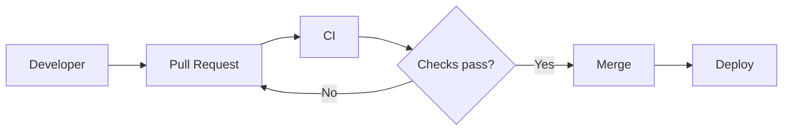

# Design and implement processes and communications

## Configure collaboration and communication

### Document a project by configuring wikis and process diagrams, including Markdown and Mermaid syntax

**Markdown first For example:**

Mermaid becomes especially useful for DevOps because diagrams are represented as text.

The major DevOps advantage is that the diagram itself is source text:
diagram change
     ↓
Git diff
     ↓
PR review
     ↓
Version history

Wiki vs repository documentation

This distinction is worth understanding.

A repository README.md is naturally suited to documentation tightly coupled to the code: setup, build instructions, contribution guidance, etc.

A project wiki can be better for broader documentation such as onboarding, operational procedures, architecture decisions, runbooks, release processes, and team practices.

And these aren't necessarily mutually exclusive

There are two Azure DevOps Wiki approaches worth recognizing:

Project wiki → Azure DevOps provisions a wiki Git repository for the project. Good for general project/team documentation.

Publish code as wiki → publish Markdown content from an existing Azure Repos Git repository as a wiki. This is useful when documentation already lives alongside source and you want to expose it as a navigable wiki.

So your decision model is:
Code-specific documentation
README / docs in repository
        ↓
Versioned with the code

Existing repository documentation
that should appear as a wiki
        ↓
Publish code as wiki

Project/team-wide documentation
runbooks, onboarding, architecture, processes
        ↓
Project wiki

For this AZ-400 bullet, remember the decision points: Markdown for structured text documentation, Mermaid for diagrams-as-code, project wiki for broader project/team knowledge, and publish code as wiki when existing repository Markdown should remain the source of truth while being presented as a wiki.

### Configure release documentation, including release notes and API documentation
Release notes answer:

“What changed in this release?”

API documentation answers:

“How do consumers use the interface we've released?”

Release notes:
Good release notes can be generated from traceable development information:
Work items / Issues
        ↓
PRs
        ↓
Commits
        ↓
Release
        ↓
Release notes

This is where all the traceability work we've done becomes useful. Instead of a developer manually trying to remember what happened since the last release, the release process can derive information from work items, commits, PRs, tags, builds, or deployments.

API documentation:
Suppose your application exposes:
GET /orders/{id}
POST /orders
DELETE /orders/{id}

Rather than maintaining a Word document separately from the API, a common approach is to define the API using OpenAPI.
paths:
  /orders/{id}:
    get:
      summary: Get an order
      responses:
        "200":
          description: Order returned successfully
        "404":
          description: Order not found

Keep documentation close enough to the implementation that it can be versioned and updated as part of the delivery process. The important design consideration is that the release notes should represent what was actually included in that release, not merely every PR ever closed.

So the exam takeaway for this bullet is: release notes should accurately reflect the changes included in a release, ideally derived from traceable PRs/work items/tags; API documentation should be version-controlled and kept aligned with the implementation; supported API versions should have matching published docs; and breaking changes should be clearly documented for consumers.

- Release notes communicate what changed in a specific release.
- Generate them from traceable release history such as PRs/work items between release tags rather than unrelated repository activity.
- Categorize and curate generated notes to reduce noise and suit the audience.
- OpenAPI provides a machine-readable API contract that can drive API documentation.
- Keep API specifications version-controlled and aligned with implementation.
- Publish documentation for supported API versions.

### Automate creation of documentation from Git history
- Define a reliable release boundary, usually previous tag → current tag.
- Use consistent PR titles, labels, or commit conventions so automation can categorize changes.
- Prefer PR/work-item metadata over raw commit messages when you want more human-friendly notes.
- Run generation in CI/CD so documentation is produced consistently for every release.

A common convention is Conventional Commits, for example:
feat: add order cancellation
fix: correct tax calculation
docs: update API examples
Automation can turn that into sections like Features, Bug Fixes, and Documentation.
Standardize Git/PR metadata → validate it in CI or repository policy → generate changelog/release notes automatically from tags/commits/PRs.

### Configure integration by using webhooks
“When event X happens here, send an HTTP request to system Y.” Webhook → the source system proactively sends an event when something changes. Typical webhook payloads include information about the event, repository/project, actor, and affected object such as a PR, issue, push, or release.

What's actually configured?

A webhook generally needs:
Payload URL
https://your-service.example/webhook

Event(s)
Pull request / push / release / etc.

Secret
Used to verify authenticity

Content/payload format
Usually JSON

That's why webhook receivers should verify authenticity, commonly using a shared secret and a cryptographic signature supplied with the request.
GitHub
  │
  │ payload + signature
  ▼
Webhook receiver
  │
  ├─ Verify signature ❌ → reject
  │
  └─ Verify signature ✅
             ↓
        Process event

That leads to three important webhook design concerns for AZ-400:
- Authenticity → verify the webhook signature/secret so forged events are rejected.
- Reliability → handle failed deliveries with retries and monitoring.
- Idempotency → be prepared for the same event to arrive more than once without performing the action twice. subscribe narrowly, then validate the payload condition you actually care about.

- The receiver must be reachable from the source system over HTTP/HTTPS.
- Configure the webhook with the payload URL and only the events you need.
- Use a secret and validate the webhook signature.
- Inspect the event type and payload fields, such as PR closed + merged + target branch main.
- Return an appropriate HTTP success response when processed.
- Handle retries, duplicate deliveries/idempotency, and logging/monitoring.
- Avoid triggering sensitive actions from unverified requests.

GitHub event
   ↓
Webhook subscription
   ↓
HTTPS POST
   ↓
Public receiver endpoint
   ↓
Verify signature
   ↓
Validate event/payload
   ↓
Perform action
   ↓
Return 2xx
   ↓
Log / monitor delivery

### Configure integration between Azure Boards and GitHub repositories
One is scope of the connection: Azure Boards can be connected to specific GitHub repositories, so you should think about which repos actually need integration rather than broadly connecting everything.

Another is permissions/authentication: the integration depends on authorized access between Azure DevOps and GitHub. If permissions are missing or revoked, linking activity will stop working even though the work items and repos still exist.

And one exam trap is worth remembering:
Using Azure Boards does not require Azure Repos.

- Configure the GitHub connection from Azure DevOps.
- Connect the relevant GitHub repository/repositories.
- Use AB#<ID> in GitHub commits/PRs to link development activity to Azure Boards.
- Use closing syntax such as Fixes AB#<ID> when you want resolution behavior.
- Preserve GitHub as the source-control system while Azure Boards remains the work-tracking system.
- Verify permissions and repository scope so the integration remains functional.

### Configure integration between GitHub or Azure DevOps and Microsoft Teams
Get useful DevOps events into the collaboration space where the team works.
GitHub / Azure DevOps
        ↓
PR / build / deployment / work-item event
        ↓
Microsoft Teams
        ↓
Relevant channel
        ↓
Team can see and act on it

For GitHub specifically, Microsoft Teams has supported GitHub integration that can subscribe a channel/chat to repository activity. For Azure DevOps, Teams integration can surface Azure Boards/work-item activity and other Azure DevOps events, depending on the integration being used. Because the exact Microsoft Teams/GitHub/Azure DevOps integration options can change, when we do the hands-on configuration I'll check the current Microsoft/GitHub instructions rather than give you potentially outdated menu clicks.

GitHub vs Azure DevOps → Teams

The exam may give you either side of this:
GitHub
├── Pull requests
├── Issues
├── Releases
└── CI/repository activity
        ↓
   Microsoft Teams

Azure DevOps
├── Azure Boards work items
├── Builds/pipelines
├── Releases/deployments
└── Other project events
        ↓
   Microsoft Teams

Which events should be routed to which people/channel, with what filtering?

Azure DevOps → Microsoft Teams

Microsoft provides separate Teams integrations for the major Azure DevOps services:

What you want in Teams	Integration
Work items	Azure Boards app
Builds/releases/approvals	Azure Pipelines app
Commits/PR activity	Azure Repos app
Dashboard/Kanban board	Azure DevOps tab

Microsoft documents these as the current supported integrations.

For example, for Azure Boards, an enterprise setup looks like:

Teams channel
     ↓
Install Azure Boards app
     ↓
Sign in
     ↓
Link Azure DevOps project
     ↓
Configure subscriptions
     ↓
Filter events
     ↓
Notifications appear in channel

Inside the Teams channel, you sign in:

@azure boards signin

Then link the project:

@azure boards link https://dev.azure.com/<organization>/<project>/

After linking, you create subscriptions. Azure Boards lets you filter those subscriptions by things such as event, area path, work-item type and tags.

So you could configure something like:

Event:
Work item updated

Work item type:
Bug

Area:
Production

Destination:
Operations Teams channel

Instead of dumping every Azure Boards event into Teams.

You can also put an actual Azure DevOps dashboard or Kanban board into a Teams tab by installing the Azure DevOps app, selecting the organization/project and choosing the dashboard or board to display.

GitHub → Microsoft Teams

GitHub has an official Microsoft Teams integration as well. An administrator/user with appropriate permissions installs the GitHub app from the Teams app store and connects their GitHub account.

You then authenticate in Teams with:

@GitHub Notifications signin

and subscribe a channel to a repository:

@GitHub Notifications subscribe owner/repository

For your lab repository, for example, that would conceptually be:

@GitHub Notifications subscribe mattls95/az400-github-flow-lab

GitHub supports subscriptions for issues, PRs, commits, releases, deployments, GitHub Actions workflows, reviews and other events.

The interesting part for our earlier notification-fatigue discussion is that you can narrow the subscription.

For example, you can enable PR reviews:

@GitHub Notifications subscribe owner/repo reviews

or GitHub Actions workflows:

@GitHub Notifications subscribe owner/repo workflows

Workflow subscriptions can also be filtered by things such as workflow name, branch, triggering event and actor.

So an enterprise might configure:

GitHub
 │
 ├── PR review requested
 │          ↓
 │     Development Teams channel
 │
 ├── Critical security event
 │          ↓
 │     Security Teams channel
 │
 └── Production workflow/deployment
            ↓
       Operations Teams channel

So for AZ-400, I wouldn't memorize every Teams button. Remember the architecture:

Install appropriate integration → authenticate → connect project/repository → subscribe to relevant events → filter → route to appropriate Teams channel → manage permissions and notification noise.
