# AZ-400 — Designing and Implementing Microsoft DevOps Solutions

> **Exam focus:** Azure DevOps + GitHub + Azure  
> **Highest-priority domain:** Build and release pipelines  
> **Blueprint:** Skills measured as of **July 27, 2026**.

---

# 0. Exam at a Glance

| Domain | Weight | Priority |
|---|---:|---|
| Design and implement processes and communications | 10–15% | 🟡 Medium |
| Design and implement a source control strategy | 10–15% | 🟡 Medium |
| **Design and implement build and release pipelines** | **50–55%** | 🔴 **Very High** |
| Develop a security and compliance plan | 10–15% | 🟡 Medium |
| Implement an instrumentation strategy | 5–10% | 🟢 Lower |

Microsoft explicitly expects experience with **both GitHub and Azure DevOps solutions**.

## DevOps lifecycle mental model

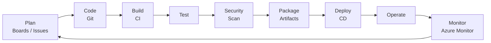

Remember:

> **Plan → Code → Build → Test → Secure → Package → Deploy → Monitor → Feedback**

---

# 1. Design and Implement Processes and Communications — 10–15%

Microsoft covers flow of work, metrics, dashboards, documentation, webhooks, Boards/GitHub integration, and Teams integration.

## 1.1 Work tracking and traceability

Know:

- Azure Boards
- GitHub Issues
- GitHub Projects
- Azure Repos / GitHub repositories
- Linking commits → pull requests → work items → builds → releases

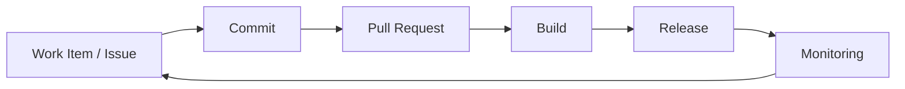

### GitHub Flow

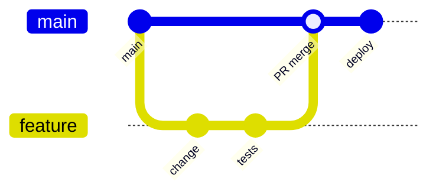

GitHub Flow is essentially:

1. Branch from `main`
2. Commit changes
3. Open PR
4. Review + automated checks
5. Merge
6. Deploy

Best for continuous delivery and short-lived branches.

---

# 2. DevOps Metrics You Should Recognize

## Flow metrics

| Metric | Meaning |
|---|---|
| Lead time | Request/commit → production |
| Cycle time | Work starts → work finishes |
| Deployment frequency | How often production releases occur |
| Change failure rate | % of deployments causing incidents |
| MTTR | Mean time to restore/recover service |
| Build duration | Time required for CI |
| Failure rate | Percentage of failed pipelines |
| Flaky test rate | Tests that intermittently pass/fail |

### Flow

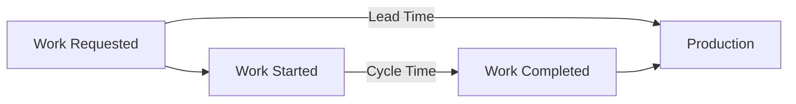

General exam pattern:

- Need faster delivery → reduce **lead/cycle time**
- Need higher reliability → watch **change failure rate**
- Need faster incident response → reduce **MTTR**
- Need pipeline optimization → monitor **duration / queue time / failures**

---

# 3. Dashboards and Queries

Possible dashboard inputs:

- Azure Boards queries
- Azure Pipelines analytics
- GitHub Insights
- Test results
- Security findings
- Application Insights
- Azure Monitor

Design dashboards around actionable outcomes rather than collecting every available metric.

Typical categories:

| Area | Useful metrics |
|---|---|
| Planning | backlog age, velocity, cycle time |
| Development | PR age, review time |
| Testing | pass rate, flaky tests, coverage |
| Security | open vulnerabilities, secret findings |
| Delivery | deployment frequency, failed deployments |
| Operations | availability, latency, MTTR |

---

# 4. Collaboration and Documentation

The blueprint explicitly includes **Markdown and Mermaid**, release notes, API documentation, Git-history-generated documentation, webhooks, Azure Boards/GitHub integration, and Teams integration.

## Webhook concept

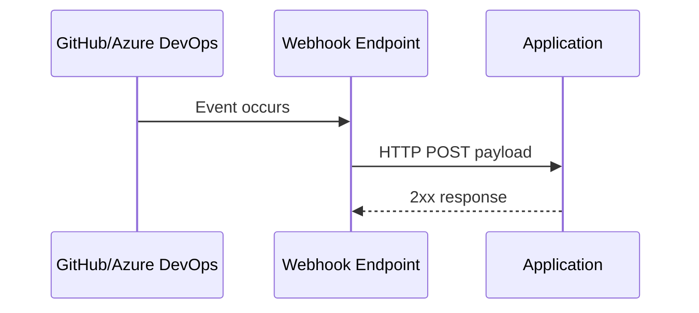

Use webhooks for **event-driven integration**.

Examples:

- PR opened
- Push received
- Build completed
- Work item updated
- Release completed

Webhook ≠ polling.

---

# 5. Design and Implement a Source Control Strategy — 10–15%

Microsoft expects branching strategies, PR workflows, repository optimization, large-file management, permissions, tags, and Git recovery/removal operations.

## 5.1 Branching strategies

| Strategy | Best fit | Characteristics |
|---|---|---|
| Trunk-based | Continuous delivery | short-lived branches, frequent merge |
| Feature branches | Isolated development | feature-specific branch |
| Release branches | Multiple supported releases | release stabilization/hotfixes |
| GitHub Flow | Web/cloud applications | branch → PR → main → deploy |

### Trunk-based

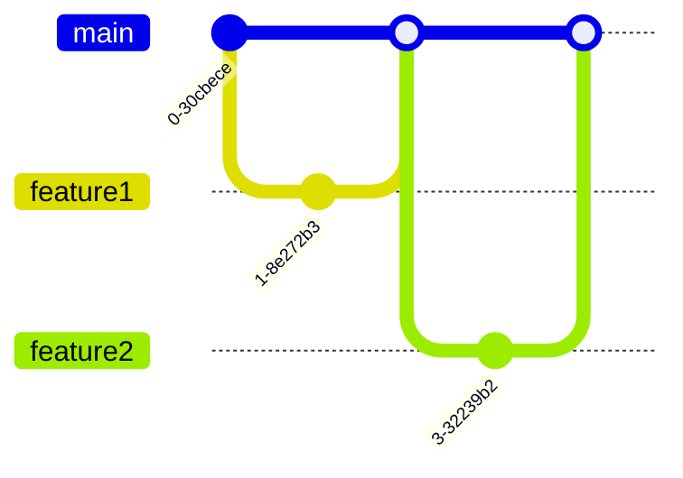

Prefer trunk-based development when:

- deployments are frequent
- automated tests are strong
- feature flags exist
- teams want to minimize merge conflicts

---

# 6. Pull Request Protection

Both GitHub branch protection and Azure Repos branch policies can enforce controls.

Common controls:

- Require PR
- Minimum reviewers
- Required status checks
- Successful build validation
- Comment resolution
- Restrict direct pushes
- Require signed commits where applicable
- Require linked work items
- Require code-owner approval
- Block force pushes

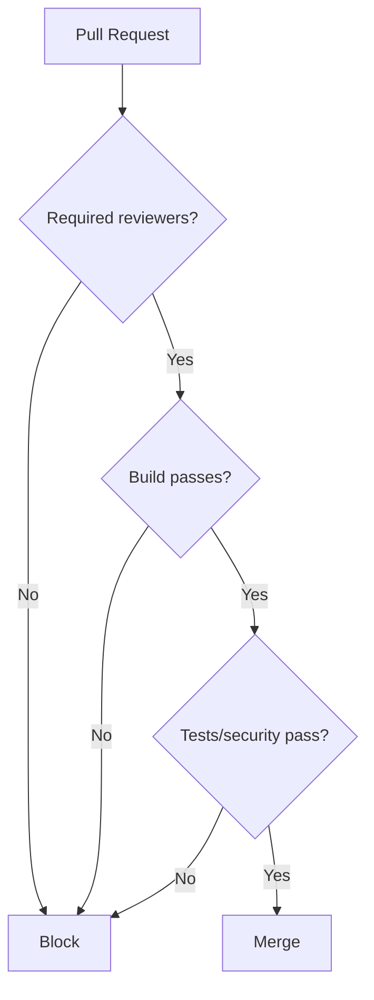

---

# 7. Git Repository Management

## Large files

### Git LFS

Git stores a pointer instead of the large binary.

```text
Repository
   |
   +-- small pointer file
              |
              v
         Git LFS Store
         large binary
```

Use for:

- large media
- datasets
- large binaries

Avoid storing huge binaries directly in normal Git history.

Microsoft also lists **git-fat** in the current blueprint.

---

## Large repository optimization

Know **Scalar**.

Scalar helps Git work efficiently with very large repositories by configuring and enabling performance-oriented Git features.

Also understand:

- shallow clone
- sparse checkout
- repository splitting where appropriate
- reducing unnecessary history/assets
- avoiding unnecessary binary files

---

# 8. Useful Git Recovery Commands

```bash
# Show commit history
git log

# Restore working-tree file
git restore file.txt

# Undo a commit safely by creating another commit
git revert <commit>

# Find recently referenced commits
git reflog

# Inspect a commit
git show <commit>

# Find commit containing a change
git blame file.txt
```

### Revert vs reset

| Command | Effect | Shared branch? |
|---|---|---|
| `git revert` | New commit reverses change | ✅ Preferred |
| `git reset` | Moves branch pointer | ⚠️ Usually avoid |
| `git restore` | Restores files | ✅ Local changes |

Exam rule:

> On shared/public history, prefer **revert** rather than rewriting history.

If secrets enter Git history:

1. Remove/rewrite the sensitive history.
2. Force update repository only with careful coordination.
3. **Rotate/revoke the exposed credential anyway.**

Removing it from Git does not make the credential safe again.

---

# 9. Tags

Tags normally identify releases:

```bash
git tag v2.1.0
git push origin v2.1.0
```

Annotated tag:

```bash
git tag -a v2.1.0 -m "Release 2.1.0"
```

Typical use:

```text
commit ──────► v1.0.0
```

---

# 10. BUILD AND RELEASE PIPELINES — 50–55%

🔥 **Spend roughly half your AZ-400 study time here.**

The current blueprint covers package management, testing, pipelines, deployments, IaC, and pipeline maintenance.

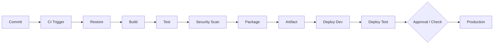

---

# 11. Package Management

Know:

### Azure Artifacts

Supports package feeds such as:

- NuGet
- npm
- Maven
- Python
- Universal Packages

### GitHub Packages

Integrated package hosting within GitHub.

---

# 12. Package Feeds

A feed provides controlled dependency distribution.

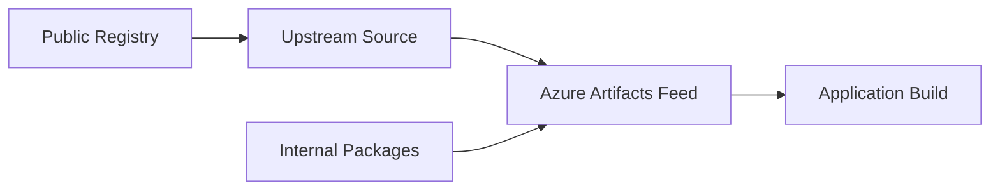

## Upstream sources

Useful when:

- caching external dependencies
- creating controlled dependency sources
- improving availability
- reducing uncontrolled external downloads

## Views

Azure Artifacts feed views can promote packages through lifecycle states.

Conceptually:

```text
@Local → @Prerelease → @Release
```

---

# 13. Versioning

## Semantic Versioning

```text
MAJOR.MINOR.PATCH
  3  .  7  .  2
```

- **MAJOR** → breaking change
- **MINOR** → backward-compatible feature
- **PATCH** → backward-compatible fix

Examples:

```text
1.0.0
1.1.0
1.1.1
2.0.0
```

## CalVer

Date-oriented versioning.

Examples:

```text
2026.10
2026.10.4
```

Useful when release date is more important than API compatibility.

---

# 14. Testing Strategy

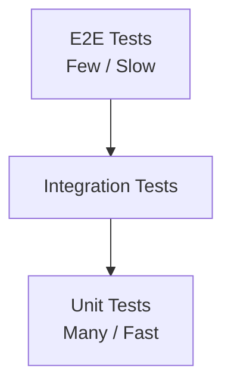

Remember the testing pyramid:

```text
        / E2E \
       /-------\
      /Integration\
     /-------------\
    /   Unit Tests  \
   /_________________\
```

Tests may include:

- local tests
- unit tests
- integration tests
- functional tests
- UI tests
- security tests
- load/performance tests

Microsoft explicitly expects pipeline test tasks, test agents, result integration, and code coverage.

---

# 15. Quality and Release Gates

A deployment gate evaluates conditions before progression.

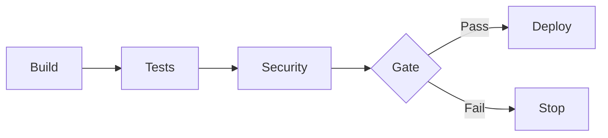

Potential gates:

- test pass threshold
- code coverage threshold
- vulnerability severity
- approval
- policy compliance
- health checks
- monitoring signals

---

# 16. GitHub Actions vs Azure Pipelines

| Feature | GitHub Actions | Azure Pipelines |
|---|---|---|
| Native platform | GitHub | Azure DevOps |
| Definition | YAML workflows | YAML pipelines |
| Hosted execution | GitHub-hosted runner | Microsoft-hosted agent |
| Self-managed | self-hosted runner | self-hosted agent |
| Reusable logic | reusable workflows/actions | YAML templates |
| Secret storage | GitHub secrets/environments | variable groups/Key Vault |
| Deployment controls | environments | environments/checks |

Do not memorize this as “one is better.”

Choose based on:

- repository platform
- existing ecosystem
- network connectivity
- licensing
- compliance
- agent requirements
- reusable assets
- operational skills

---

# 17. Runners and Agents

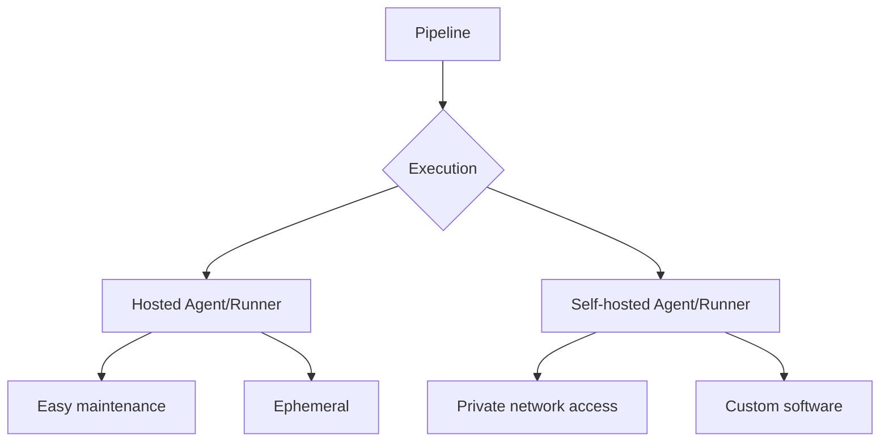

## Hosted

Good when:

- standard tools are sufficient
- internet-accessible targets
- minimal maintenance wanted

## Self-hosted

Good when:

- private network access is required
- specialist/custom software is needed
- specialized hardware is required
- repeated downloads are expensive

But you own:

- patching
- scaling
- security
- maintenance
- capacity

---

# 18. Pipeline Triggers

Typical triggers:

```text
push
pull request
schedule
manual
pipeline completion
```

### Azure Pipelines example

```yaml
trigger:
  branches:
    include:
      - main

pr:
  branches:
    include:
      - main
```

### GitHub Actions example

```yaml
on:
  push:
    branches: [main]

  pull_request:
    branches: [main]
```

---

# 19. Pipeline Structure

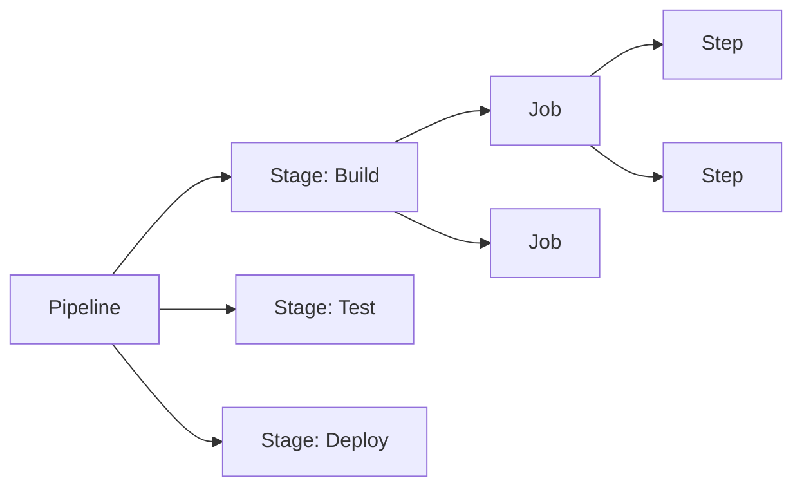

Mental hierarchy:

```text
Pipeline
 └─ Stage
     └─ Job
         └─ Step / Task
```

---

# 20. Azure Pipelines YAML Skeleton

```yaml
trigger:
- main

stages:

- stage: Build
  jobs:
  - job: BuildApplication
    pool:
      vmImage: ubuntu-latest

    steps:
    - checkout: self

    - script: dotnet build
      displayName: Build

    - script: dotnet test
      displayName: Test

- stage: Deploy
  dependsOn: Build
  condition: succeeded()

  jobs:
  - deployment: DeployProduction
    environment: production

    strategy:
      runOnce:
        deploy:
          steps:
          - script: echo "Deploy"
```

Important concepts:

- `dependsOn`
- `condition`
- variables
- parameters
- templates
- environments
- stages
- jobs
- steps

---

# 21. Parallelism

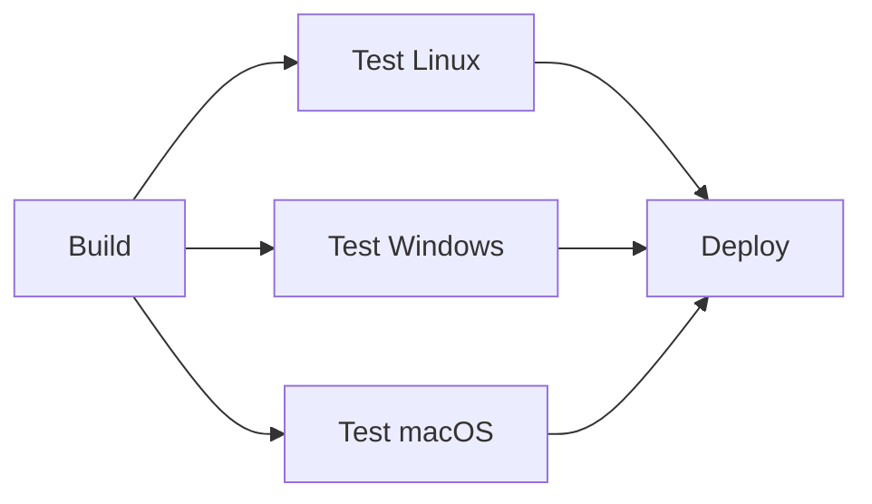

Parallelize independent work.

Do not parallelize when jobs have strict dependencies.

Trade-off:

```text
More parallel jobs
       ↓
faster execution
       ↓
potentially higher cost/capacity requirements
```

---

# 22. Reusable Pipelines

Azure Pipelines:

- YAML templates
- variable groups
- variables
- task groups for applicable classic scenarios

Example:

```yaml
steps:
- template: templates/build.yml
  parameters:
    configuration: Release
```

Use templates to promote:

- consistency
- DRY pipelines
- centralized policy
- easier maintenance

---

# 23. Variables vs Parameters

## Parameters

Resolved primarily at template/compile time.

Good for:

- selecting jobs/stages
- template behavior
- typed inputs

## Variables

Used during pipeline execution.

Good for:

- values used by tasks/scripts
- runtime configuration

Simple mental model:

```text
Parameters → shape the pipeline
Variables  → configure the pipeline
```

---

# 24. Environments, Checks and Approvals

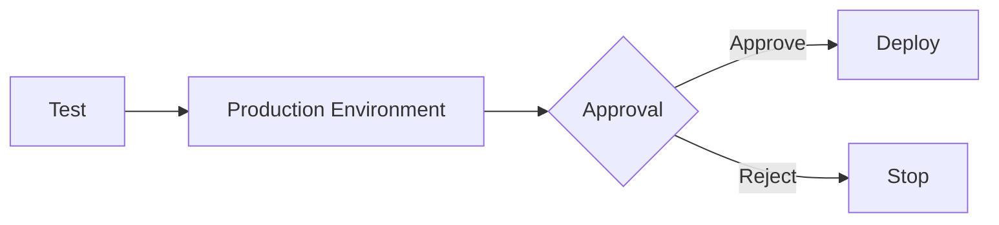

Uses include:

- approvals
- environment security
- deployment history
- checks
- resource protection

Important exam concept:

> Treat the environment as a protected resource, not merely a YAML stage name.

---

# 25. Deployment Strategies

Microsoft explicitly includes **blue-green, canary, ring, progressive exposure, feature flags, and A/B testing**.

## Blue-Green

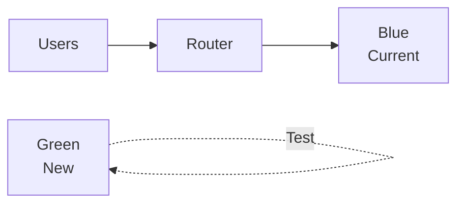

After validation:

```text
Users → Green
Blue remains rollback target
```

### Good for

- rapid rollback
- near-zero downtime

### Trade-off

- duplicate environment capacity

---

# 26. Canary Deployment

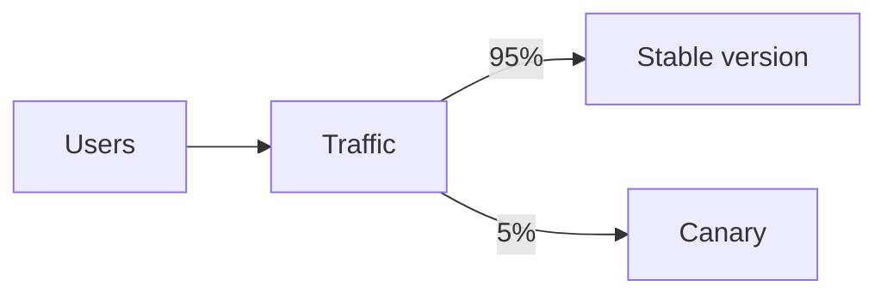

Increase gradually:

```text
5% → 10% → 25% → 50% → 100%
```

Stop rollout if telemetry worsens.

---

# 27. Ring Deployment

```text
Ring 0 → Internal users
Ring 1 → Early adopters
Ring 2 → Small customer group
Ring 3 → Wider population
Ring 4 → Everyone
```

The difference from a simple canary is that users/resources are deliberately grouped into deployment rings.

---

# 28. Progressive Exposure

General pattern:

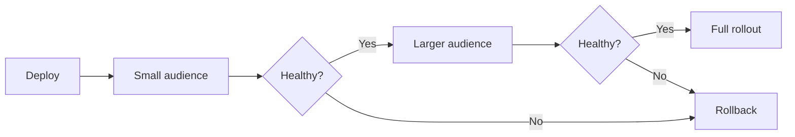

---

# 29. A/B Testing vs Feature Flags

## Feature flag

Controls whether a feature is active.

```text
if FeatureX:
    newExperience()
else:
    oldExperience()
```

## A/B testing

Compares outcomes between alternatives.

```text
Group A → old checkout
Group B → new checkout

Compare conversion rates
```

Feature flags can enable A/B testing, but they are not identical concepts.

---

# 30. Azure App Configuration Feature Management

Use feature flags without redeploying the application.

Potential targeting:

- percentage
- users
- groups
- time windows

Advantages:

- decouple deployment from release
- emergency disable
- progressive rollout

---

# 31. Rolling Deployment

```text
Instance 1 → update
Instance 2 → old
Instance 3 → old

then

Instance 1 → new
Instance 2 → update
Instance 3 → old
```

Requires enough healthy capacity to serve users during rollout.

---

# 32. Deployment Slots

Common App Service pattern:

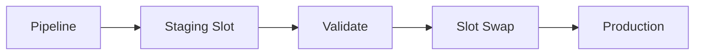

Benefits:

- validation before production
- warm application before swap
- quick rollback by swapping back

---

# 33. Hotfix Strategy

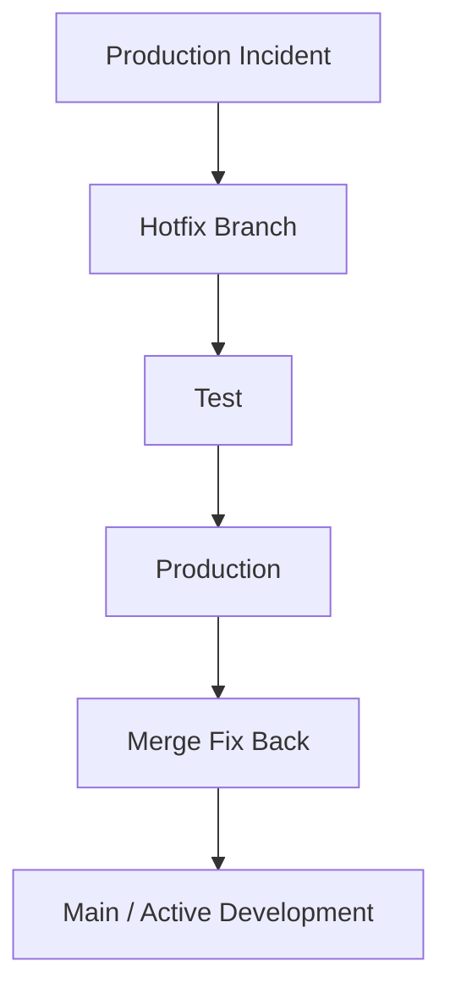

Critical concept:

> The production fix must also be incorporated back into ongoing development branches.

Otherwise the bug may return in a future release.

---

# 34. Database Deployment

Application + database deployments need dependency ordering.

```mermaid
flowchart LR
    DB1[Backward-compatible DB change]
    DB1 --> APP[Deploy application]
    APP --> DB2[Remove obsolete schema later]
```

Prefer backward-compatible migrations.

Avoid:

```text
Drop old DB column
        ↓
Old application still needs column
        ↓
💥 outage
```

Use approaches such as **expand → migrate → contract**.

---

# 35. Infrastructure as Code

The blueprint includes ARM, Bicep, Azure Machine Configuration, Azure Automation State Configuration concepts, configuration management, and Azure Deployment Environments.

```mermaid
flowchart LR
    G[Git] --> PR[PR Review]
    PR --> V[Validate]
    V --> T[Test]
    T --> D[Deploy Infrastructure]
    D --> A[Azure]
```

Treat infrastructure like application code:

- source control
- PR review
- automated tests
- versioning
- automated deployment

---

# 36. Declarative vs Imperative

## Declarative

Describe **desired state**:

```bicep
resource storage 'Microsoft.Storage/storageAccounts@...' = {
  ...
}
```

System determines how to achieve it.

Examples:

- Bicep
- ARM templates

## Imperative

Describe commands:

```bash
az group create ...
az storage account create ...
```

Exam preference:

> For repeatability and idempotent infrastructure provisioning, prefer declarative IaC.

---

# 37. Bicep

Bicep provides a cleaner authoring experience over raw ARM JSON.

Example:

```bicep
param location string = resourceGroup().location

resource storage 'Microsoft.Storage/storageAccounts@2023-05-01' = {
  name: 'examplestorage123'
  location: location
  sku: {
    name: 'Standard_LRS'
  }
  kind: 'StorageV2'
}
```

Remember:

```text
Bicep
  ↓ compile
ARM template
  ↓
Azure Resource Manager
```

---

# 38. Desired State Configuration

Desired state idea:

```text
Actual state
     ↓ compare
Desired state
     ↓
Correct configuration drift
```

Configuration management asks:

> “Is this machine configured the way it is supposed to be?”

IaC commonly asks:

> “Does the required infrastructure exist in the desired form?”

---

# 39. Azure Deployment Environments

Know the purpose:

- standardized developer environments
- environments based on approved infrastructure templates
- self-service/on-demand environment creation
- governance while enabling developer autonomy

Think:

```text
Platform team
    ↓
Approved environment definitions
    ↓
Developer self-service
    ↓
Consistent Azure environments
```

---

# 40. Pipeline Health

Microsoft expects monitoring of **failure rate, duration and flaky tests**, plus optimization for cost, performance, reliability, concurrency, retention, and classic-to-YAML migration.

Monitor:

```text
Failure rate
Queue time
Execution time
Agent utilization
Test duration
Flaky tests
Deployment success
Artifact size
Cost
```

---

# 41. Pipeline Optimization

## Speed

- cache dependencies
- parallelize independent jobs
- avoid unnecessary builds
- use incremental work
- optimize tests
- reuse build artifacts

## Cost

- avoid unnecessary agents
- tune parallelism
- stop redundant pipeline runs
- choose appropriate hosted/self-hosted infrastructure

## Reliability

- retry only transient failures
- remove flaky tests
- make deployments idempotent
- use health checks
- create rollback paths

---

# 42. Artifact Retention

Avoid keeping everything forever.

Design retention according to:

- audit requirements
- rollback requirements
- storage cost
- package lifecycle
- compliance requirements

Typical principle:

```text
Recent releases → retain
Important releases → retain longer
Temporary CI artifacts → remove sooner
```

---

# 43. Classic → YAML Pipeline Migration

Why migrate?

- pipeline as code
- version control
- PR review
- reuse/templates
- easier environment reproduction

Migration mindset:

```text
Classic pipeline
      ↓
Identify stages/tasks
      ↓
Convert to YAML
      ↓
Extract templates
      ↓
Validate
      ↓
Cut over
```

---

# 44. Security and Compliance — 10–15%

Microsoft covers identities, GitHub/Azure DevOps authorization, secrets, secretless authentication, security scanning, Defender for Cloud DevOps Security, GitHub Advanced Security, CodeQL and Dependabot.

```mermaid
flowchart LR
    C[Code] --> S1[Secret Scan]
    S1 --> S2[Dependency Scan]
    S2 --> S3[Code Scan]
    S3 --> S4[Container Scan]
    S4 --> B[Build]
    B --> D[Deploy]
```

Think **DevSecOps = shift security left**.

---

# 45. Service Principal vs Managed Identity

| | Service Principal | Managed Identity |
|---|---|---|
| Credential management | Usually required | Azure manages identity |
| Secret rotation | You may manage | Azure handles underlying credential |
| Azure resource integration | Yes | Excellent |
| Best use | External automation / scenarios needing app identity | Azure-hosted workloads |

### Managed identity types

#### System-assigned

```text
Azure Resource
      │
      └── Identity
```

Lifecycle tied to the resource.

Delete the resource → identity disappears.

#### User-assigned

```text
Managed Identity
   ├── Resource A
   ├── Resource B
   └── Resource C
```

Independent lifecycle and reusable across resources.

---

# 46. Secretless Authentication / OIDC

Preferred modern pattern:

```mermaid
sequenceDiagram
    participant P as Pipeline
    participant IDP as GitHub/Azure DevOps Identity
    participant E as Microsoft Entra ID
    participant A as Azure

    P->>IDP: Obtain workload identity token
    IDP->>E: Federated authentication
    E-->>P: Short-lived access token
    P->>A: Access Azure
```

Benefit:

> No long-lived cloud secret stored in CI/CD.

Keywords:

- workload identity federation
- OpenID Connect
- federated credential
- short-lived token

---

# 47. GitHub Authentication

Know the distinctions.

## `GITHUB_TOKEN`

- automatically created for workflow
- short-lived
- repository-scoped
- permissions configurable

## Personal Access Token

- represents a user
- permissions/scopes configured
- should be minimized
- requires lifecycle management

## GitHub App

Good for integrations requiring:

- scoped permissions
- organization/repository installation
- application identity
- short-lived tokens

General preference:

```text
Short-lived, narrowly scoped credential
            >
Long-lived personal credential
```

---

# 48. Azure DevOps Service Connections

Service connections allow pipelines to authenticate to external resources/services.

Examples:

```text
Azure Resource Manager
Kubernetes
Docker Registry
GitHub
External services
```

Security rules:

- least privilege
- scope narrowly
- restrict who can use connection
- avoid broad subscription permissions when unnecessary

---

# 49. RBAC and Least Privilege

```mermaid
flowchart LR
    U[User / Pipeline] --> R[Role]
    R --> S[Scope]
    S --> Resource[Resource]
```

Azure RBAC:

```text
Security principal
       +
Role definition
       +
Scope
       =
Role assignment
```

Choose smallest sufficient scope:

```text
Resource > Resource Group > Subscription > Management Group
```

Higher scopes inherit downward.

---

# 50. Secrets Management

Use **Azure Key Vault** for:

- secrets
- keys
- certificates

```mermaid
flowchart LR
    P[Pipeline] --> ID[Managed/Federated Identity]
    ID --> KV[Key Vault]
    KV --> S[Secret]
    P --> A[Application Deployment]
```

Avoid:

```yaml
password: SuperSecret123
```

Also avoid:

- secrets in Git
- secrets printed in logs
- credentials embedded in artifacts
- excessive variable exposure

---

# 51. Secure Files

Azure Pipelines Secure Files are useful for protected deployment files such as certificates or provisioning/configuration assets.

Treat them as protected pipeline resources and tightly control authorization.

---

# 52. Security Scanning

Know the categories.

| Scan | Finds |
|---|---|
| SAST / code scanning | vulnerabilities in source |
| Dependency scanning | vulnerable third-party packages |
| Secret scanning | committed credentials |
| Container scanning | vulnerable image components |
| License scanning | licensing/compliance risks |

---

# 53. GitHub Advanced Security

Important capabilities to recognize:

- code scanning
- CodeQL
- secret scanning
- dependency-related security capabilities

Current AZ-400 also covers GitHub Advanced Security for **GitHub and Azure DevOps** and integration with Microsoft Defender for Cloud.

---

# 54. CodeQL

Think:

```text
Source Code
    ↓
CodeQL database
    ↓
Security queries
    ↓
Find vulnerabilities
```

CodeQL = semantic/static analysis of source code.

---

# 55. Dependabot

Dependabot helps identify vulnerable/outdated dependencies.

Conceptually:

```mermaid
flowchart LR
    D[Dependency File] --> DB[Vulnerability Data]
    DB --> A[Dependabot Alert]
    A --> Fix[Update Dependency]
```

On the exam, distinguish dependency risk from source-code-analysis risk.

---

# 56. Container Security

A secure container pipeline may resemble:

```mermaid
flowchart LR
    C[Source] --> B[Build Image]
    B --> S[Scan Image]
    S --> G{Gate}
    G -->|Pass| R[Registry]
    G -->|Fail| X[Stop]
    R --> D[Deploy]
```

Scan before production.

Prefer immutable versioned images rather than silently overwriting important release tags.

---

# 57. Instrumentation Strategy — 5–10%

The blueprint includes Azure Monitor, Log Analytics/Azure Monitor Logs, Application Insights, VM Insights, Container Insights, storage/network monitoring, GitHub monitoring, alerts, distributed tracing, and basic KQL.

```mermaid
flowchart LR
    A[Application] --> AI[Application Insights]
    VM[VM] --> AM[Azure Monitor]
    K8S[Containers] --> CI[Container Insights]
    AI --> LA[Log Analytics Workspace]
    AM --> LA
    CI --> LA
    LA --> Alert[Alerts]
    LA --> Dash[Dashboards]
```

---

# 58. Azure Monitor Mental Model

Azure Monitor works with:

```text
Metrics
Logs
Traces
Alerts
Dashboards / Workbooks
```

### Metrics

Numeric time-series information.

Examples:

- CPU
- memory
- request rate
- latency

### Logs

Structured event data queried using KQL.

### Traces

Track requests through distributed components.

---

# 59. Application Insights

Use for application performance monitoring.

Common telemetry:

- requests
- dependencies
- exceptions
- traces
- availability
- application performance

Distributed tracing:

```mermaid
sequenceDiagram
    participant U as User
    participant API as API
    participant S as Service
    participant DB as Database

    U->>API: Request
    API->>S: Dependency call
    S->>DB: Query
    DB-->>S: Result
    S-->>API: Response
    API-->>U: Response
```

Tracing lets you discover which component caused latency/failure.

---

# 60. Infrastructure Signals

Know the basics:

```text
CPU
Memory
Disk
Network
```

Common interpretation:

| Symptom | Possible signal |
|---|---|
| application slow | latency, CPU, dependency duration |
| frequent restarts | memory/resource pressure |
| storage bottleneck | disk latency / IOPS |
| connectivity problem | network failures / latency |

---

# 61. KQL Essentials

Basic KQL pattern:

```kusto
TableName
| where Condition
| summarize ...
| order by ...
```

## Filter

```kusto
requests
| where success == false
```

## Select columns

```kusto
requests
| project timestamp, name, resultCode
```

## Count failures

```kusto
requests
| where success == false
| summarize Failures=count()
```

## Group by response code

```kusto
requests
| summarize Count=count() by resultCode
```

## Time bucket

```kusto
requests
| summarize Requests=count() by bin(timestamp, 5m)
```

## Sort

```kusto
requests
| order by timestamp desc
```

Remember the pipe:

```text
Data
 |
 v
where
 |
 v
summarize
 |
 v
order/project
```

---

# 62. Alerting

```mermaid
flowchart LR
    T[Telemetry] --> R[Alert Rule]
    R --> C{Condition met?}
    C -->|Yes| AG[Action Group]
    AG --> E[Email / SMS / Webhook / Automation]
```

Good alerts should be:

- actionable
- meaningful
- appropriately scoped
- low-noise

Avoid creating alerts for every possible signal.

---

# 63. Feedback Loop

Instrumentation should feed development.

```mermaid
flowchart LR
    D[Deploy] --> M[Monitor]
    M --> A[Analyze]
    A --> I[Issue / Work Item]
    I --> C[Code Change]
    C --> P[Pipeline]
    P --> D
```

That loop is fundamental to DevOps.

---

# 64. High-Yield Decision Matrix

| Requirement | Likely answer |
|---|---|
| Protect main from direct pushes | Branch protection / branch policies |
| Enforce successful CI before merge | Required status/build check |
| Handle large binaries | Git LFS |
| Optimize enormous Git repo | Scalar |
| Safely reverse shared commit | `git revert` |
| Host internal packages | Azure Artifacts / GitHub Packages |
| Standard package version scheme | SemVer |
| No long-lived Azure secret in CI | Workload identity federation/OIDC |
| Store application secrets | Azure Key Vault |
| Azure-native workload identity | Managed identity |
| Gradually expose deployment | Canary / rings / progressive exposure |
| Instant switch between environments | Blue-green |
| Enable feature without redeployment | Feature flag |
| Compare user outcomes | A/B testing |
| Reduce App Service downtime | Deployment slots / swap |
| Repeatable Azure infrastructure | Bicep / ARM |
| Self-service standardized Azure environments | Azure Deployment Environments |
| Analyze source vulnerabilities | CodeQL |
| Detect vulnerable dependencies | Dependabot |
| Application telemetry | Application Insights |
| Query Azure logs | KQL |
| Trace request across services | Distributed tracing |
| Private-network pipeline execution | Self-hosted runner/agent |

---

# 65. Common Exam Traps

## Secret vs variable

A pipeline variable is **not automatically an appropriate secret-management system**.

For sensitive data, favor:

```text
Key Vault
secure secret storage
federated authentication
managed identities
```

---

## Deployment vs release

With feature flags:

```text
Deployment = put code in production
Release    = expose feature to users
```

They can occur at different times.

---

## Authentication vs authorization

```text
Authentication
"Who are you?"

Authorization
"What may you do?"
```

---

## CI vs CD

```text
CI
Commit → Build → Test → Artifact

CD
Artifact → Environment → Validation → Production
```

---

## Hosted vs self-hosted

Do not choose self-hosted merely because it sounds more powerful.

Choose it because a requirement exists:

- private connectivity
- custom tooling
- specialized hardware
- persistent caches/configuration

Otherwise hosted execution generally minimizes maintenance.

---

# 66. Scenario Answering Framework

For scenario questions, identify the requirement first.

```mermaid
flowchart TD
    Q[Read Question] --> R[Identify Requirement]
    R --> S{Security?}
    R --> C{Cost?}
    R --> A{Availability?}
    R --> P{Performance?}

    S --> LP[Least privilege / Secretless auth]
    C --> OPT[Optimize agents / retention / concurrency]
    A --> BG[Blue-green / slots / rolling]
    P --> PAR[Parallelism / cache / optimize]
```

Look for words such as:

### “Minimize administrative effort”

Often suggests:

- managed service
- hosted runner/agent
- managed identity
- automated solution

### “Least privilege”

Think:

- narrow roles
- minimal scopes
- limited token permissions

### “No secrets”

Think:

- managed identity
- workload identity federation
- OIDC

### “Minimal downtime”

Think:

- deployment slots
- rolling deployment
- blue-green
- load balancing

### “Small percentage of users”

Think:

- canary
- progressive exposure

### “Different groups over time”

Think:

- deployment rings

---

# 67. What to Memorize vs Understand

## Memorize

```text
Pipeline hierarchy:
Pipeline → Stage → Job → Step

SemVer:
MAJOR.MINOR.PATCH

Azure monitoring:
Metrics + Logs + Traces + Alerts

Git:
revert = safe shared-history undo

Security:
least privilege + short-lived credentials

IaC:
source control + review + test + deploy
```

## Understand deeply

- branch strategy trade-offs
- deployment strategy selection
- hosted vs self-hosted agents
- service principal vs managed identity
- secret vs secretless authentication
- variables vs parameters
- build artifact vs package
- feature flag vs A/B test
- code scanning vs dependency scanning
- metrics vs logs vs traces

---

# 68. Last-Minute Review Map

```mermaid
mindmap
  root((AZ-400))
    Processes
      GitHub Flow
      Boards / Issues
      Traceability
      Metrics
      Markdown / Mermaid
      Webhooks
    Source Control
      Branching
      PR Policies
      Git LFS
      Scalar
      Permissions
      Git Recovery
    Pipelines
      Packages
      Tests
      YAML
      Agents / Runners
      Templates
      Environments
      Deployments
      IaC
      Optimization
    Security
      Entra ID
      Managed Identity
      OIDC
      Key Vault
      GHAS
      CodeQL
      Dependabot
    Monitoring
      Azure Monitor
      Application Insights
      Logs
      KQL
      Tracing
      Alerts
```

---

# 69. Final High-Yield Checklist

Before taking AZ-400, make sure you can explain without notes:

- [ ] GitHub Flow
- [ ] Trunk-based vs feature vs release branches
- [ ] Branch policies / protection rules
- [ ] `revert` vs `reset`
- [ ] Git LFS and Scalar
- [ ] Azure Artifacts and GitHub Packages
- [ ] SemVer
- [ ] Test pyramid and pipeline gates
- [ ] GitHub Actions vs Azure Pipelines
- [ ] Hosted vs self-hosted agents/runners
- [ ] Stages, jobs and steps
- [ ] YAML templates
- [ ] Parameters vs variables
- [ ] Environments and approvals
- [ ] Blue-green
- [ ] Canary
- [ ] Rings
- [ ] Progressive exposure
- [ ] Feature flags
- [ ] A/B testing
- [ ] Deployment slots
- [ ] Hotfix paths
- [ ] Safe database deployment
- [ ] Bicep / ARM / desired state
- [ ] Azure Deployment Environments
- [ ] Pipeline health and optimization
- [ ] Managed identities
- [ ] Service principals
- [ ] Workload identity federation / OIDC
- [ ] Key Vault
- [ ] GitHub Apps / `GITHUB_TOKEN` / PAT
- [ ] Azure DevOps service connections
- [ ] GitHub Advanced Security
- [ ] CodeQL
- [ ] Dependabot
- [ ] Container scanning
- [ ] Azure Monitor
- [ ] Application Insights
- [ ] Distributed tracing
- [ ] Basic KQL
- [ ] Alerts and feedback loops

---

# 70. The 10 Rules to Remember on Exam Day

1. **Automate repeatable work.**
2. **Keep configuration and infrastructure in source control.**
3. **Prefer short-lived, least-privileged credentials.**
4. **Use managed identities or workload identity federation where possible.**
5. **Protect important branches with PRs and automated checks.**
6. **Build once and promote the same artifact through environments.**
7. **Use telemetry to control progressive deployments.**
8. **Design deployments with rollback/resiliency in mind.**
9. **Shift testing and security earlier in the delivery lifecycle.**
10. **Optimize for feedback speed without sacrificing reliability or security.**

---

## Study Priority

Given the official weighting:

```text
███████████████████████████  Pipelines      50–55%
███████                      Processes      10–15%
███████                      Source Control 10–15%
███████                      Security       10–15%
████                         Monitoring      5–10%
```

If your study time is limited:

```text
1. Pipelines + deployments + IaC
2. Security / identity / DevSecOps
3. Git and source-control strategy
4. Processes / traceability / metrics
5. Monitoring / KQL
```

**Most important principle:** AZ-400 is less about memorizing where buttons live and more about choosing the **right DevOps design for a requirement**.

# AZ-400 Objective Coverage Patch

> Append this section to the existing AZ-400 cheat sheet.
>
> This patch focuses only on objectives that were missing or needed more exam-level depth in the original version.

---

# 71. Feedback Cycles and Work Tracking

AZ-400 expects you to design feedback loops involving:

- GitHub Issues
- Azure Boards
- GitHub Projects
- pull requests
- builds and tests
- production telemetry
- notifications

```mermaid
flowchart LR
    I[Issue / Work Item]
    C[Commit]
    PR[Pull Request]
    B[Build + Test]
    D[Deployment]
    M[Production Monitoring]

    I --> C
    C --> PR
    PR --> B
    B --> D
    D --> M
    M --> I
```

The goal is **traceability across the whole DevOps lifecycle**.

Think:

```text
Requirement
   ↓
Work Item
   ↓
Commit
   ↓
Pull Request
   ↓
Build
   ↓
Test
   ↓
Deployment
   ↓
Production telemetry
```

## Notifications

Useful notifications include:

- PR requires review
- build failed
- deployment failed
- work item assigned
- production incident detected
- approval required

Avoid excessive notifications.

Good DevOps notifications should be:

```text
Relevant
+
Actionable
+
Sent to the right audience
```

---

# 72. DevOps Queries

Dashboards display information.

**Queries determine which information is selected.**

Typical Azure Boards query scenarios:

```text
All active bugs
Bugs assigned to me
Work items in current sprint
High-priority unresolved defects
Items blocked for more than N days
```

Queries may support:

- project planning
- development
- testing
- security
- delivery
- operations

Example mental model:

```mermaid
flowchart LR
    W[Work Items]
    Q[Query]
    D[Dashboard Widget]

    W --> Q
    Q --> D
```

Choose metrics and queries based on the intended audience.

| Audience | Useful information |
|---|---|
| Product owner | backlog, velocity, cycle time |
| Development team | PR age, active
