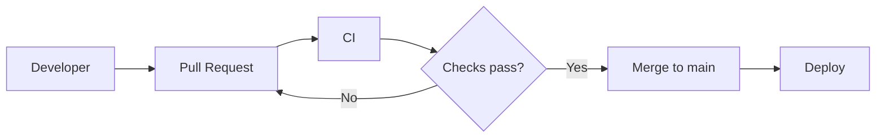
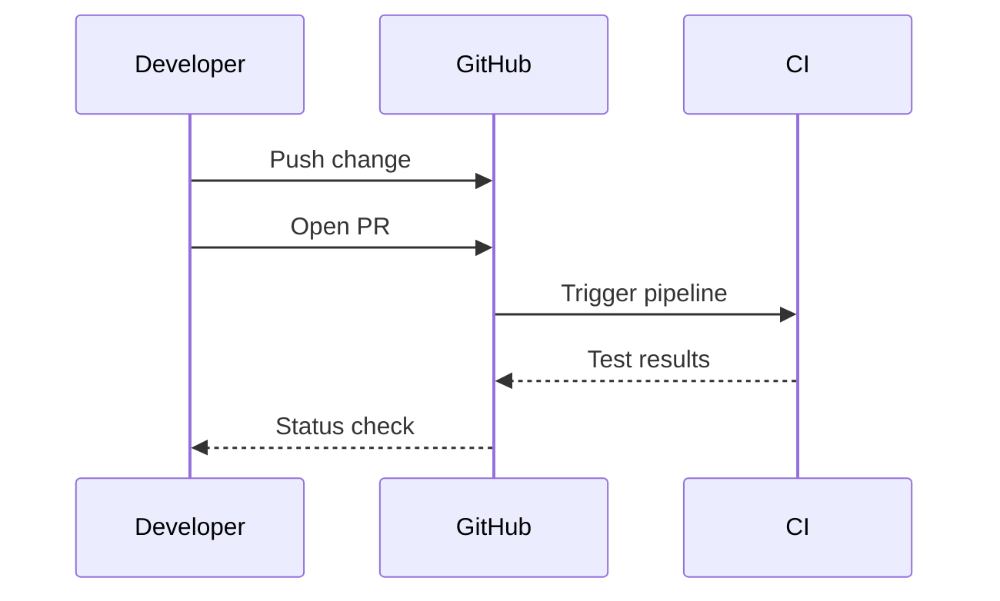

# Deployment Process

## Purpose

This document describes the process used to move a change from development to production.

## Process

A few pieces to understand:

flowchart LR means we're creating a flowchart laid out left-to-right.

A[Developer]

defines a node.

A --> B

defines a directional connection.

And:

D{Checks pass?}

uses braces to create a decision-style node.

Finally:

D -->|Yes| E

puts Yes on the connecting edge.

## Rules

- Changes must be submitted through a pull request.
- Required CI checks must pass.
- Changes are merged into `main` before deployment.